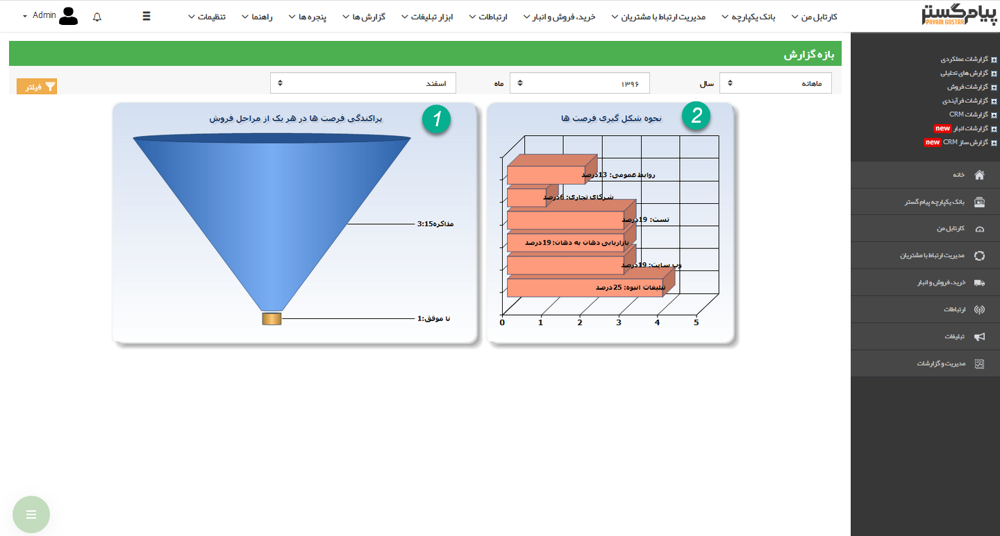

# نمودار وضعیت فروش        

**نمودار وضعیت فروش**

گزارش وضعیت فروش به شما کمک میکند تا با استفاده از نمودارهای منبع مشتریان فرصت و مراحل فرصت ها، بتوانید بازار هدف خود و روش های بازاریابی را در بازه زمانی خاص بهتر برنامه ریزی نمایید. نمودار شماره یک (نمودار مراحل فرصت) بخوبی تعداد هر فرصت در آن مرحله را نمایش داده و به شما کمک خواهد کرد تا گلوگاه ها را شناسایی نمایید. نمودار شماره دو (نمودار نحوه شکل گیری فرصت ها) منابع شکل شگیری فرصت های فروش را به تفکیک درصد با یکدیگر مقایسه می کند.

نکته: می توانید با استفاده از فیلترهای موجود، گزارش وضعیت فروش را بر اساس بازه زمانی دلخواه خود فیلتر کنید.

