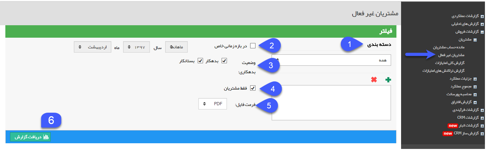
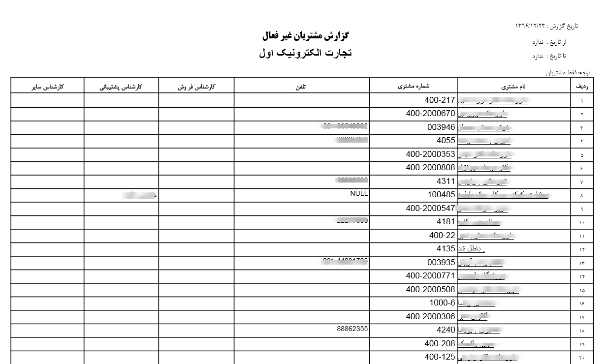

# مشتریان غیر فعال        

مشتریان غیر فعال 

این گزارش، گزارشی از مشتریان و مخاطبینی است که اطلاعات آنها در نرم افزار ذخیره شده اما تاکنون تراکنش مالی (فاکتور فروش و قرارداد مالی) با آنها صورت نگرفته است یادر یک بازه زمانی خاص هیچ گونه تراکنش مالی برای آنها ثبت نشده است. از طریق این گزارش به خوبی میتوان مشتریانی که به هر دلیل جذب سایر فروشندگان یا ارائه دهندگان شده اند را شناسایی کرد.

1. **دسته بندی:** میتوانید منبع مورد نظر (دسته بندی بانک اطلاعاتی یا گروه های هدف) برای گزارش گیری را انتخاب کرده و از میان دسته بندی های زیر مجموعه آن، موارد دلخواه را با استفاده از علامت پلاس اضافه کنید.

2. **فیلتر بازه زمانی:** در صورتی که بخواهید گزارش تراز حساب مشتریان را برای بازه زمانی خاصی دریافت کنید، می توانید این گزینه را فعال نموده و سپس بازه زمانی مورد نظر خود را تعیین کنید.

3. **وضعیت بدهکاری:** وضعیت تراز مالی مخاطبانی (بدهکار، بستانکار) که مایل به گزارش گیری از آنها هستید، را انتخاب کنید.

4. **فقط مشتریان:** با فعال نمودن این گزینه نرم افزار تنها کسانی که شماره مشتری به آن ها اختصاص داده شده را مورد گزارش گیری قرار میدهد.

5.  **فرمت فایل:** مشخص کنید که فایل خروجی گزارش با چه فرمتی ( PDF، Excel یا Html ) باشد.

6. **دریافت گزارش:** پس از اعمال فیلترهای مورد نظر خود می توانید با کلیک بر روی این دکمه، گزارش مشتریان غیرفعال را دریافت کنید.

 