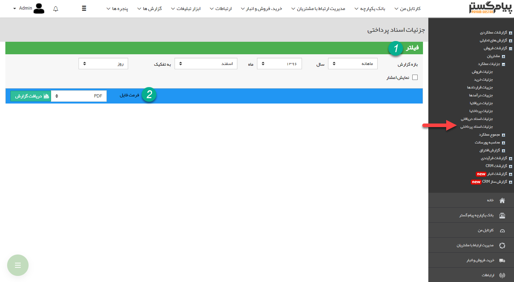
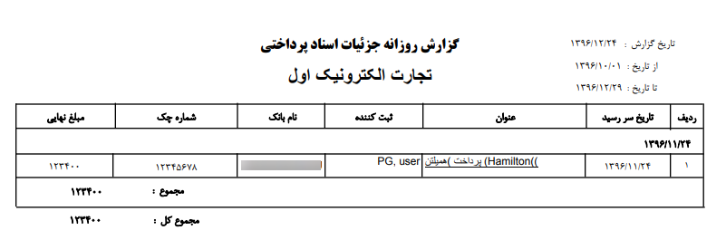

# جزئیات اسناد پرداختی    

**جزئیات اسناد پرداختی**

 در این گزارش تمامی پرداخت های چکی و اعتباری که تاریخ سررسید آن ها در بازه زمانی مشخص شده باشد،  نمایش داده می شود.

نکته: توجه داشته باشید که تاریخ ایجاد پرداخت ها در این گزارش تاثیری ندارد و تاریخ سررسید اهمیت دارد.

نکته: توجه داشته باشید، این گزارش مربوط به اسناد پرداخت نشده می باشد و در صورتی که چک باکس "پرداخت شده" در یک پرداخت، فعال شده باشد، گزارش مربوط به آن بر اساس تاریخ پرداخت در گزارش [جزئیات پرداخت ها](HelpPayamgostar\ManagementAndReports\SalesReport\Details\Paysdetails.md) قابل مشاهده است.

1. **فیلتر:** در قسمت فیلترها، با توجه به بازه زمانی مورد نظر، فیلدها را پر نمایید.

2\. **فرمت فایل:** در قسمت فرمت فایل، نوع فایل خروجی را انتخاب کرده و روی دریافت گزارش کلیک کنید تا گزارش مورد نظر دانلود شود.

