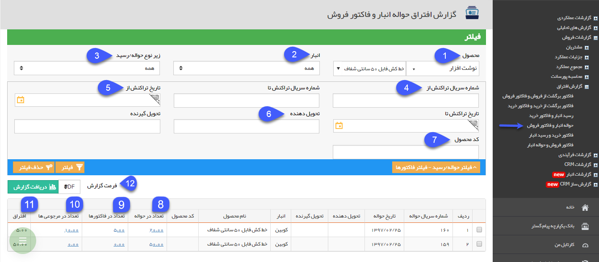
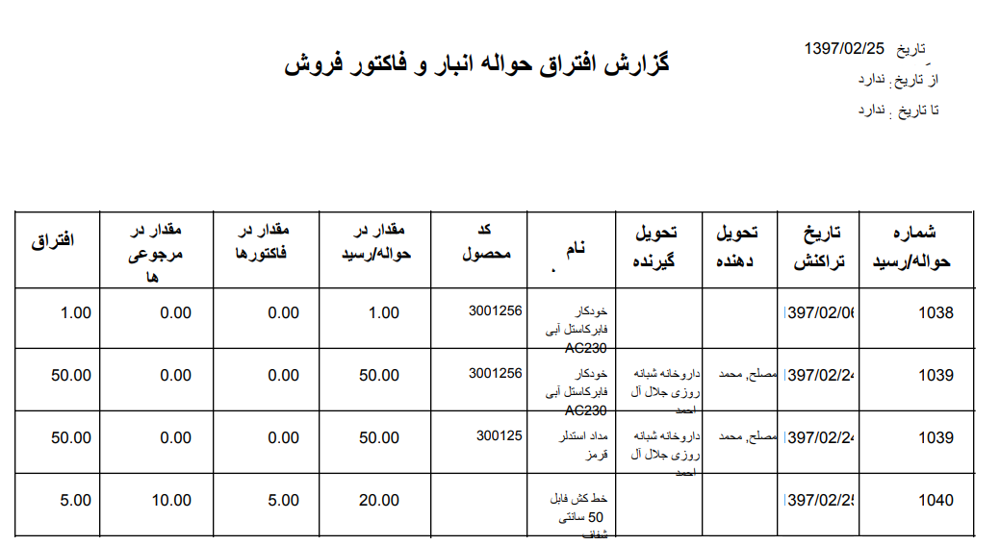

# حواله انبار و فاکتور فروش    

حواله انبار و فاکتور فروش

در این قسمت لیست حواله هایی که همه یا تعدادی از اقلام موجود در آن ها از طریق [قیمت گذاری](../../../Buysaleswarehouse/Warehouses/Pricing.md) به هیچ فاکتور فروش یا رسید مرجوعی وصل نشده است را می توانید مشاهده کنید.

(به زبان دیگر کالا از انبار خارج شده است اما مشخص نیست که متعلق به کدام فاکتور فروش می باشد و از طریق هیچ رسیدی به انبار مرجوع نشده است.)

هر ردیف از جدول نمایش داده شده در این گزارش، نشان دهنده خروج یک محصول از انبار می باشد که تعداد خارج شده از انبار از تعداد اتصال آن ها با فاکتورهای فروش و رسید های مرجوعی بیشتر است. نحوه نمایش این گزارش به ازای هر ردیف محصول از حواله های انبار می باشد. یعنی اگر در یک حواله انبار دو ردیف محصول وارد شده باشد که تعدادی از اقلام کالای هر دو ردیف به هیچ فاکتور فروش یا رسید مرجوعی متصل نشده باشند، گزارش افتراق آن ها در دو ردیف مجزا نمایش داده خواهد شد.

1\. **فیلتر محصول:** می توانید گروه محصول یا محصول مورد نظر خود که قصد مشاهده گزارش افتراق مربوط به آن را دارید، انتخاب نمایید.

2\. **انبار:** از آنجایی که این گزارش افتراق به ازای هر حواله انبار نمایش داده می شود، می توانید از بین انبارهای تعریف شده در نرم افزار، یک انبار را فیلتر کنید تا تراکنش های مربوط به آن انبار در گزارش نمایش داده شوند.

3\. **زیرنوع حواله:** می توانید یکی از زیرنوع های حواله انبار را انتخاب نمایید. در این صورت تراکنش های ثبت شده از آن زیرنوع حواله در گزارش نمایش داده خواهد شد.

4\. **شماره سریال تراکنش از/تا:** می توانید یک حد پایین و یک حد بالا برای سریال تراکنش هایی که قصد مشاهده گزارش افتراق مربوط به آن ها را دارید، در نظر بگیرید.

5\. **تاریخ تراکنش از/تا:** می توانید یک حد پایین و یک حد بالا برای تاریخ تراکنش هایی که قصد مشاهده گزارش افتراق مربوط به آن ها را دارید، در نظر بگیرید.

6. **تحویل دهنده/تحویل گیرنده:** می توانید تحویل دهنده یا تحویل گیرنده حواله های انباری که قصد مشاهده گزارش افتراق مربوط به آن ها را دارید، مشخص کنید.

7. **کد محصول:** می توانید در این قسمت کد محصولی که قصد مشاهده گزارش افتراق مربوط به آن را دارید، وارد کنید.

8. **تعداد در حواله:** در این ستون، به ازای هر حواله انبار که همه یا تعدادی از اقلام کالای آن به هیچ فاکتور فروشی متصل نشده اند یا مرجوع نشده اند، تعداد محصول وارد شده در حواله انبار نمایش داده می شود، می توانید یا کلیک بر روی لینک نمایش داده شده، حواله انبار مربوطه را مشاهده نمایید.

9\. **تعداد در فاکتورها:** در صورتی که برخی از اقلام کالا در این حواله انبار به فاکتور فروش متصل گردند، تعداد اتصال داده شده به فاکتورهای فروش در این قسمت نمایش داده می شود، می توانید یا کلیک بر روی لینک نمایش داده شده، فاکتورهای فروش مربوطه را مشاهده نمایید.

10\. **تعداد در مرجوعی ها:** در صورتی که تعدادی از اقلام کالای خارج شده در این حواله انبار مرجوع شده باشند و در رسید مرجوعی مربوطه از طریق این حواله قیمت گذاری شده باشند، در این قسمت تعداد وارد شده در رسید مرجوعی نمایش داده خواهد شد. می توانید یا کلیک بر روی لینک نمایش داده شده، رسید/رسید های مرجوعی مربوطه را مشاهده نمایید.

11\. **افتراق:** میزان افتراق محصول در این قسمت نمایش داده خواهد شد. این عدد از کسر تعداد در فاکتورها و تعداد در مرجوعی ها از تعداد در حواله به دست می آید.

12\. **دریافت گزارش:** پس از اعمال فیلترهای مورد نظر خود، می توانید اطلاعات نمایش داده شده را با فرمت دلخواه از نرم افزار خروجی بگیرید. شکل زیر نمونه ای از خروجی با فرمت pdf از گزارش افتراق حواله انبار و فاکتور فروش را نمایش می دهد.

