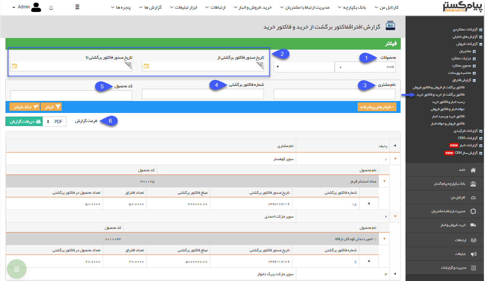
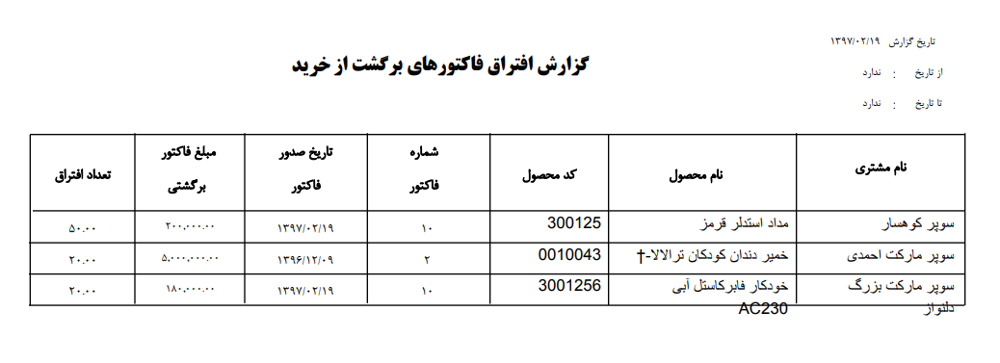

# فاکتور برگشت از خرید و فاکتور خرید    

فاکتور برگشت از خرید و فاکتور خرید

 در این قسمت لیست فاکتور برگشت از خرید هایی که همه یا تعدادی از اقلام موجود در آن ها به هیچ فاکتور خریدی وصل نشده است را می توانید مشاهده کنید.

(به زبان دیگر کالا به تامین کننده مرجوع شده است اما مشخص نیست که متعلق به کدام فاکتور خرید می باشد.)

در این گزارش بر اساس فیلترهای اعمال شده، لیستی از تامین کنندگان نمایش داده خواهد شد و برای هر کدام از آن ها، لیستی از محصولاتی که برای آن ها افتراق فاکتور برگشتی و فاکتور فروش وجود دارد به همراه کد محصول نمایش داده خواهد شد. علاوه بر این برای هر کدام از محصولات، اطلاعات فاکتور های برگشتی مربوطه را می توانید مشاهده نمایید.

 

1\. **محصولات:** می توانید یک گروه محصول یا یک محصول خاص را جهت نمایش گزارش افتراق فیلتر کنید.

2\. **تاریخ صدور فاکتور برگشتی:** می توانید یک حد بالا و یک حد پایین برای تاریخ صدور فاکتورهای برگشتی نمایش داده شده در نظر بگیرید.

3\. **نام مشتری:** می توانید نام یا بخشی از نام تامین کننده(یا تامین کنندگان) مورد نظر خود را در این قسمت وارد کنید.

4\. **شماره فاکتور برگشتی:** می توانید شماره فاکتور برگشتی مورد نظر خود که قصد مشاهده گزارش افتراق مربوط به آن را دارید، در این فیلد وارد نمایید.

5\. **کد محصول:** می توانید کد یا بخشی از کد محصول یا محصولاتی که قصد مشاهده گزارش افتراق مربوط به آن (آن ها) را دارید، در این فیلد وارد نمایید.

6.**دریافت گزارش:** فرمت فایل خروجی گزارش مورد نظر خود را انتخاب کرده و روی دکمه دریافت گزارش کلیک کنید تا گزارش مربوطه با فیلترهای اعمال شده، دانلود شود.

