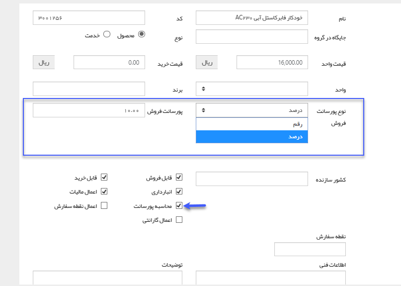
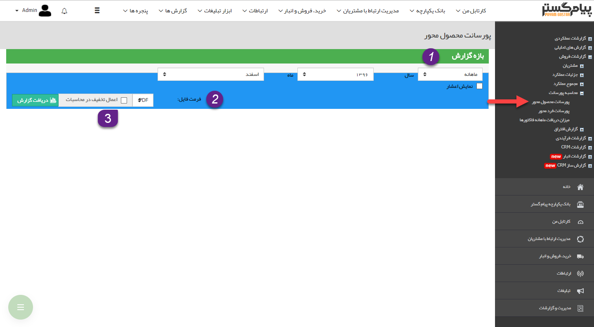
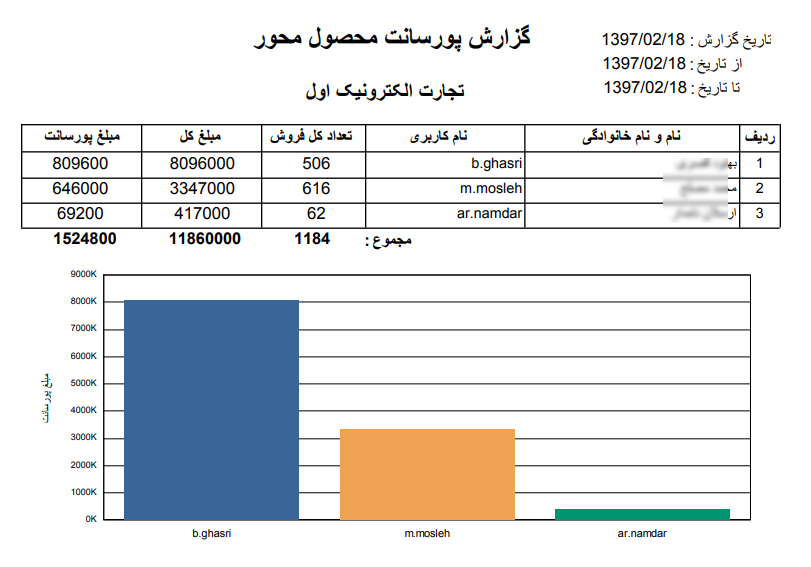

# پورسانت محصول محور    

**پورسانت محصول محور**

در [مدیریت محصولات](../../BaseInformatio/ProduceManagement.md) می توان برای محصولات پورسانت درصدی و یا قیمتی مشخص کرد(مطابق شکل زیر). ب

این گزارش، پورسانت کالاهای فروخته شده و جمع کل آنها را در بازه زمانی مشخص شده نمایش می دهد.

نکته مهم: توجه داشته باشید که پورسانت هر فاکتور فروش به کاربری تعلق می یگرد که نام او در فیلد "فروشنده" درج شده باشد.

1.**فیلتر:**در قسمت فیلترها، با توجه به بازه زمانی مورد نظر، فیلدها را پر نمایید.

2. **فرمت فایل:**در قسمت فرمت فایل، نوع فایل خروجی را انتخاب کرده و روی دریافت گزارش کلیک کنید تا گزارش مورد نظر دانلود شود.

3. **اعمال تخفیف در محاسبات:** با فعال کردن این گزینه مبلغ نهایی فاکتورها (که تخفیف بر روی آن اعمال شده) در محاسبات گزارش در نظر گرفته میشود.

