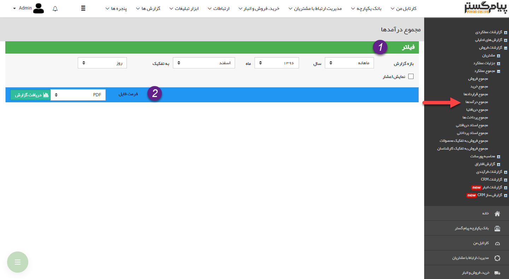
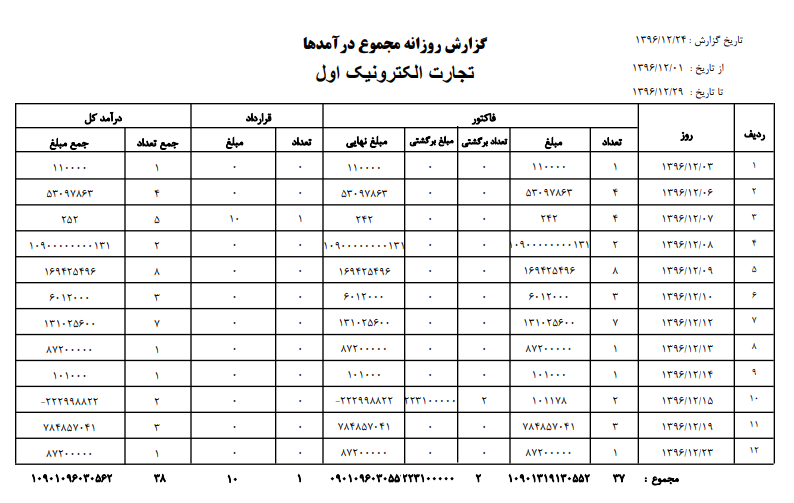

# مجموعه درآمدها    

**مجموع درآمدها**

در این گزارش تعداد فاکتورهای فروش، فاکتورهای برگشت از فروش و قراردادهایی که جنبه مالی دارند و همچنین مبلغ آنها در بازه زمانی مشخص شده نشان داده می شود.

1. **فیلتر:** در قسمت فیلترها، با توجه به بازه زمانی مورد نظر، فیلدها را پر نمایید.

2. **فرمت فایل:** در قسمت فرمت فایل، نوع فایل خروجی را انتخاب کرده و روی دریافت گزارش کلیک کنید تا گزارش مورد نظر دانلود شود.

