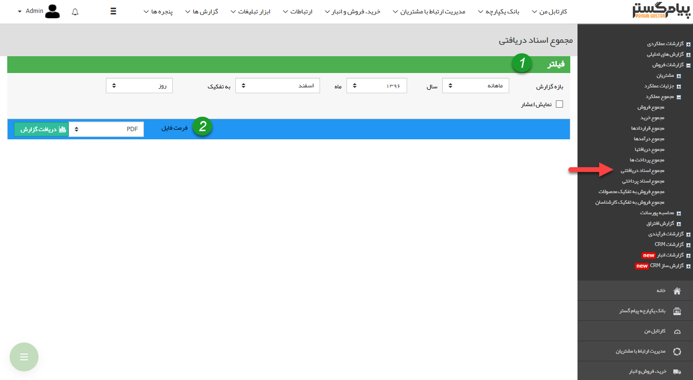

# مجموع اسناد دریافتنی    

**مجموع اسناد دریافتنی**

در این گزارش مجموع تمامی دریافت های چکی و اعتباری که تاریخ سررسید آن ها در بازه زمانی مشخص شده باشد، به همراه مبالغ آن ها نمایش داده می شود.

نکته: توجه داشته باشید که تاریخ ایجاد دریافت ها در این گزارش تاثیری ندارد و تاریخ سررسید اهمیت دارد.

نکته: توجه داشته باشید، این گزارش مربوط به اسناد دریافت نشده می باشد و در صورتی که چک باکس "دریافت شده" در یک دریافت، فعال شده باشد، گزارش مربوط به آن بر اساس تاریخ دریافت در گزارش [مجموع دریافت ها](Totalrecived.md) قابل مشاهده است.

1. **فیلتر:** در قسمت فیلترها، با توجه به بازه زمانی مورد نظر، فیلدها را پر نمایید.

2. **فرمت فایل:** در قسمت فرمت فایل، نوع فایل خروجی را انتخاب کرده و روی دریافت گزارش کلیک کنید تا گزارش مورد نظر دانلود شود.

