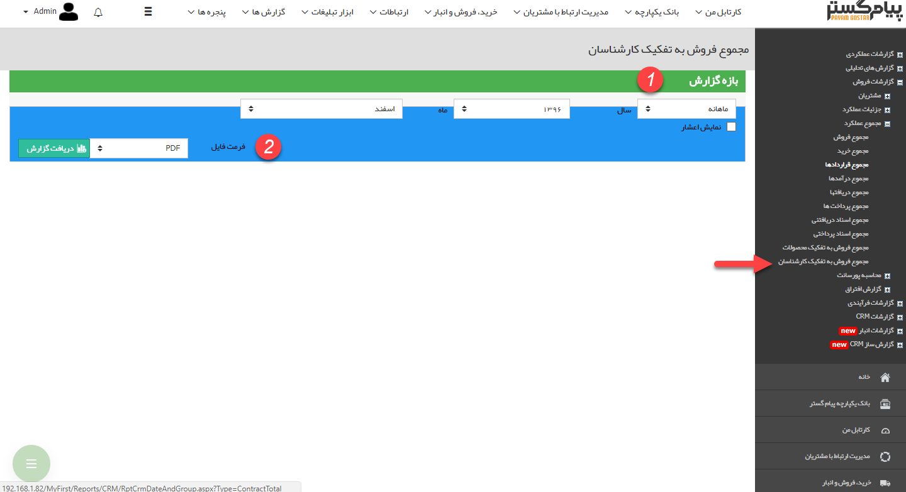
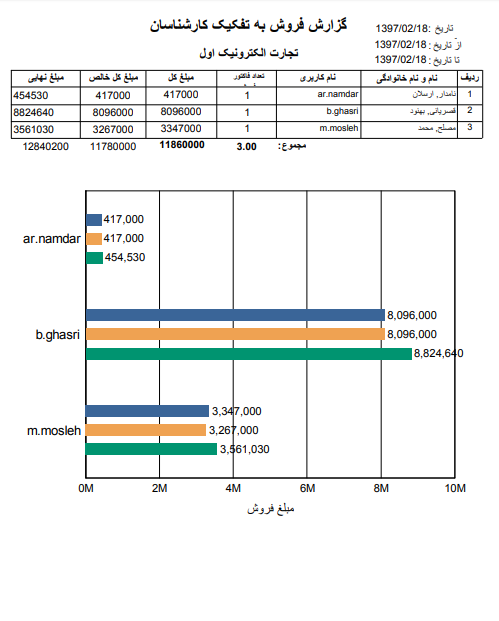

# مجموعه فروش به تفکیک کارشناسان    

**مجموع فروش به تفکیک کارشناسان**

در این گزارش مشخص می شود که هر کدام ازکاربران سیستم چه تعداد فاکتور زده اند ومبلغ فروش کل به تفکیک هر کاربر در بازه زمانی مشخص شدهبه چه میزان بوده است .

1.**فیلتر:**در قسمت فیلترها، با توجه به بازه زمانی مورد نظر، فیلدها را پر نمایید.

2. **فرمت فایل:**در قسمت فرمت فایل، نوع فایل خروجی را انتخاب کرده و روی دریافت گزارش کلیک کنید تا گزارش مورد نظر دانلود شود.

نکته: مبلغ خالص، مبلغ فاکتورها پس از اعمال تخفیف و مبلغ نهایی، مبلغ پس از اعمال تخفیف و مالیات می باشد.