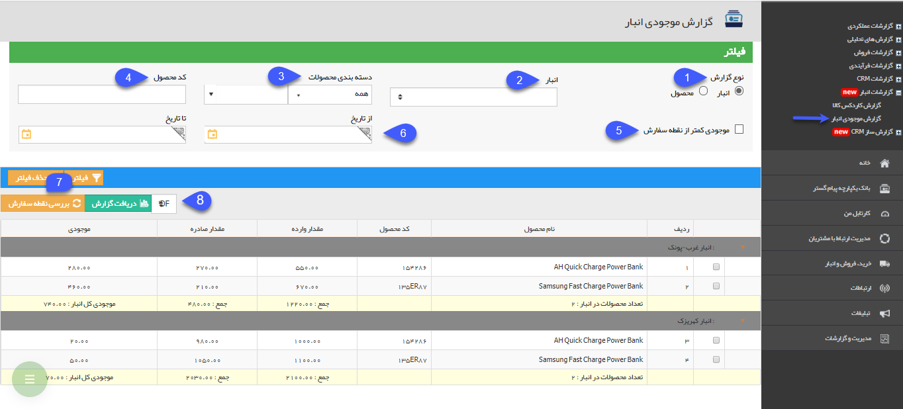
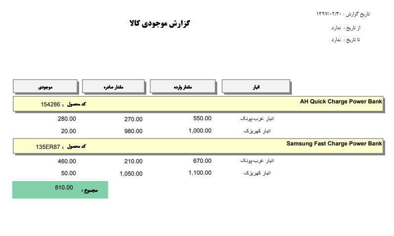

# گزارش موجودی انبار    

گزارش موجودی انبار

در این قسمت می توانید موجودی هرکدام از محصولات خود را در انبار های مختلف مشاهده کنید. همچنین  با استفاده از فیلترهای موجود می توانید محصولاتی که به نقطه سفارش خود رسیده اند را مشاهده کرده و اقدامات لازم جهت سفارش خرید یا تولید محصول را انجام دهید.

 

1\. **نوع گزارش:** موجودی به دو صورت قابل نمایش است:

الف) بر اساس انبار: هر انبار و موجودی کالاهای آن را نمایش می دهد.

ب) بر اساس کالا: هر کالا و موجودی آن را در تمامی انبار ها نمایش می دهد.

2\. **انبار:** می توانید انبار دلخواه را فیلتر کنید.

3\. **انتخاب محصول:** در صورت نیاز یک گروه محصول یا محصول دلخواه را فیلتر کنید.

4\. **کد محصول:** می توانید از کد محصول برای فیلتر کردن لیست گزارش استفاده کنید.

5\. **موجودی کمتر از نقطه سفارش:** در صورت فعال بودن این گزینه، گزارش محصولاتی نمایش داده می شود که مقدار موجودی فعلی آن ها کمتر از نقطه سفارش تعیین شده در انبار باشد.

6\. **از/تا تاریخ:** در صورت تعیین کردن یک بازه زمانی در این قسمت، گزارش میزان ورود و خروج محصولات در این بازه نمایش داده خواهد شد.

7\. **بررسی نقطه سفارش:** با کلیک بر روی این دکمه، نرم افزار نقطه سفارش تعیین شده برای محصولات در انبارهای مختلف را بررسی می کند و در صورت ایجاد تغییر، آن را در گزارش لحاظ خواهد کرد.

8\. **دریافت گزارش:** می توانید از اطلاعات نمایش داده شده، یک گزارش با فرمت دلخواه خود دریافت کنید، ایتدا فرمت فایل مورد نظر خود را انتخاب کرده و سپس روی دریافت گزارش کلیک کنید.

 