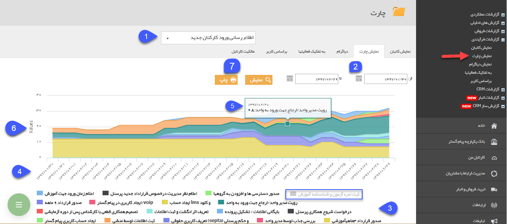

# نمایش چارت    

نمایش چارت

در این قسمت چارت گردش کار، بین کارتابل های مختلف فرآیند بر اساس زمان ورود آنها به آن مرحله نمایش داده می شود.

از طریق این چارت می توانید مقدار زمان توقف گردش کار در هر کارتابل را به خوبی پایش کنید.

 

1.  **انتخاب فرآیند:** آیتمی که قصد مشاهده چارت گردش کار مربوط به آن را دارید انتخاب کنید. توجه داشته باشید که در این قسمت تنها می توانید آیتم هایی را انتخاب کنید که چرخه کاری فعال داشته باشند.

2\. **بازه زمانی:** بازه زمانی مورد نظر خود را جهت نمایش در چارت مشخص کنید و روی دکمه نمایش کلیک کنید.

3\. رنگ هر کارتابل از گردش کار نمایش داده می شود و با کلیک بر روی آن می توانید نمایش آن در چارت را فعال و غیر فعال کنید.

4\. **تاریخ:** روز های مختلف گردش کار را بر اساس بازه انتخاب شده نمایش می دهد.

5\. با اشاره بر روی هر مرحله از گردش کار، نام مرحله، تعداد آیتم هایی که در آن مرحله قرار گرفته اند و تاریخ آن نمایش داده می شود.

6\. Values: تعداد آیتم هایی که در هر مرحله هستند را بر حسب تاریخ نمایش می دهد.

7\. **چاپ:** با کلیک بر روی این دکمه می توانید از چارت نمایش داده شده، چاپ بگیرید.