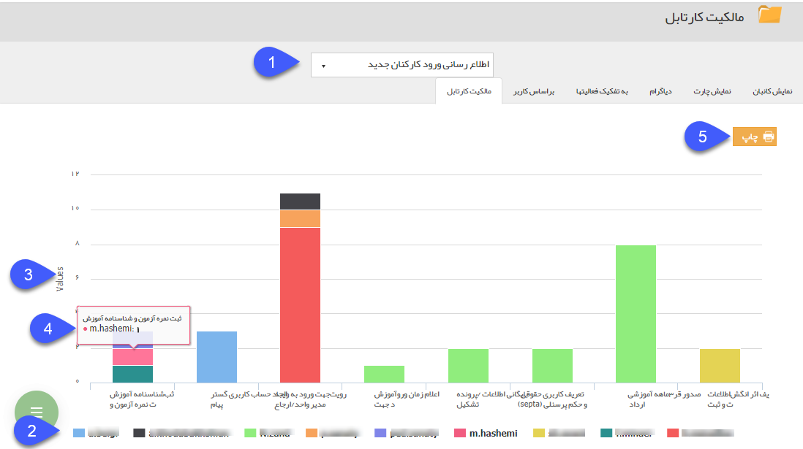

# مالکیت کارتابل

**مالکیت کارتابل**

با استفاده از این گزارش می توانید میزان پراکندگی آیتم های موجود در هریک از کارتابل ها را به تفکیک کاربران مالک کارتابل مشاهده کنید، به طور مثال در شکل زیر مشاهده می کنید که سه سابقه در جریان از این فرم درکارتابل " ثبت نمره آزمون و شناسنامه آموزش" قرار دارد، اما این آیتم ها تحت مالکیت سه کاربر مختلف قرار دارند. نحوه نمایش رنگ در این گزارش بر اساس کاربران و هر یک از ستون های آن نشان دهنده یک کارتابل از فرآیند می باشد.

1\. **انتخاب فرآیند:**  آیتمی که قصد مشاهده دیاگرام گردش کار مربوط به آن را دارید انتخاب کنید.توجه داشته باشید که در این قسمت تنها می توانید آیتم هایی را انتخاب کنید که چرخه کاری فعال داشته باشند.

2\. نام کاربرانی که در حال حاضر حداقل یک سابقه در جریان از این آیتم در کارتابل آن ها قرار دارد را نمایش می دهد و با کلیک بر روی هرکدام می توانید نمایش آن در نمودار را غیرفعال کنید. 

3.Values: تعداد آیتم هایی که در هر مرحله هستند را نمایش می دهد.

4\. با اشاره بر روی هر قسمت از نمودار نام کاربر و تعداد آیتم هایی که در کارتابل آن کاربر موجود است را می توانید مشاهده کنید.

5\. **چاپ:** با کلیک بر روی این دکمه می توانید از اطلاعات نمایش داده شده، چاپ بگیرید.