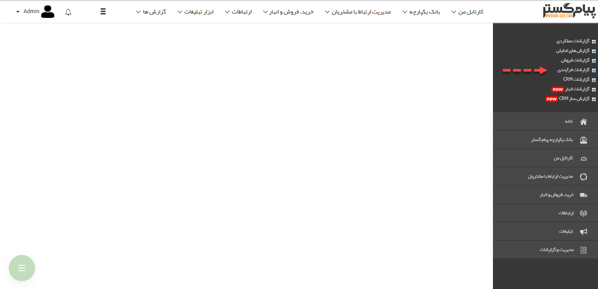

# گزارشات فرآیندی    

گزارشات فرآیندی

با استفاده از گزارشات فرآیندی میتوانید نحوه عملکرد فرآیندهای پیاده سازی شده روی آیتم های مختلف نرم افزار را مورد رصد قرار دهید و گلوگاه های فرایندهای خود را بشناسید. یعنی بدانید که فرآیندهای در جریان، بیشتر در کدام کارتابل ها و تحت مالکیت کدام کاربران هستند.

[نمایش کانبان](Workflow/Kanbanview.md)

[نمایش چارت](Workflow/Chartview.md)

[نمایش دیاگرام](Workflow/Diagramview.md)

[به تفکیک فعالیتها](Workflow/Actionbase.md)

[بر اساس کاربر](Workflow/Userbase.md)