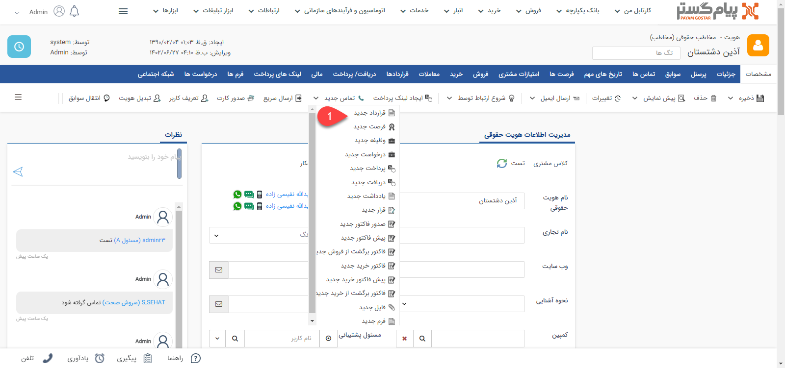
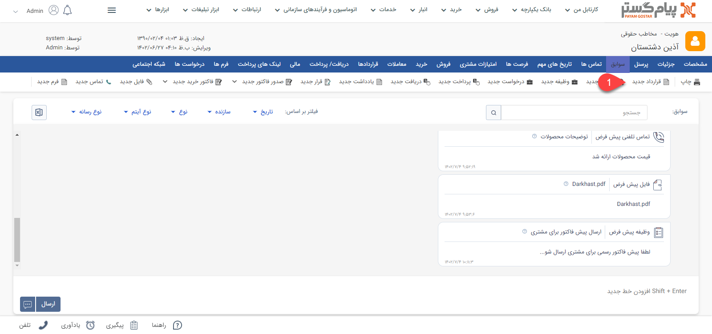
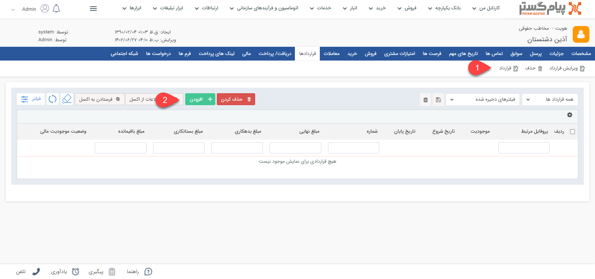
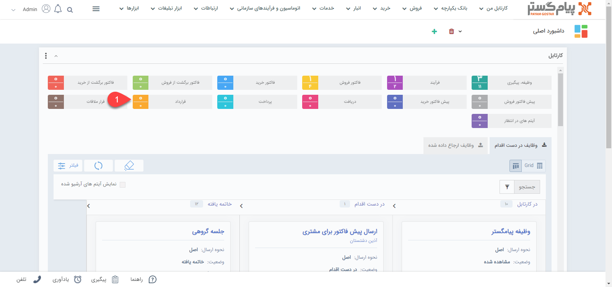
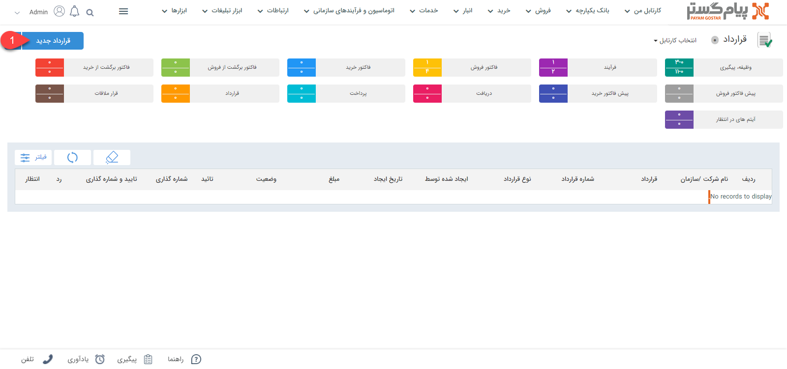
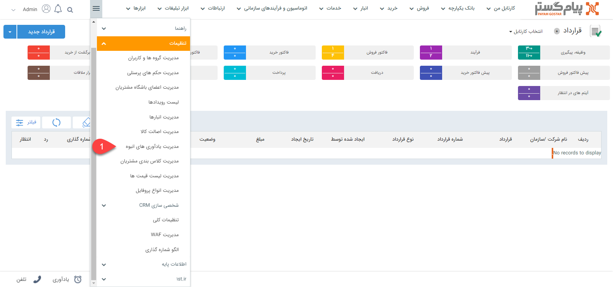
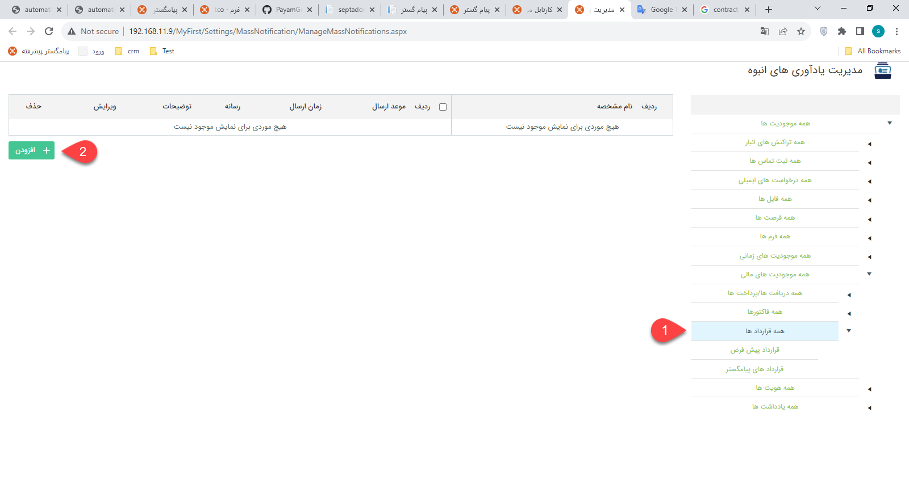

## ثبت قرارداد جدید در CRM  پیام گستر
برای ثبت قرارداد جدید در پیام گستر می توانید از طریق روش های زیر اقدام نمایید.
1.	برای ثبت قرارداد جدید، پس از ورورد به صفحه اصلی هویت مشتری و سربرگ مشخصات می توانید آیتم قرارداد جدید را انتخاب نمایید. با ثبت اطلاعات مورد نظر می توانید برای مشتری خود قرار داد جدید ثبت کنید.

2.	برای ثبت قرارداد جدید کافی است پروفایل مورد نظر را باز نمایید و در سربرگ سوابق روی دکمه قرارداد جدید کلیک کنید. پس از پر کردن  و ذخیره کردن فیلدهای مربوطه می توانید قرارداد جدیدی را برای مشتری خود ثبت کنید.

3.	برای ثبت قرارداد جدید کافی است پروفایل مورد نظر را باز نمایید و در سربرگ قرارداد روی دکمه قرارداد یا افزودن کلیک کنید. پس از پر کردن  و ذخیره کردن فیلدهای مربوطه می توانید قرارداد جدیدی را برای مشتری خود ثبت کنید.

4.	برای ثبت قرارداد جدید، می توانید از طریق ویجت دسترسی سریع به راحتی قرارداد جدید ثبت کنید.

5.	برای ثبت قرارداد جدید همچنین می توانید از طریق تب کارتابل من، قرارداد جدید ثبت نمایید.

6.	در CRM پیام گستر از طریق تنظیمات، به مدیریت یادآوری انبوه دسترسی خواهید داشت. مدیریت یادآوری انبوه شامل تمامی موجودیت های ثبت شده در سیستم می باشد. در قسمت مدیریت یادآوری انبوه می توانید تمامی آیتم های ثبت شده را به راحتی مشاهده و حتی ثبت نمایید. برای ثبت قرارداد جدید، ابتدا باید زیرنوع قرارداد مورد نظر را در شخصی سازی تعریف کرده باشید.

**نکته**: " قرارداد مالی" پس از ایجاد و تایید، مشتری را به میزان مبلغ قرارداد بدهکار می کند و این مبلغ در سوابق مشتری لحاظ خواهد شد اما در قراردادهای حقوقی اینگونه نیست.

مشخصات قرارداد در پیام گستر به شرح زیر می‌باشد:

1. **وضعیت تایید و شماره گذاری:** در صورتی که در شخصی سازی آیتم های دارای قابلیت تایید و شماره گذاری قرارداد چک باکس های "نیاز به تایید دارد" و "نیاز به شماره گذاری دارد" غیر فعال باشند، پس از ذخیره آیتم، شماره گذاری و تایید به صورت خودکار انجام خواهد شد، اما اگر هرکدام از این چک باکس ها فعال باشند، پس از ذخیره آیتم باید توسط کاربران دارای مجوز، تایید و شماره گذاری شوند. در این قسمت می توانید وضعیت تایید و شماره گذاری این آیتم را مشاهده کنید. توجه داشته باشید که پس از تایید قرارداد، مبلغ آن در محاسبات مالی نرم افزار حساب می گردد و امضای تعریف شده نیز در قالب چاپ این قرارداد ظاهر می شود.

2. **کارشناس مرتبط:** می توانید کارشناس مرتبط با این قرارداد را تعیین کنید.

3. **تاریخ شروع:** تاریخ شروع قرارداد را تعیین کنید.
4. **تاریخ پایان:**تاریخ انقضای قرار داد را تعیین کنید.
5. **مبلغ:**  مبلغ قرارداد را تعیین کنید. در صورتی که در تنظیم قرارداد گزینه قرارداد مالی را فعال کرده باشید، ارزش مالی این قرارداد در حساب مالی مخاطب تاثیر داده خواهد شد. 
6. **شماره:**  شماره قرارداد به صورت خودکار نمایش داده می شود و در صورت نیاز می توانید آن را عوض کنید. توجه داشته باشید برای شماره گذاری دستی قرارداد باید مجوز مربوطه را داشته باشید.
7. **یادآوری:** در تاریخ مشخص قبل از تاریخ سررسید 