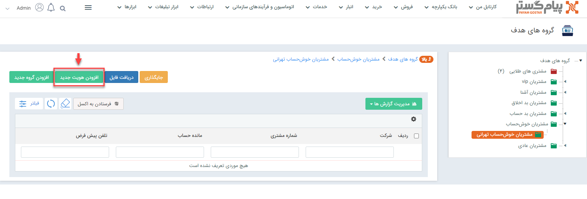
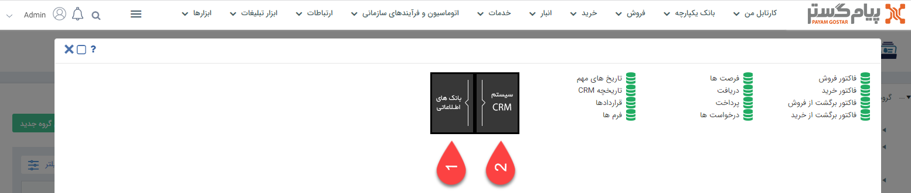
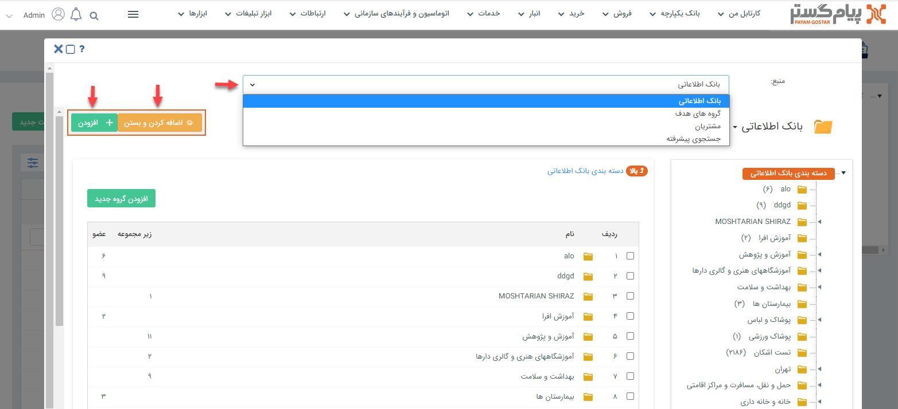

# اضافه کردن عضو (هویت) به گروه هدف
به‌منظور عضو‌دهی و اضافه کردن هویت به گروه هدف‌تان می‌بایست به صفحه‌ی گروه هدف موردنظرتان بروید و بر روی دکمه **افزودن هویت جدید** کلیک کنید.

در مرحله‌ی بعدی یک پنجره باز می‌شود که آیکون‌های آن، امکان استفاده از **بانک اطلاعاتی** و **آیتم‌هایCRM** برای اضافه کردن هویت‌های مختلف به گروه هدف موردنظرتان را برای شما فراهم می‌کند.

1)  شما از این قسمت می‌توانید از هویت‌های حقیقی و حقوقی ثبت شده در **بانک اطلاعات یکپارچه** برای عضو دادن به گروه هدف‌تان استفاده کنید. 
2) شما با کمک گرفتن از گزینه‌های این آیکون می‌توانید از آیتم‌های مختلف **سیستم CRM** برای اضافه کردن اعضا به گروه هدف‌تان استفاده کنید؛ به‌طور مثال مشتریانی که تمامی پرداخت‌های آن‌ها نقدی بوده یا هیچ‌گونه بدهی به شما ندارند را در گروه هدف *مشتریان خوش‌حساب* اضافه کنید. 
اگر از آیکون بانک‌‌‌های اطلاعاتی برای اضافه کردن هویت به گروه هدف‌تان استفاده کنید و بر روی **درج از بانک یکپارچه پیام‌گستر** کلیک نمایید، یک صفحه برایتان باز می‌شود که می‌توانید از فیلد منبع (با باز کردن لیست کشویی) از بانک اطلاعاتی، اطلاعات سایر گروه‌های هدف، مشتریان و در نهایت با کمک گرفتن از جستجوی پیشرفته و فیلتر کردن روی اطلاعات خاص مدنظرتان برای گروه هدف خود، عضو انتخاب کنید. شما می‌توانید بعد از تیک زدن هویت مدنظرتان  بر روی دکمه **اضافه کردن و بستن** کلیک کنید  تا پس از اضافه شدن هویت، اتوماتیک از صفحه خارج شوید و به صفحه گروه هدف برگردید یا با کلیک بر روی **افزودن** بعد از این که هویت را به گروه هدف‌تان اضافه کردید همچنان در همان صفحه بمانید و مجدد سایر هویت‌های مدنظرتان را بتوانید انتخاب کنید.

> باید به این نکته توجه داشته باشید که هنگام اضافه کردن هویت‌های مختلف  به گروه هدف، می‌بایست مشخص کنید که اگر در بین آن‌ها هویت حقوقی (شرکت) بود فقط آن هویت حقوقی به گروه هدف اضافه شود یا افرادی که در آن شرکت دارای سمت هستند و اطلاعات‌شان در پروفایل شرکت ثبت شده (همه‌ی پرسنل، مدیرعامل، رئیس هیات مدیره، مدیر فروش و کارمند) به گروه هدف شما اضافه شوند. 

> یکی از راه‌های دیگری که شما می‌توانید  از آن طریق هویت‌های مختلف را به گروه هدف‌تان اضافه کنید این است که به صفحه لیست مربوط به آن هویت‌ بروید و با کلیک‌راست روی نام آن و  انتخاب گزینه‌ی **اضافه به گروه**، آن‌را به هر گروه یا زیرگروه هدفی که می‌خواهید اختصاص دهید. 
> از روش‌های دیگر اضافه کردن هویت و عضو به گروه هدف این است که شما از بانک اطلاعاتی به صفحه پروفایل هویتی که قصد دارید آن را به گروه هدف‌تان اضافه کنید، بروید و از تب بالا به ترتیب روی گزینه‌های  **مشخصات**>**شروع ارتباط توسط**>**گروه‌های مرتبط** کلیک کنید و از آن‌جا نام گروه هدف مدنظرتان را انتخاب کنید.