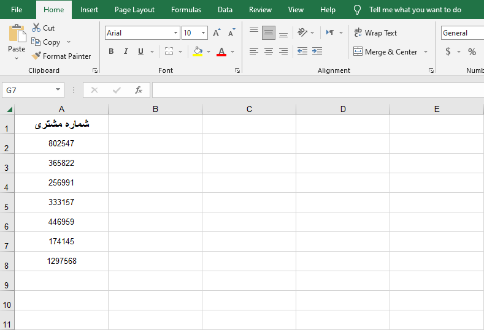
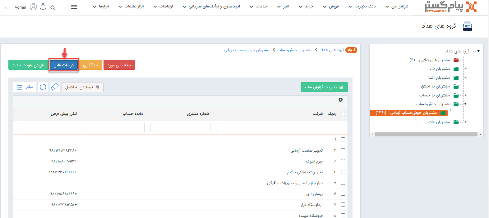
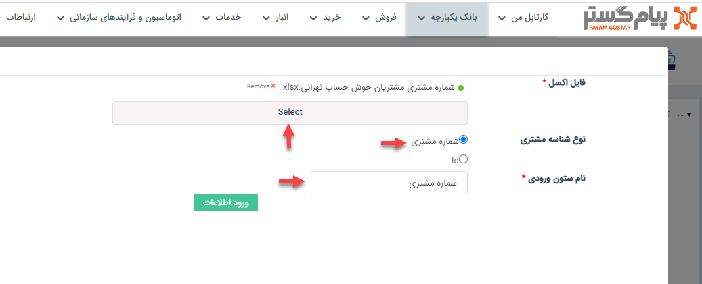

# اضافه کردن عضو به گروه هدف از طریق اکسل
یکی از راه‌هایی که می‌توان به **گروه هدف** عضو اضافه کرد، اکسل (Excel) است. این روش زمانی کارایی خود را نشان خواهد داد که ما بخواهیم تعداد اعضای زیادی را 
 به‌یک‌باره به گروه اضافه کنیم و محدودیت زمانی‌، امکان دستی انجام دادن این کار را از ما بگیرد. 
برای این منظور می‌بایست در یک فایل اکسل یک ستون را با **شماره مشتری** و یا **ID** پر کنیم. 
**شماره مشتری**: شماره‌ای است منحصر‌به‌فرد برای هر یک از مشتریان (چه حقیقی و چه حقوقی) که  فیلد آن در صفحه پروفایل  هر  مشتری موجود است. 
**شناسهID**: ‌هر هویت دارای شناسه‌ی هویت است که شما می‌توانید با خروجی اکسل گرفتن از هویت‌ها در بانک اطلاعاتی به مقدار آن دسترسی پیدا کنید. این مقدار در خروجی اکسل با سرستون **شناسه** مشخص شده است. 
برای مثال در ادامه یک نمونه اکسل از شماره‌ی مشتری برخی از خریداران خوش‌حساب تهرانی که می‌خواهیم از طریق اکسل آن‌ها را به زیرگروه هدف **مشتریان خوش‌حساب تهرانی** اضافه کنیم، آورده شده است.

در گام بعدی می‌بایست به صفحه‌ی مربوط به گروه هدف برویم و بر روی گزینه‌ی **دریافت فایل** کلیک کنیم.

در این مرحله پنجره‌ای برای شما باز می‌شود که می‌بایست اکسلی را که پیش‌تر آماده کرده بودید را از قسمت **Select**  انتخاب کنید. در قسمت بعدی مشخص می‌کنید که در اکسل‌تان از کدام نوع شناسه مشتری استفاده کرده‌اید و در فیلد نام ستون ورودی نیز باید عنوان سرستونی که در اکسل مقداردهی کردید را دقیقا یادداشت کنید؛ در این نمونه که برای مثال بیان شده، نام ستون ورودی می‌بایست **شماره مشتری** درج شود.

در نهایت با زدن دکمه **ورود اطلاعات**، هویت‌هایی که شماره مشتری آن‌ها در اکسل آورده شده بود، به زیرگروه هدف دلخواه شما اضافه می‌شود.
