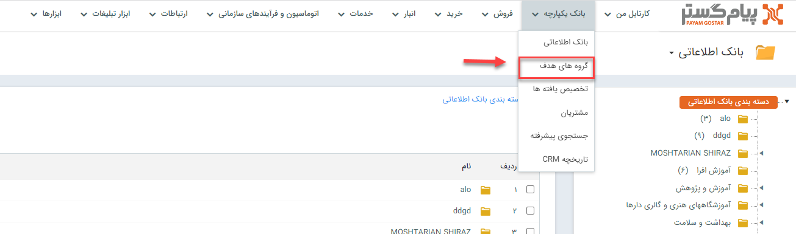
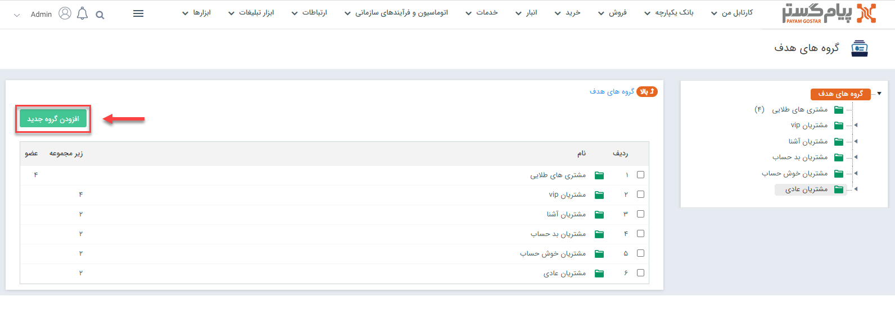
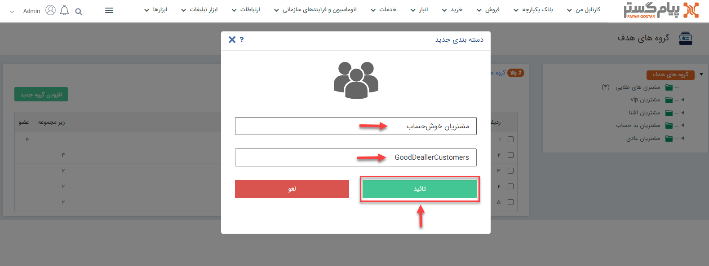
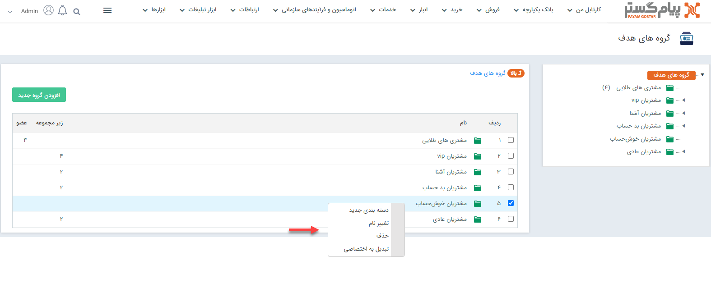
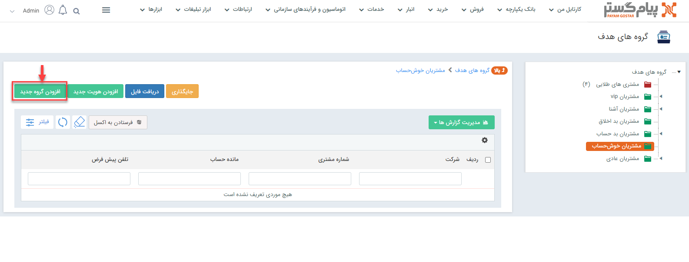
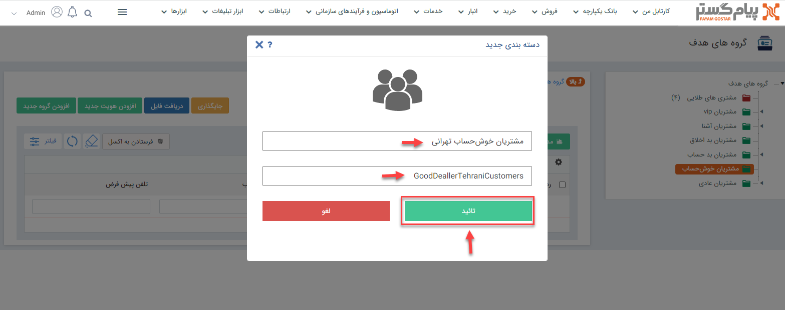
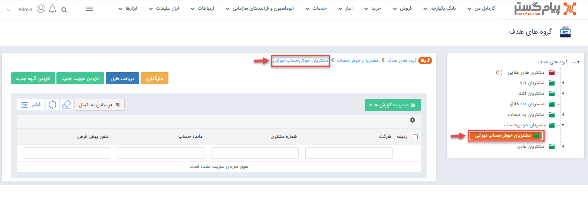

# ساخت گروه هدف جدید
منظور از ایجاد یک گروه تحت‌عنوان **گروه هدف** این است که تعدادی از هویت‌های ثبت شده در نرم‌افزار را به روشی دلخواه دسته‌بندی کنید تا بتوانید از آن برای اهداف مختلف که در آینده خواهید داشت، استفاده نمایید. شاید یک مجموعه‌ای بخواهد همه‌ی مشتریان خوش‌حساب (Favorite) خودش را در یک گروه دسته‌بندی کند تا در آینده برایشان درصد تخفیف ویژه و یا یک هدیه‌ در نظر بگیرد، برای این منظور می‌تواند گروه هدف *مشتریان خوش‌حساب* را ایجاد کند و هویت‌های مدنظرش را به آن اضافه نماید. از گروه‌های هدف می‌شود در پیگیری بازاریابی فروش، تبلیغات، گزارشات و فرآیندهای کاری نیز استفاده کرد.  
‌برای ایجاد گروه هدف ابتدا باید از نوار بالای نرم‌افزار، بر روی گزینه‌‌های **بانک یکپارچه**>**گروه‌های هدف** کلیک کنید. 

 

حالا بر روی گزینه‌ی **افزودن گروه جدید** کلیک کنید. 

 

 در پنجره‌ی باز شده می‌بایست **نام** و **کلید کاربر** گروه جامعه هدف‌تان را وارد کرده و در نهایت بر روی دکمه **تایید** کلیک نمایید. 
 > **نکته** 
 > **کلید کاربر** فیلدی است که از آن برای ارتباط با وب سرویس استفاده می‌شود. این فیلد حتما می‌بایست با حروف لاتین شروع شود و می‌توان در مقداردهی آن از اعداد هم کمک گرفت ولی به‌هیچ‌عنوان به‌کارگیری از حروف فارسی در آن امکان‌پذیر نیست. 
 > پیشنهاد ما به شما برای پر کردن فیلد کلید کاربر، استفاده از روش Camel Case است. در این روش نگارشی فاصله بین کلمات حذف شده و برای جداسازی واژگان از یکدیگر، حرف اول هر واژه با حروف بزرگ نوشته می‌شود.

 

در این مرحله نام گروه هدف‌تان (به‌طور مثال: مشتریان خوش‌حساب) در لیست مربوطه اضافه شده است. شما می‌توانید با کلیک‌راست روی هر گروه، برایش دسته‌بندی جدید (زیرگروه) ایجاد کنید، نامش را تغییر دهید، آن را به‌کل حذف نمایید (در صورتی که گروه هدف شما دسته‌بندی داشته باشد ابتدا باید زیرگروه‌های آن را حذف کنید) و یا به گروه اختصاصی برای خود (اگر قبلا آن را برای خود اختصاصی کرده باشید، می‌توانید به عمومی) تغییر دهید. 

> **نکته** 
>  لازم به ذکر است که اگر کاربر گروه هدفی را برای خود اختصاصی کند، دیگر فقط خودش می‌تواند اطلاعات گروه مذکور را ببینید، البته مدیر سیستم و مدیر بانک اطلاعاتی، از این مورد مستثنی هستند (آن‌ها به اطلاعات کلیه گروه‌ها اعم از عمومی و اختصاصی دسترسی دارند). 
> کاربران می‌بایست به این نکته هم توجه داشته باشند که لازمه‌ی اختصاصی کردن یک گروه هدف این است که گروه مذکور قبلا توسط خود کاربر ایجاد شده باشد و یا مجوز این کار توسط مدیر سیستم  یا مدیر بانک اطلاعاتی به کاربر داده شده باشد. 

در صورتی که بخواهید برای گروه هدف‌تان یک زیرگروه (زیرشاخه/ساب‌گروپ) ایجاد کنید، می‌توانید  در صفحه‌ی گروه هدف‌تان، از گزینه‌ی افزودن گروه جدید استفاده کنید. به‌طور مثال یک مجموعه می‌خواهد گروه هدف مشتریان خوش‌حساب خود را با توجه به شهری که مشتریان در آن ساکن هستند تقسیم‌بندی کند؛ برای این منظور می‌بایست بعد از ایجاد گروه هدف مشتریان خوش‌حساب، چندین زیرگروه به تفکیک شهر یا استان ایجاد نماید مثلا زیرگروه مشتریان خوش‌حساب تهرانی، زیرگروه مشتریان خوش‌حساب یزدی و... 

در این مرحله نام و کلید کاربر زیرگروه هدف‌تان را وارد کرده و گزینه تایید را کلیک می‌کنید.

حال برای گروه هدف **مشتریان خوش‌حساب**، یک زیرگروه به‌نام **مشتریان خوش‌حساب تهرانی** دارید که می‌توانید به آن عضو اضافه کنید.

