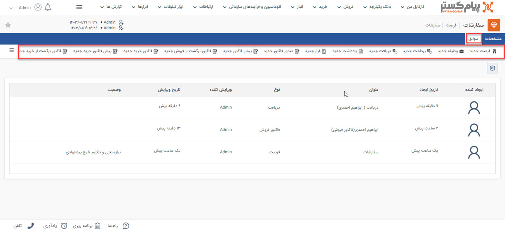

# سوابق هر فرصت
چنانچه پیش‌تر به آن اشاره شد، موجودیت‌های مختلفی (از جمله پیش‌فاکتور، فاکتور، قرارداد، دریافت، قرارملاقات و سایر موارد) می‌توانند به فرصت متصل باشند. این آیتم‌‌ها علاوه بر سوابق هویت، در سوابق فرصتی که به آن متصل  شده‌اند نیز قابل دسترس هستند. برای دسترسی به آن‌ها کافیست وارد صفحه فرصت مورد نظر شوید و بر روی تب سوابق کلیک کنید. 

نوار بالایی تب سوابق فرصت، امکان ثبت سوابق جدید را به شما می‌دهد. سوابقی که از این بخش ثبت شوند، به فرصت مذکور متصل خواهند‌بود. 
چنانچه سوابق متصل شده به فرصت، از آیتم‌های مالی باشد، بر مانده‌ی فرصت تاثیر می‌گذارد. یعنی به ازای مبلغ فاکتور و قراردادهای مالی متصل شده به فرصت به میزان بدهکاری فرصت افزوده می‌شود. به صورت مشابه به میزان مبلغ دریافت‌های متصل شده به فرصت، از میزان بدهکاری مشتری کم و به عبارت دیگر به بستانکاری او اضافه می‌شود. 

> **نکته** 
> اگر یک آیتم مالی، با واسطه به فرصت متصل شود، بر روی مانده‌ی فرصت تاثیر نمی‌گذارد. به عنوان مثال، اگر شما فاکتور را به فرصت خود متصل کنید (از روی فرصت فاکتور صادر کنید) و در مرحله‌ی بعد یک دریافت برای آن فاکتور ثبت کنید، مبلغ دریافتی بر روی مانده‌ی فرصت تاثیر نمی‌گذارد. با اینکه مانده حساب اصلی مشتری در صفحه هویت صحیح است اما مانده‌ی فرصت فقط به میزان فاکتور بدهکاری نمایش می‌دهد. برای اینکه‌ مانده‌ی فرصت درست نمایش داده شود باید دریافت را متصل به فرصت (نه فاکتور) ثبت نمایید. 