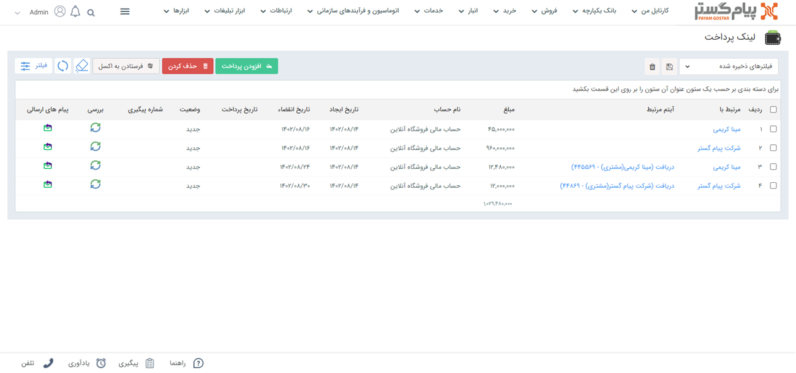
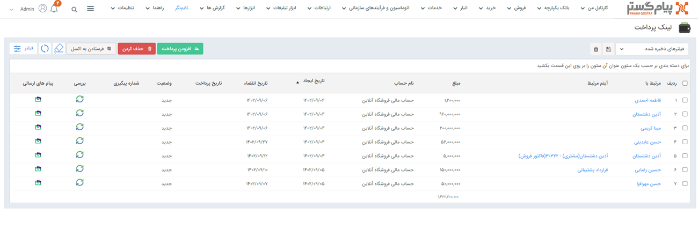
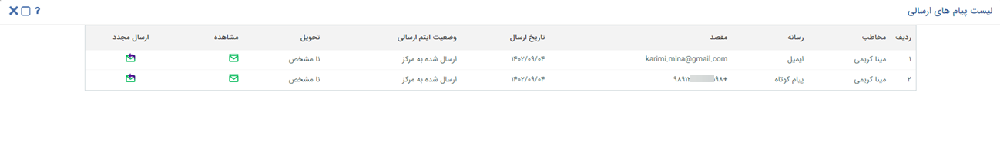
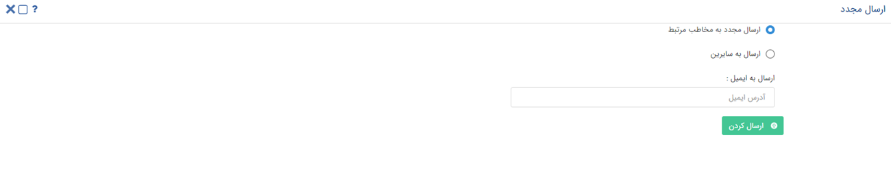

# مشاهده لیست لینک‌های پرداخت 
دراین مقاله مطالب زیر بررسی می‌شود:
- [مشاهده لیست تمامی لینک‌های پرداخت‌](#AllPaymentLinks)
- [مشاهده لینک‌های پرداخت ثبت شده برای یک هویت](#customerPaymentLinks)
- [اطلاعات لینک‌های پرداخت](#PaymentLinksInformation)
(شامل وضعیت لینک‌های ارسالی، پیام‌های ارسال شده و قابلیت ارسال مجدد)

## مشاهده لیست همه لینک‌های پرداخت ارسال شده {#AllPaymentLinks}
برای مشاهده لیست همه لینک‌های پرداخت ثبت شده، از این طریق اقدام نمایید:
- **تب فروش** > **لینک پرداخت**

## مشاهده لیست لینک‌های پرداخت ارسال شده برای یک هویت{#customerPaymentLinks}
برای مشاهده لیست لینک‌های پرداخت ارسال شده برای یک هویت، از این طریق  اقدام نمایید:
-	 صفحه اصلی **پروفایل هویت** > **لینک‌های پرداخت**

>**نکته** 
لینک‌های ارسال شده برای مشتری در **پروفایل مشتری** و قسمت **سوابق**  به صورت پیام (از نوع رسانه‌ی انتخابی برای ارسال لینک) نمایش داده می‌شود. 

## اطلاعات لینک‌های پرداخت{#PaymentLinksInformation}
لیست لینک‌های پرداخت ارسال شده در هر دو حالت (لیست تمامی لینک‌های پرداخت و لیست لینک‌های پرداخت یک هویت) در جدولی مشابه تصویر زیر به شما نمایش داده می‌شود. در این جدول تمامی اطلاعات مورد نیاز در خصوص لینک‌های ارسال شده در دسترس است.

- **مرتبط با:** مخاطبی که لینک پرداخت مرتبط با او ثبت شده است (نه شخصی که پیام برای او ارسال شده) در این قسمت نمایش داده می‌شود.
- **آیتم مرتبط:** چنانچه لینک پرداخت به یکی از آیتم‌های CRM (مثل فاکتور) متصل باشد، آیتم مربوطه در این قسمت نمایش داده می‌شود.
- **مبلغ:** مبلغ تعیین شده در لینک پرداخت در این قسمت قابل مشاهده است.
- **نام حساب:** حسابی که در صورت پرداخت مشتری از طریق لینک،‌ مبلغ به آن واریز می‌شود،‌ در این قسمت درج شده است.
- **تاریخ ایجاد:** تاریخ ایجاد و ارسال لینک را نمایش می‌دهد.
- **تاریخ انقضا:** تاریخ انقضای تنظیم شده در لینک (به هنگام ارسال) را نمایش می‌دهد.
- **تاریخ پرداخت:** در صورت پرداخت شدن وجه از طریق لینک،‌ تاریخ پرداخت در این قسمت نمایش داده می‌شود.
- **وضعیت:** وضعیت پرداخت از طریق لینک در این قسمت نمایش داده می‌شود.
- **شماره پیگیری:** در صورت پرداخت شدن وجه از طریق لینک، شماره‌ی پیگیری پرداخت در این قسمت درج می‌شود.
- **بررسی:** در صورت نیاز به بروزرسانی وضعیت (بررسی مجدد وضعیت پرداخت)‌ بر روی آیکون نمایش داده شده در این ستون کلیک نمایید.
- **پیام‌های ارسالی:** با کلیک بر روی این قسمت، پیام‌های ارسالی حامل لینک به شما نمایش داده می‌شود. اگر برای ارسال لینک از چند رسانه (به عنوان مثال هم پیامک هم ایمیل) استفاده کرده باشید،‌ تمامی پیام‌ها در این قسمت در دسترس است. با کلیک بر روی این آیکون، پیام‌های ارسال‌شده در صفحه‌ای مشابه تصویر زیر به شما نمایش داده می‌شود.

در صفحه لیست پیام‌های ارسالی،‌ اطلاعات زیر قابل رویت است:

- **مخاطب:** در این قسمت نام مخاطب دریافت‌کننده پیام  که حاوی لینک پرداخت است (نه مرتبط با)، نمایش داده می‌شود.
- **رسانه:** نوع رسانه‌ای که پیام از طریق آن ارسال شده است را نشان می‌دهد.
- **مقصد:** با توجه به نوع رسانه، مقصدی که پیام‌ها به آن ارسال شده‌اند را نشان می‌دهد. در مورد پیامک‌ها شماره‌ی موبایل و در مورد ایمیل آدرس ایمل دریافت‌کننده نمایش داده می‌شود.
- **تاریخ ارسال:** تاریخی که پیام‌ها در آن ارسال شده‌اند را نشان می‌دهد.
- **وضعیت آیتم ارسالی:** وضعیت ارسال پیام‌‌ها، در این ستون نمایش داده می‌شود. وضعیت پیام‌ها می‌توانند در حالت‌های در صف ارسال،‌ ارسال شده به مرکز، ارسال شده به مخاطب و یا ارسال ناموفق باشند.
- **تحویل:** وضعیت تحویل پیام‌های ارسالی، در این ستون نمایش داده می‌شود.
- **مشاهده:** برای مشاهده‌ی محتوای پیام‌های ارسالی و لینک پرداخت ایجاد شده بر روی این آیکون کلیک کنید.
- **ارسال مجدد:** برای ارسال مجدد پیام‌های حاوی لینک پرداخت ایجاد شده، بر روی این آیکون کلیک کنید.

 برای ارسال مجدد پیام به گیرنده‌ی قبلی آن، گزینه انتخابی («ارسال مجدد به مخاطب مرتبط») را بدون تغییر باقی گذاشته و بر روی کلید ارسال کلیک نمایید. در صورت تمایل به ارسال پیام به شخص دیگری، حالت ارسال را به گزینه «ارسال به سایرین» تغییر داده و شماره موبایل/آدرس ایمیل (بنا بر نوع پیام) مورد نظر را وارد نمایید. 

