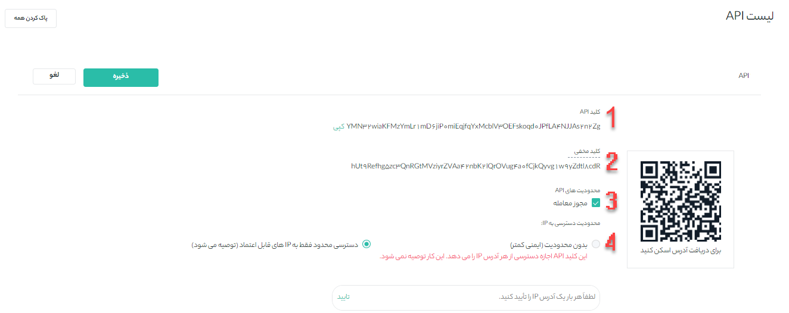
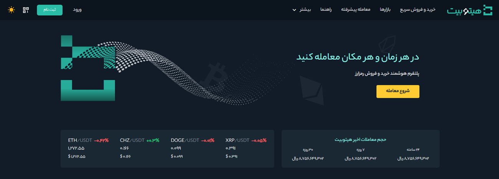

# MD Syntax Guide


**pipe Tables  sample:**


|تعداد | مستندات     | کیفیت       |
|---- | ---- | -----|
|11  |  داک    |12  |
|11   | ویدیو  |   34 |


|تعداد | مستندات     | کیفیت       |
|---- | ---- | -----|
|11  |  داک    |12  |

|سطح کاربری| سقف برداشت ریالی |سقف برداشت رمزارز| سقف واریز ریالی | سقف واریز رمزارز | مدارک احراز هویت|
|----|----|----|----|----|----|
|سطح صفر|0|0|نامحدود|نامحدود| بدون احراز هویت|
|سطح یک|100 میلیون ریال|500 دلار|نامحدود|نامحدود|موبایل به نام کاربری، کد ملی، شماره شبا/کارت، تاریخ تولد، تصویر کارت ملی (در صورت نداشتن کارت ملی صفحه اول شناسنامه) 
|سطح دو|3 میلیارد ریال|10000 دلار|نامحدود|نامحدود|آدرس و کدپستی، تلفن ثابت تأییدشده، عکس سلفی احراز هویت|
|سطح سه|10 میلیارد ریال|40000 دلار|نامحدود|نامحدود|سند قولنامه یا اجاره نامه  یا قبوض محل سکونت (ارائه فایل معتبر برای قبض)، عقد قرارداد حضوری|
|سطح ویژه|توافقی|توافقی|نامحدود|نامحدود|عقد قرارداد حضوری برای شرایط توافق|


|مدارک احراز هویت | سقف واریز رمزارز| سقف واریز ریالی|
|----|----|-----|
|بدون احراز هویت|نامحدود|نامحدود|

**Inline Code   sample:** 

```
SELECT @(this.SELECT(Children.Form.Subject).Order(Children.Form. CreateDate).TakeOrDefault(3,"0"))و(this.Form.Where(Children.number==90&&(Children.poljoin == 30||Children.numfirst==18)).Select(Children.Form.polformat))
```
OR


      SELECT @(this.SELECT(Children.Form.Subject).Order(Children.Form. CreateDate).TakeOrDefault(3,"0"))و(this.Form.Where(Children.number==90&&(Children.poljoin == 30||Children.numfirst==18)).Select(Children.Form.polformat))


**Link to MD File**

[تست لینک به داکیومنت](https://github.com/1stco/PayamGostarDocs/blob/master/Other/Mds/test.md)

**BooKmark link Sample:**

[شاخص های رضایت مشتری](https://github.com/1stco/PayamGostarDocs/blob/master/Other/CRMIndex.md "Index")

[شاخص های رضایت مشتری](https://github.com/1stco/PayamGostarDocs/blob/master/Other/CRMIndex.md#Index)

**Link to Website**

[تست لینک به گوگل](https://www.google.com/)


**Image Relative Address Sample:**


**highlight text sample**

`اپلیکیشن آندروید پیام‌گستر جهت دسترسی به کارتابل‌ها و امکانات سیستم بر روی گوشی ‌های هوشمند`

**Quote Sample with br:**

> **Note**<br>
> Description1<br>
> Description2<br>

**Quote  sample with one >**

> **Note**<br>
 Description

*************************
**Quote Sample with 1 Enter:**
> **Note**
> <br>
> Description

*********************
**Quote Sample with 2 Enter:**
> Description

> Description

********************
**Nested Quote**

> **Note**<br>
>> Description
***********************************
**Quote Sample with Bullets:**
> **Note:**<br>
> - Description <br>
> - Description

********************************
**Quote Sample with Order List:**
> **Note:**<br>
> 1. Description <br>
> 2. Description


**Heading Sample (Without Enter):**

# این شماره را به‌صورت دستی به عدد 1 تغییر دهید. 
## این شماره را به‌صورت دستی به عدد 2 تغییر دهید.
### این شماره را به‌صورت دستی به عدد 3 تغییر دهید. 
#### این شماره را به‌صورت دستی به عدد 4 تغییر دهید. 
##### این شماره را به‌صورت دستی به عدد 5 تغییر دهید. 
###### این شماره را به‌صورت دستی به عدد 6 تغییر دهید. 

**Heading Sample (With Enter):**

# این شماره را به‌صورت دستی به عدد 1 تغییر دهید. 

## این شماره را به‌صورت دستی به عدد 2 تغییر دهید.

### این شماره را به‌صورت دستی به عدد 3 تغییر دهید. 

#### این شماره را به‌صورت دستی به عدد 4 تغییر دهید. 

##### این شماره را به‌صورت دستی به عدد 5 تغییر دهید. 

###### این شماره را به‌صورت دستی به عدد 6 تغییر دهید. 


**Alternate Syntax Heading**

 تیتر 1
 ======
 تیتر 2


**Bold & Italic Sample**

این یک متن **بلد** است.<br>
I just love __bold text__.<br>
این یک متن *ایتالیک* است.<br>
این یک متن _ایتالیک_ است.<br>
ثبت ***مستندات جدید***

**Line space by br tag and Enter**

This is test<br>
This is test
**********************

This is test
This is test
********************
This is test

This is test
*******************
This is test<br>

This is test


**Bullet Smple**

- This is test
- This is test
*******************
- This is test
   - This is test
*******************

**Order List Sample**

1. This is test
2. This is test
3. This is test

**4.**	اکنون API شما ایجاد شده است و طبق مراحل زیر می‌توانید از آن استفاده کنید.
   1. کلید API را کپی و در قسمت موردنظر استفاده کنید.

   **4.**	اکنون API شما ایجاد شده است و طبق مراحل زیر می‌توانید از آن استفاده کنید.



   الف) کلید API را کپی و در قسمت موردنظر استفاده کنید.<br>
   ب) **کلید مخفی خود را یادداشت و در جای مناسب نگه دارید** زیرا دیگر نمایش  داده **نخواهد** شد. این کلید را با کسی به اشتراک نگذارید. اگر کلید مخفی خود را فراموش کردید، باید API را حذف کرده و یک API جدید ایجاد کنید.<br>
   ج) مجوز معامله: در صورت فعال کردن مجوز معامله، فرو می‌توایند از طریق این API معامله انجام دهد.<br>

*******************




- **پشتیبانی آنلاین:** برای مطرح کردن سوالات و مشکلات خود در هر ساعت از شبانه‌روز می‌توانید از طریق پشتیبانی آنلاین با کارشناسان هیتوبیت در ارتباط باشید.
- **تماس تلفنی:** کارشناسان هیتوبیت روزهای شنبه تا پنج‌شنبه از ساعت 9 تا  17 پاسخگوی تماس‌های تلفنی شما هستند.
- **ایمیل:** support@hitobit.com