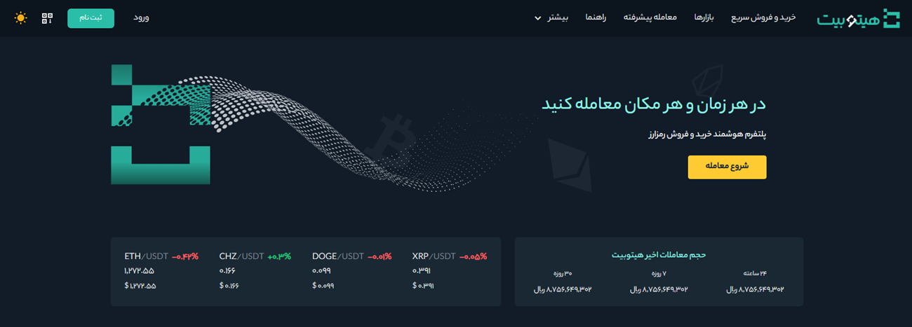

# MD Syntax Guide


**pipe Tables  sample:**


|تعداد | مستندات     | کیفیت       |
|---- | ---- | -----|
|11  |  داک    |12  |
|11   | ویدیو  |   34 |


**Inline Code   sample:** 

```
SELECT @(this.SELECT(Children.Form.Subject).Order(Children.Form. CreateDate).TakeOrDefault(3,"0"))و(this.Form.Where(Children.number==90&&(Children.poljoin == 30||Children.numfirst==18)).Select(Children.Form.polformat))
```
OR


      SELECT @(this.SELECT(Children.Form.Subject).Order(Children.Form. CreateDate).TakeOrDefault(3,"0"))و(this.Form.Where(Children.number==90&&(Children.poljoin == 30||Children.numfirst==18)).Select(Children.Form.polformat))


**Link to MD File**

[تست لینک به داکیومنت](https://github.com/1stco/PayamGostarDocs/blob/master/Other/Mds/test.md)

**BooKmark link Sample:**

[شاخص های رضایت مشتری](https://github.com/1stco/PayamGostarDocs/blob/master/Other/CRMIndex.md "Index")

[شاخص های رضایت مشتری](https://github.com/1stco/PayamGostarDocs/blob/master/Other/CRMIndex.md#Index)

**Link to Website**

[تست لینک به گوگل](https://www.google.com/)


**Image Relative Address Sample:**


**highlight text sample**

`اپلیکیشن آندروید پیام‌گستر جهت دسترسی به کارتابل‌ها و امکانات سیستم بر روی گوشی ‌های هوشمند`

**Quote Sample with br:**

> **Note**<br>
> Description

*************************
**Quote Sample with 1 Enter:**
> **Note**
> <br>
> Description

*********************
**Quote Sample with 2 Enter:**
> Description

> Description

********************
**Nested Quote**

> **Note**<br>
>> Description
***********************************
**Quote Sample with Bullets:**
> **Note:**<br>
>  Description <br>
>  Description


**Heading Sample (Without Enter):**

# این شماره را به‌صورت دستی به عدد 1 تغییر دهید. 
## این شماره را به‌صورت دستی به عدد 2 تغییر دهید.
### این شماره را به‌صورت دستی به عدد 3 تغییر دهید. 
#### این شماره را به‌صورت دستی به عدد 4 تغییر دهید. 
##### این شماره را به‌صورت دستی به عدد 5 تغییر دهید. 
###### این شماره را به‌صورت دستی به عدد 6 تغییر دهید. 

**Heading Sample (With Enter):**

# این شماره را به‌صورت دستی به عدد 1 تغییر دهید. 

## این شماره را به‌صورت دستی به عدد 2 تغییر دهید.

### این شماره را به‌صورت دستی به عدد 3 تغییر دهید. 

#### این شماره را به‌صورت دستی به عدد 4 تغییر دهید. 

##### این شماره را به‌صورت دستی به عدد 5 تغییر دهید. 

###### این شماره را به‌صورت دستی به عدد 6 تغییر دهید. 


**Alternate Syntax Heading**

 تیتر 1
 ======
 تیتر 2


**Bold & Italic Sample**

این یک متن **بلد** است.<br>
I just love __bold text__.<br>
این یک متن *ایتالیک* است.<br>
این یک متن _ایتالیک_ است.<br>
ثبت ***مستندات جدید***

**Line space by br tag and Enter**

This is test<br>
This is test
**********************

This is test
This is test
********************
This is test

This is test
*******************
This is test<br>

This is test


**Bullet Smple**

- This is test
- This is test
*******************
- This is test
   - This is test
*******************

**Order List Sample**

1. This is test
2. This is test
3. This is test

**4.**	اکنون API شما ایجاد شده است و طبق مراحل زیر می‌توانید از آن استفاده کنید.
   1. کلید API را کپی و در قسمت موردنظر استفاده کنید.

   **4.**	اکنون API شما ایجاد شده است و طبق مراحل زیر می‌توانید از آن استفاده کنید.


   الف) کلید API را کپی و در قسمت موردنظر استفاده کنید.<br>
   ب) **کلید مخفی خود را یادداشت و در جای مناسب نگه دارید** زیرا دیگر نمایش  داده **نخواهد** شد. این کلید را با کسی به اشتراک نگذارید. اگر کلید مخفی خود را فراموش کردید، باید API را حذف کرده و یک API جدید ایجاد کنید.<br>
   ج) مجوز معامله: در صورت فعال کردن مجوز معامله، فرو می‌توایند از طریق این API معامله انجام دهد.<br>

*******************




# بازیابی رمز عبور حساب کاربری

شما می‌توانید در صورت فراموشی رمز عبور حساب خود، آن را از طریق وب‌سایت بازیابی کنید.<br>
> **توجه** <br>به دلایل امنیتی، برداشت از حساب به مدت 24 ساعت پس از بازیابی رمز عبور معلق خواهد شد.

**1.** به سایت هیتوبیت بروید و بر روی **[ورود]** کلیک کنید تا وارد حساب کاربریتان شوید.
<br>
## مرحله دوم: احراز هویت
برای شروع و افزایش سقف واریز و برداشت، لازم است احراز هویت خود را تکمیل کنید. این مرحله شامل تأیید اطلاعات اولیه حساب شما، بارگذاری مدارک شناسایی و یک عکس سلفی است.
لازم به ذکر است اطلاعات حساب کاربری شما در هیتوبیت محفوظ است، با این حال نیاز است پیشنهادات مطرح‌شده برای افزایش   [امنیت حساب](https://github.com/HitoBitCo/FAQDocs/blob/main/Security/SequrityTips/SecuringHitobitAccount.md) را انجام دهید تا حساب شما در برابر هرگونه کلاهبرداری ایمن شود.
## مرحله 3: شارژ حساب از طریق ریال یا رمزارز

# API چیست؟
API  (Application Programming Interface) به معنای «رابط برنامه‌نویسی اپلیکیشن» است. «اپلیکیشن» در API به هر نرم‌افزاری با عملکرد مشخص اشاره می‌کند. رابط نیز به‌عنوان قرارداد خدمات بین دو نرم‌افزار در نظر گرفته می‌شود. این قرارداد نحوه برقراری ارتباط بین دو نرم‌افزار را با استفاده از درخواست و پاسخ تعریف می‌کند.<br>
API امکان ارتباط نرم‌افزارها را با یکدیگر فراهم می‌کند. همچنین یک راه امن و استاندارد برای اپلیکیشن‌ها ایجاد می‌کند تا بتوانند با یکدیگر کار کنند و اطلاعات یا عملکرد درخواست‌شده را بدون مداخله کاربر ارائه دهند.
در واقع API قطعه کدی است که به دو برنامه این امکان را می‌دهد تا اطلاعات خود را با یکدیگر به اشتراک بگذارند. API در هر جایی که بخش‌های مختلف نرم‌افزارها نیاز به تعامل دارند وجود دارد. برای مثال یک بلاک چین، APIهای رایگانی ارائه می‌کند که به توسعه‌دهندگان این امکان را می‌دهد تا به پردازش تراکنش‌های بیت کوین، سرویس‌های کیف پول، داده‌های تراکنش و داده‌های بازار جهت استفاده در وب‌سایت‌ها و اپلیکیشن‌ها دسترسی داشته باشند.<br>
## API چگونه کار می‌کند؟
API مجموعه‌ای از تعاریف و پروتکل‌ها است که به بخش‌های مختلف نرم‌افزار این امکان را می‌دهد تا با استفاده از مجموعه‌ای از دستورات ساده با یکدیگر تعامل برقرار کنند. در واقع API به‌شکل یک پیام‌رسان عمل می‌کند، درخواست یک برنامه را به برنامه دیگر می‌دهد و به‌صورت بلادرنگ یک پاسخ دریافت می‌کند.<br>
اگر سرور بتواند درخواست کلاینت را انجام دهد، API منبع موردنیاز کلاینت یا یک کد وضعیت را بازمی‌گرداند و مأموریت با موفقیت انجام می‌شود، در غیر این صورت API یک پیغام خطا ارسال می‌کند.
## API در صرافی‌های ارز دیجیتال
با رشد بازار رمزارزها شرکت‌های فعال در این حوزه، سرویس‌ها و نرم‌افزارهای بیشتری ارائه می‌دهند تا به کاربران کمک کنند از معاملات خود بیشترین دریافتی را داشته باشند. برای استفاده از این سرویس‌ها نیاز است مجوز دسترسی به یک برنامه شخص ثالث را از طریق یک کلید API به حساب کاربری شخصی خود بدهید. به همین دلیل یکی از بخش‌های مهم در معاملات ارزهای دیجیتال، API ارز دیجیتال است. این API ارتباط با صرافی، دسترسی به داده‌های بازار و مدیریت حساب را امکان‌پذیر می‌کند و موجب سهولت در انجام معاملات می‌شود.<br>
APIهای قیمت و خریدوفروش، دو API‌ پرکاربرد ارز دیجیتال هستند. از آنجا که انتقال سریع اطلاعات در صرافی‌ها اهمیت دارد، آنها با استفاده از API قیمت، داده‌های مربوط به قیمت کنونی و گذشته را به‌شکل لحظه‌ای ارائه می‌دهند. به این ترتیب داده‌های مربوط به قیمت بدون تأخیر به کاربر نمایش داده می‌شود. با API خرید و فروش نیز میتوان از طریق پلتفرم‌های واسطه ترید کرد.<br>
حفظ امنیت در صرافی‌های ارزهای دیجیتال نیز اهمیت زیادی دارد و API به‌شکل یک لایه امنیتی از دارایی شما محافظت می‌کند.<br>
## نحوه استفاده از API
افراد در جایگاه‌های مختلفی می‌توانند از API استفاده کنند. برای مثال شما به‌عنوان یک توسعه‌دهنده برنامه‌های رمزارز، معامله‌گر یا کاربر فعال در دنیای رمزارزها می‌توانید API را مورد استفاده قرار دهید.<br>
برای استفاده از API ابتدا باید یک کلید در آن ایجاد کنید. کلید API مانند یک سیستم نام کاربری و رمزعبور پیچیده است که از کلید، عبارت عبور و رمز API تشکیل شده است و به برنامه‌های دیگر این امکان را می‌دهد که با صرافی یا کیف پول ارتباط برقرار کنند.<br>
در مرحله بعدی باید مجوزها تعیین شوند. مجوزها سطوح دسترسی هستند که شما به کلید  API و در نتیجه به برنامه شخص ثالث می‌دهید. در نتیجه انتخاب مجوزهای خاص، دسترسی متفاوتی را به حساب کاربری شما می‌دهد. بنابراین پیش از ایجاد کلیدAPI ، دقیقاً بدانید چه نوع دسترسی را انتخاب می‌کنید. برای توضیحات بیشتر نحوه ایجاد API را مطالعه کنید.