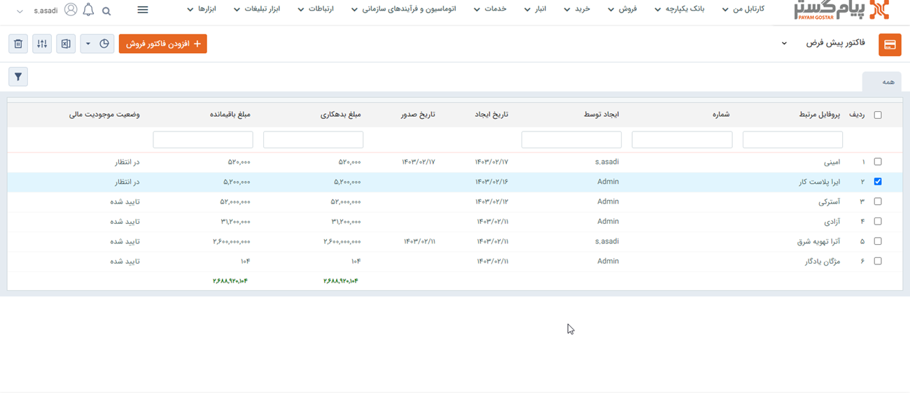

- **مبداء:** این فیلتر برای تراکنش‌های از نوع انتقال بین انباری (تراکنش‌هایی که در آن انبار فعلی به عنوان انبار مقصد انتخاب شده است) کاربرد دارد. می‌توان انبار مبدا مورد نظر را انتخاب کرد و تراکنش‌های بین انباری بین انبار مبدا و انبار فعلی را مشاهده کرد.
- **مقصد:** این فیلتر برای تراکنش‌های از نوع انتقال بین انباری (تراکنش‌هایی که در آن انبار فعلی به عنوان انبار مبداء انتخاب شده است) کاربرد دارد. می‌توان انبار مقصد مورد نظر را انتخاب کرد و تراکنش‌های بین انباری، انبار مقصد و انبار فعلی را مشاهده کرد .
- **شماره:** شماره یا بخشی از شماره تراکنش(های) انبار مورد نظر را می‌توان فیلتر نمود .
- **نوع تراکنش انبار:** تراکنش‌های انبار به سه نوع رسید موجودی اولیه، رسید انبار و حواله انبار تقسیم می‌شوند. نوع تراکنش مورد نظر خود را مشخص کنید.
- **زیرنوع تراکنش انبار:** پس از انتخاب نوع تراکنش انبار در مرحله قبل، می‌توانید زیرنوع تراکنش مورد نظر خود را نیز انتخاب کنید.(رسید انبار سه زیر نوع و حواله انبار چهار زیرنوع دارد)
- **سریال:** سریال یا بخشی از سریال تراکنش(های) انبار مورد نظر را می‌توان فیلتر نمود.
- **وضعیت:** وضعیت تایید، رد و قیمت‌گذاری تراکنش(های)انبار مورد نظر خود را می‌توانید مشخص کنید.
- **بازه تایید:** می‌توانید یک حد پایین و بالا برای تاریخ تایید تراکنش‌های انبار مورد نظر خود تعیین کنید.
- **تاییدکننده:** می‌توانید کاربر تایید کننده تراکنش‌های انبار مورد نظر را فیلتر کنید .
- **فیلدهای تراکنش انبار:** در این قسمت می‌توانید یکی از زیرنوع‌های تراکنش انبار تعریف شده در شخصی سازی را فیلتر کنید. همچنین می‌توانید با استفاده از دکمه فیلتر موجود در این فیلد، پس از انتخاب یکی از زیرنوع‌های تراکنش انبار، روی فیلدهای اضافه شده به آن نیز فیلتر مورد نظر خود را اعمال کنید.
- **تگ‌ها:** می‌توانید آیتم‌ها را بر اساس تگ‌های درج شده روی آن‌ها جستجو کنید.
- **تحویل دهنده:** تحویل دهنده تراکنش انبار مورد نظر خود که می‌تواند یک کاربر، یک هویت از بانک اطلاعاتی یا یک شخص/شرکت متفرقه باشد را مشخص کنید.
- **تحویل گیرنده:** تحویل گیرنده تراکنش انبار مورد نظر خود که می‌تواند یک کاربر، یک هویت از بانک اطلاعاتی یا یک شخص/شرکت متفرقه باشد را مشخص کنید.
- **مدیریت گزارش‌ها:**  با استفاده از این بخش می‌توان از لیست تراکنش‌های انبار با توجه به فیلتر‌های اعمال شده، گزارش گیری کرد. برای توضیحات بیشتر می‌توانید به بخش[ گزارش ساز جدید ](https://github.com/1stco/PayamGostarDocs/blob/master/Help/Management-and-reports/Report-Builder/Report-Builder.md)مراجعه کنید.

