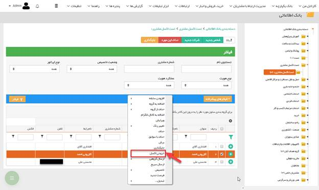
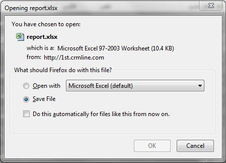

# خروجی اکسل        

**خروجی اکسل**

برای گرفتن خروجی از اطلاعاتی که خود در نرم افزار وارد نموده اید ، کافیستبه دسته بندی مورد نظروارد شده و اطلاعاتی را که می خواهید از آن ها خروجی تهیه نمایید انتخاب کنید. سپس با کلیک راست و انتخاب گزینه خروجی اکسل، فایل خروجی را تهیه نمایید.

نکته: تنها کاربران دارای مجوز مدیر بانک اطلاعاتی و یا مدیر سیستم قابلیت خروجی گرفتن از اطلاعات را دارا هستند.

نکته: خروجی گرفتن از فیلدهای مشخصات اضافه شده تنها از انواع: متن، تاریخ شمسی، تاریخ میلادی، لیست وچک باکس امکان پذیر است.

نکته: امکان خروجی گرفتن از همه پرسنل شرکت ها در خروجی اکسل وجود ندارد و تنها اطلاعات مدیر و رابط نمایش داده می شود.

نکته: امکان خروجی گرفتن از بانک فهرست مشاغل اول که توسط نرم افزار ارائه می شود، وجود ندارد.

نکته: در خروجی اکسل از هویت های حقیقی، نام شرکت هایی که در آنها فعالیت دارند نمایش داده می شود.

با زدن دکمه خروجی اکسل، باید مسیر ذخیره فایلExcel را مشخص نمایید.

