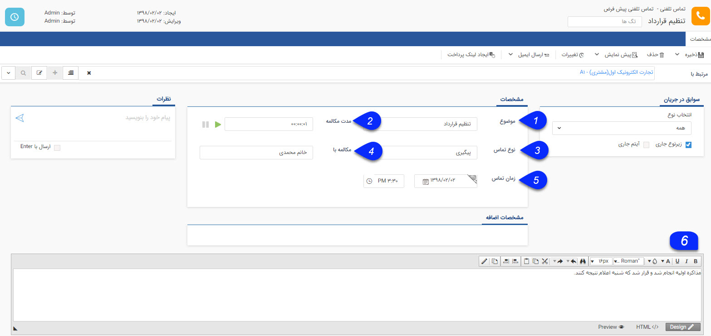

# تماس تلفنی جدید      

**تماس تلفنی جدید**

زمانی که با یک مشتری تماس حاصل می نمایید و یا مشتری با شما تماس می گیرد می توانید مکالمات را ثبت نمایید تا تاریخچه ای از زمان های تماس مشتری و مکالمات صورت گرفته، ایجاد شود. در مدیریت سوابق مخاطبان این آیتم از جایگاه ویژه ای برخوردار است.

نکته مهم: لطفا ابتدا قسمت [اطلاعات مشترک سوابق](Backgroundscommoninfo.md) را مطالعه کنید.

 

1\. موضوع: ابتدا موضوع تماس مشتری را ثبت نمایید

2\. نوع تماس: نوع تماس را با توجه به فعالیت شرکت و بخش های مختلف شرکت ( [مدیریت آیتم ها](../../../BaseInformatio/SystemsItemsManagement.md) ) اضافه نمایید.

3\. مدت مکالمه: شما می توانید مدت زمان مکالمه را نیز با انتخاب گزینه سبز رنگ Play در ابتدای تماس و انتخاب گزینه توقف در پایان تماس ثبت نمایید.

نکته: در صورتی که از پنجره تماس در نرم افزار استفاده می کنید. نیازی به پر کردن این فیلد نیست.

4\.  مکالمه با: نام شخصی که مکالمه با آن صورت گرفته شده را نیز می توانید وارد نمایید .

5\. زمان: تاریخ تماس به صورت خودکار، تاریخ همان روز را نمایش می دهد.

6\. خلاصه ای از مکالماتی که با مخاطب صورت گرفته است را در این قسمت یادداشت نمایید.

نکته: برای اطلاعات در خصوص پنجره تماس تلفنی به قسمت [نمایش پنجره تماس تلفنی](../../../Windows/CIDWindow.md) مراجعه کنید.