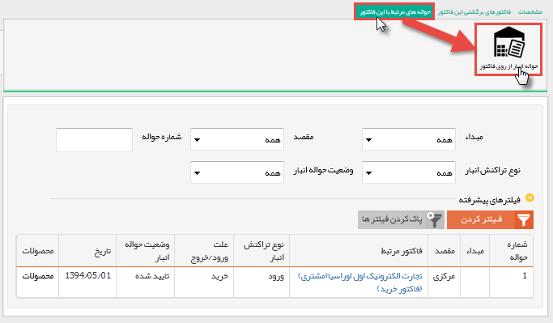

# حواله انبار    

**حواله انبار**

در صورتی که ماژول انبارداری پیشرفته فعال باشد، می تواند برای محصولات موجود در یک فاکتور چندین حواله انبار صادر کرد.

نکته مهم: لطفا ابتدا قسمت [اطلاعات مشترک سوابق](Backgroundscommoninfo.md) را مطالعه کنید.

نکته: در حالتی که اقلام کالاهایی که از انبار باید خارج شوند را در تب مشخصات فاکتور تعیین نکرده باشید، از این قسمت می توانید آنها را مشخص کنید.

نکته: در خصوصی که در قسمت [مدیریت فاکتورها](../../../../Setting/Personalizing/FactorsManagement.md) صدور حواله خودکار فعال شده باشد، پس از تایید هر فاکتور یک حواله خروج به تعداد کالاهای موجود در آن صادر می گردد.

