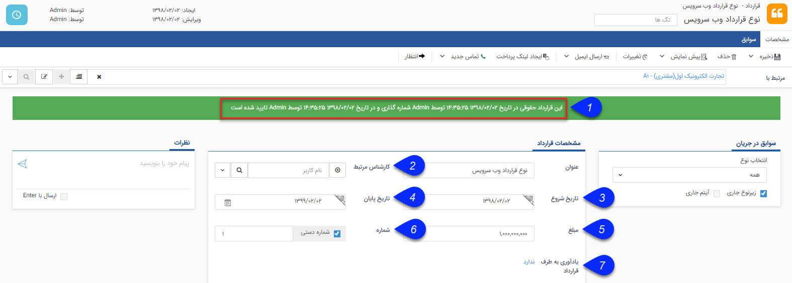

# قرارداد جدید    

 **** 

**قرارداد جدید**

بعد از تعریف یک قرارداد جدید در قسمت تنظیمات، مدیریت قراردادها ( [راهنمای تنظیم قرارداد جدید](../../Setting/ContractManagement.md) )، می توانید برای پروفایل های مختلف موجود در نرم افزار پیام گستر، این قرارداد را تنظیم و ذخیره و چاپ نمایید. کافی است پروفایل مورد نظر را باز نمایید و در سربرگ سوابق یا قراردادها روی دکمه قرارداد جدید کلیک کنید. قراردادهای تعریف شده در نرم افزار پیام گستر می توانند قرارداد مالی یا قرارداد حقوقی باشند. مبلغ وارد شده در قراردادهای مالی مشتری را بدهکار می کنند و این مبلغ در سوابق مالی مشتری لحاظ خواهد شد، اما در قراردادهای حقوقی اینگونه نیست.

نکته مهم: لطفا ابتدا قسمت [اطلاعات مشترک سوابق](Backgroundscommoninfo.md) را مطالعه کنید.

۱. **وضعیت تایید و شماره گذاری:** در صورتی که در شخصی سازی آیتم های دارای قابلیت تایید و شماره گذاری (پیش فاکتور، فاکتور، دریافت/پرداخت و قرارداد) چک باکس های "نیاز به تایید دارد" و "نیاز به شماره گذاری دارد" غیر فعال باشند، پس از ذخیره آیتم، شماره گذاری و تایید به صورت خودکار انجام خواهد شد، اما اگر هرکدام از این چک باکس ها فعال باشند، پس از ذخیره آیتم باید توسط کاربران دارای مجوز، تایید و شماره گذاری شوند. در این قسمت می توانید وضعیت تایید و شماره گذاری این آیتم را مشاهده کنید. توجه داشته باشید که پس از تایید قرارداد، مبلغ آن در محاسبات مالی نرم افزار حساب می گردد و امضای تعریف شده نیز در قالب چاپ این قرارداد ظاهر می شود.

۲ . **کارشناس مرتبط**: می توانید کارشناس مرتبط با این قرارداد را تعیین کنید.

۳ . **تاریخ شروع** : تاریخ شروع قرارداد را تعیین کنید.

۴. **تاریخ پایان** : تاریخ انقضای قرار داد را تعیین کنید.

۵.  **مبلغ**: مبلغ قرارداد را تعیین کنید. در صورتی که در تنظیم قرار داد گزینه قرار داد مالی را فعال کرده باشید، ارزش مالی این قرارداد در حساب مالی مخاطب تاثیر داده خواهد شد. (به قسمت  [مدیریت قراردادها](../../../Setting/Personalizing/ContractManagement.md) مراجعه کنید.)

۶. **شماره**: شماره قرارداد به صورت خودکار نمایش داده می شود و در صورت نیاز می توانید آن را عوض کنید. توجه داشته باشید برای شماره گذاری دستی قرارداد باید مجوز مربوطه را داشته باشید.

۶. **یاد آوری:** در تاریخ مشخص قبل از تاریخ سررسید قرارداد، می توانید یادآوری به شکل پیامک، ایمیل و یا فکس برای طرف قرار داد تنظیم نمایید تا او را از زمان پایان قرارداد آگاه کنید.

برای اطلاعات بیشتر در خصوص ارسال پیام به [اطلاعات مشترک ابزارها](../../../AdvertisedTools/ToolsSharedInformation.md) ابزار تبلیغات مراجعه کنید.