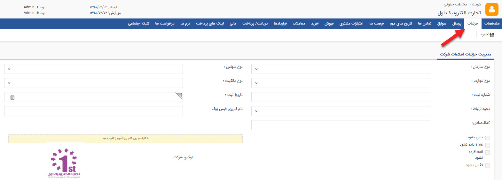

# جزئیات    

**جزئیات**

در این قسمت جزییات بیشتری از هویت را می توانید ثبت کنید، نام کاربر ثبت کننده اطلاعات به همراه تاریخ ایجاد آن نیز در این قسمت نمایش داده می شود.

نکته: در صورتی که این پروفایل جزو پروفایل های بانک اطلاعاتی باشد، نام ایجاد کننده آن خالی است.

نکته: به عنوان نمونه عکس زیر از صفحه ی مدیریت اطلاعات یک مخاطب حقوقی(شرکت) در تب جزئیات می باشد. 

