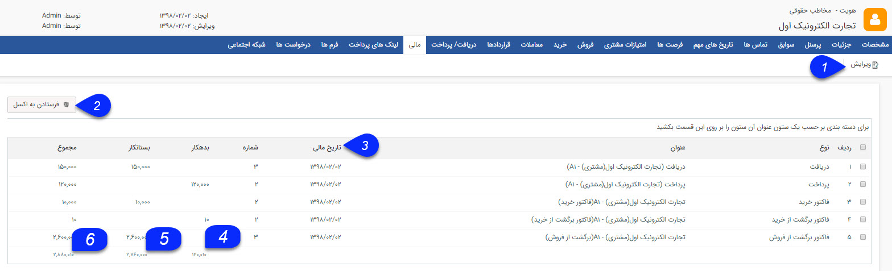

# مالی    

**مالی**

کل سابقه مالی مشتری را به صورت بدهکار و بستانکار نمایش می دهد.

در مورد پیش فاکتور/فاکتورها و دریافت/پرداخت و قراردادها، در صورتی که نیاز به تایید داشته باشند بعد از تایید جز سابقه مالی محسوب می شوند.

در مورد قراردادها، در صورتی که قراردادها جنبه مالی داشته باشند به عنوان سابقه مالی در نظر گرفته می شوند .

**__**

1\. **ویرایش:** می توانید سابقه مالی مورد نظر را ویرایش کنید.

2\. **فرستادن به اکسل:** با استفاده از این دکمه می توانید سابقه مالی مخاطب را در قالب یک فایل اکسل دریافت کنید.

3\. **تاریخ مالی:** تاریخ سر رسید پرداخت/دریافت، تاریخ صدور پیش فاکتور/فاکتور و تاریخ شروع قرارداد را نمایش می دهد.

4\. **مجموع  بدهکاری:** در این ستون میزان بدهی مخاطب در آیتم مالی (پرداخت ها، فاکتورهای فروش، قراردادها) به ازای هر سابقه و در انتهای ستون مجموع این مبالغ نشان داده می شود.

5\. **مجموع  بستانکاری:** در این ستون میزان بستانکاری مخاطب در آیتم مالی (دریافت ها، فاکتورهای خرید، قرادادها) به ازای هر سابقه و در انتهای ستون مجموع این مبالغ نشان داده می شود.

9\. **مانده حساب:** از تفاضل مبالغ بستانکاری از بدهکاری، مبلغ کل مانده حساب مخاطب در این قسمت نمایش داده می شود. منفی بودن این مقدار به معنی بدهکار بودن و مثبت بودن آن به معنی بستانکار بودن مخاطب می باشد. این مقدار به صورت یک فیلد در صفحه مشخصات هویت نیز نمایش داده می شود.