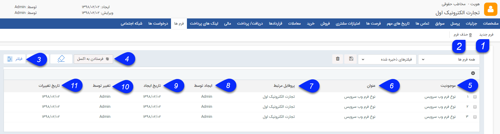

# فرم ها        

**فرم ها**

سوابق فرم های مختلف ایجاد شده برای مخاطب را می توانید در این قسمت مشاهده کرده و در صورت نیاز از آن ایجاد کنید.

در صورتی که ماژول مدیریت فرم ساز را تهیه کرده باشید، می توانید فرم های موجود در فرآیندهای شرکت خود را در شخصی سازی CRMپیام گستر طراحی و پیاده سازی نمایید . ([راهنمای مدیریت فرم ها](.HelpPayamgostar/Setting/Personalizing/FormsManagement.md) )

نکته: فرم می تواند سوابق مختص به خود را داشته باشد. این سوابق به عنوان زیر مجموعه فرم نمایش داده شده و در صورت حذف فرم می توان آنها را به سوابق مخاطب منتقل کرد.

نکته: فرم از سوابقی است که بدون اتصال به پروفایل یک هویت قابل ذخیره کردن است.

 

۱. **فرم جدید:** می توانید فرم دلخواه خود را از بین فرم های تعریف شده در شخصی سازی برای این هویت ایجاد کنید.

۲. **حذف فرم:** می توانید فرم های انتخاب شده را حذف کنید.

۳.  **فیلترهای پیشرفته:** می توانید برای پیدا کردن فرم مورد نظر از[فیلترهای پیشرفته](Background/AdvancedFilters.md) استفاده کنید.

۴.**فرستادن به اکسل:** با استفاده از این دکمه می توانید اطلاعات  فرم های انتخاب شده را در قالب یک فایل اکسل دریافت کنید. 

۵ . **نوع:**  نوع فرم مورد نظر را نمایش می دهد.

6\. **عنوان فرم:** نام فرم ایجاد شده را نمایش می دهد.

7\. **نام شرکت/سازمان:** نام مخاطب مرتبط با فرم را نمایش میدهد.

8\. **ایجاد توسط** : کاربر ایجاد کننده فرم را نمایش میدهد.

9\. **تاریخ ایجاد:** تاریخ ایجاد فرم را نمایش میدهد.

10. **تغییر** **توسط:** آخرین کاربر ویرایش کننده فرم را نمایش می دهد.

11\. **تاریخ تغییرات:** آخرین تاریخ ویرایش فرم مورد نظر را نمایش می دهد.

نکته:  با کلیک راست بر روی یک یا چند فرمموجود در لیست می توانید اقدام به افزودن سابقه یا ویرایش گروهی کنید.