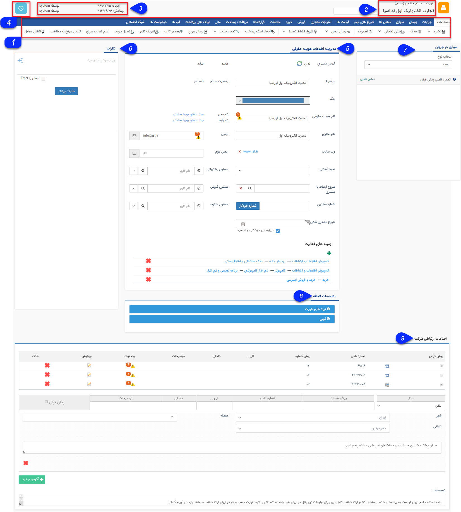

# مشخصات عمومی        

**مشخصات عمومی**  

در اینجا می توانید توضیحاتی در خصوص مشخصات عمومی انواع هویت هایی که در نرم افزار پیام گستر تعریف شده، مشاهده و مطالعه نمایید.

نکته:  انواع هویت هایی کهبرایاضافه کردن یک هویت جدید می  توانید انتخابکنید شامل :مخاطب حقیقی(شخص)، سرنخ حقیقی،مخاطب حقوقی (شرکت) و سرنخ حقوقی می باشد. همچنین می توانید در قسمت شخصی سازی، زیرنوع های جدیدی برای هویت اضافه کنید.

نکته: به عنوان نمونه عکس زیراز صفحه ی مدیریت اطلاعات یک مخاطب حقوقی(شرکت) در تب مشخصات می باشد.

مشخصاتهویت های حقیقی و حقوقی شامل اطلاعات اصلی، تلفن ها و آدرس ها می باشد،اضافه کردن فیلدهای اطلاعاتی دلخواه با استفاده از [شخصی سازی](../../Setting/ParametersAndPersonalInformationManagement.md) امکان پذیر است.

 

1\. [نوار ابزار مشخصات](GeneralSpecification/Contactstoolbar.md) : بعد از ذخیره ی هویت با استفاده از دکمه های نمایش داده شده در این قسمت می توانید از عملکردهای متفاوتی بهره مند گردید.

2\. عنوان: عنوانآیتم و نوع آن را نمایش می دهد، لازم به ذکر استنوع آیتمقبل از ذخیره شدن هویت، قابل انتخاب و تغییر به یکی از انواع هویت های تعریف شده در قسمت شخصی سازی می باشد.

3\. اطلاعات ثبت: تاریخ ایجاد و آخرین ویرایش، کاربر ایجاد کننده و کاربری که آخرین ویرایش بر روی این آیتم انجام داده است را نمایش می دهد .

4\. [یادآور و پیگیری](GeneralSpecification/Reminderandalarms.md) : با کلیک بر روی آیکون ساعت نمایش داده شده در این قسمت می توانید یک پیگیری بر روی آیتم، برای کاربری خود ایجاد کنید.

5\. [مدیریت اطلاعات هویت](GeneralSpecification/Contactdatamanagement.md) : در این قسمت اطلاعات اصلی هویت شامل نام، ایمیل، وب سایت و ... وارد می شود.

6\. [نظرات](GeneralSpecification/Comments.md) : در این قسمت می توانید نظرات ثبت شده روی این آیتم را مشاهده کنید و یا نظر جدید ثبت کنید.

7\. سوابق در جریان: دراین قسمت سوابق در جریان مرتبط با هویت یا به عبارت دیگر سوابقی که تحت چرخه بوده و هنوز به مرحله پایانی نرسیده باشند مشخص می گردند کهبا استفاده از فیلتر انتخاب نوع می‌توانید انواع سوابق مدنظر جهت نمایش را مشخص نمایید .

8 . مشخصات اضافه : اگر از قسمت شخصی سازی هویت، فیلدهایی را به این زیرنوع هویت یا فیلدهایی را به عنوان سوپر فیلد به هویت اضافه کرده باشید، می توانید این فیلدها را در این قسمت مشاهده کنید.

9 . [اطلاعات ارتباطی](GeneralSpecification/Contactcomminicationsdata.md) : در این قسمت شماره های تماس و آدرس های هویت وارد می شود.