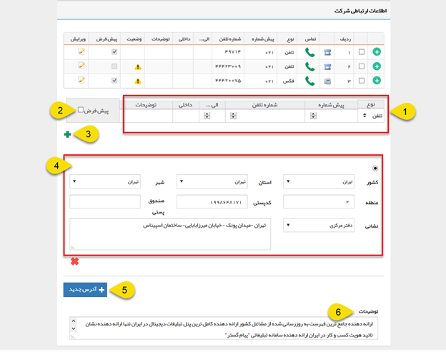

# اطلاعات ارتباطی        

**اطلاعات ارتباطی**

در این قسمت اطلاعاتمربوط به راه های ارتباطی با مخاطب قرار داده می شود.

۱. از این قسمت می توانید اطلاعات مرتبط با تلفن، تلفن همراه، فکس و تلفکس را اضافه کنید. می توانید ابتدا فیلدهای مرتبط را با توضیحات دلخواه پر کنید.

۲.  پیش فرض: می توانید یک شماره را برای هر نوع از راه های ارتباطی(تلفن، موبایل و فکس) به عنوان پیشفرض تعیین کنید. در صورتی که بخواهید برای این هویت یک پیام کوتاه یا فکس از طریق نرم افزار ارسال کنید، این پیام به شماره پیشفرض تعیین شده در این قسمت ارسال خواهد شد. همچنین در صورت قرار دادن پارامتر هوشمند تلفن، موبابل یا فکس در هریک از قالب های چاپی آیتم ها، مقدار مرتبط با شماره پیشفرض درج خواهد شد.

۳. با استفاده از این گزینه می توانید اطلاعاتی که در قسمت ۱ وارد کرده اید را به ردیف های اطلاعات ارتباطی اضافه کنید.

۴.  آدرس:می توانیدقسمت های مختلف را انتخاب و با تکمیل آناقدام به ثبت آدرس مورد نظر خودکنید. برای ویرایش لیست کشور، استان و یا شهر به[مدیریت شهرها](../../../BaseInformatio/CitysManagement.md) مراجعه کنید.

۵.آدرس جدید: با استفاده از این گزینه می توانید یک آدرس دیگر (برای مثال آدرسدفتر مرکزی و یا انبار) برای این هویت ایجاد کنید.

۶.  توضیحات: می توانید توضیحاتی که در خصوص این مخاطب مورد نیاز است را در این قسمت وارد کنید. (مانند حوزه فعالیت و یا خدماتی که این مخاطب ارائه می دهد.)