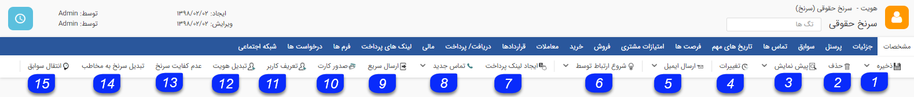
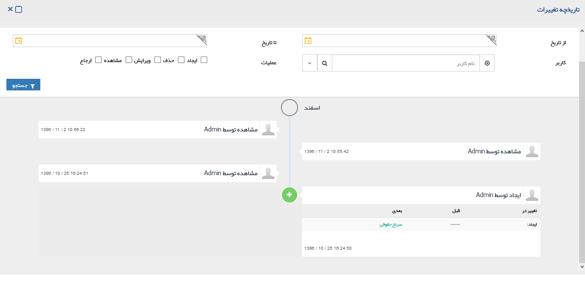
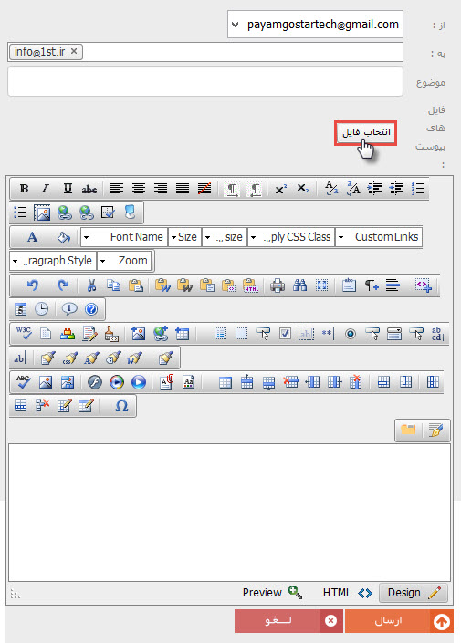
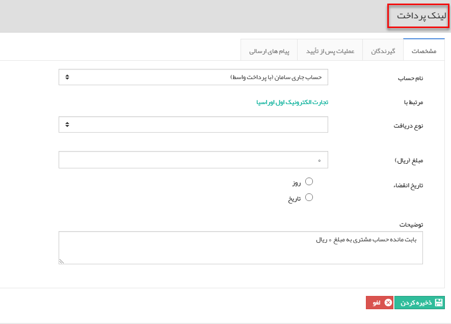
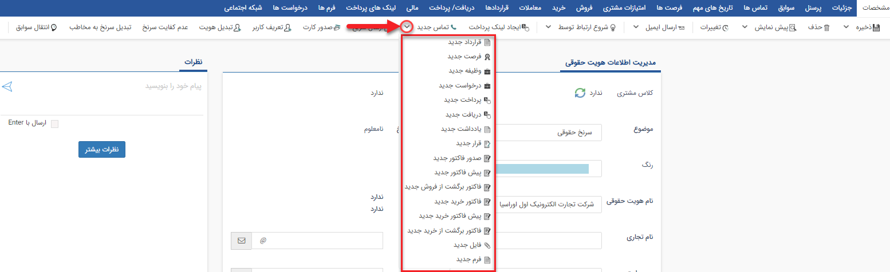
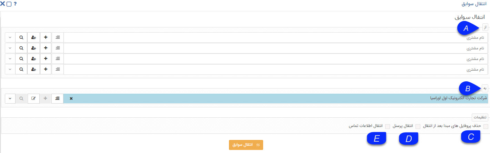

# نوار ابزار مشخصات        

**نوار ابزار مشخصات**

در این نوار ابزار، می توانید از امکانات زیر استفاده نمایید.

1\. ذخیره/ذخیره و خروج: اطلاعات وارد شده را ذخیره می کند. اگر روی ذخیره و خروج کلیک کنید پس از ذخیره تغییرات، صفحه بسته خواهد شد.

2. حذف: هویت را از بانک اطلاعاتی حذف می کند .

3\. پیش نمایش/چاپ: قالب نمایش چاپی آیتم را نمایش می دهد و یا می توانید مستقیما آن را چاپ کنید.

نکته: برای تنظیم این قالب به [تنظیم قالب چاپ](../../../Setting/Personalizing/Totalview/printpreviewdesign.md) مراجعه کنید.

4\. تغییرات: در این قسمت می توانید تاریخچه تمامی تغییراتی که از ذخیره اولیه این پروفایل تا کنون رخ داده است را مشاهده کنید. این تغییرات شامل ایجاد، ویرایش و مشاهده آیتم و همچنین افزودن یا حذف سابقه برای این هویت می باشد.

5\.   ارسال ایمیل/ارسال فکس: می توانید به این مخاطب یک ایمیل یا فکس ارسال کنید. برای ارسال ایمیل از این قسمت نیاز به ماژول مدیریت صندوق های پستی است. می توانید فایلی را نیز به ایمیل مورد نظر خود پیوست نمایید.

6\. شروع ارتباط توسط: لیست[کمپین های تبلیغاتی](../../../AdvertisedTools/AdvertismentManagement.md) که از طریق پیام گستر اجرا شده است در این قسمت نمایش داده می شود و در صورتی که این هویت از طریق یکی از برنامه های اجرا شده در کمپین ها جذب شده باشد، می توانید آن را انتخاب نمایید. مرتبط کردن هویت ها با کمپین های تبلیغاتی گزارشات دقیق تری از میزان جذب مخاطب از هریک از کمپین ها در قسمت گزارشات تحلیلی نرم افزار در اختیارتان قرار خواهد داد.

گروه های مرتبط : در صورتی که مثلث کنار  گزینه "شروع ارتباط توسط" را کلیک کنید آیتم گروه های مرتبط را مشاهده خواهید کرد.

با استفاده از این گزینه می توانید در صورت تمایل، مستقیما پروفایل مورد نظر را با زدن تیک نام هرکدام از گروه ها، به عضویت گروه های ساخته شده مورد نظر در قسمت [گروه های هدف](../../PerposeOfGroups.md) درآورید. همچنین مسیر پروفایل را در گروه های هدف ساخته شده نمایش می دهد.

نکته: ممکن است یک هویت در بیشتر از یک گروه قرار گرفته باشد .

.7 ایجاد لینک پرداخت : با استفاده از این دکمه می توانید لینک پرداختی برای مخاطب ایجاد و ارسال کنید. مخاطب با استفاده از لینک مزبور به درگاه پرداخت واسط هدایت ‌می شود تا عملیات پرداخت را به آسانی انجام دهد. برای مطالعه جزئیات بیشتر در این رابطه به صفحه " [ایجاد لینک پرداخت](HelpPayamgostar\PayamGostarSyncBank\JobsForFirst\PeymentLink\PeymentLinkCreate.md) " مراجعه کنید

 

8\. تماس جدید: با کلیک بر روی این دکمه می توانید یک تماس جدید ثبت کنید. همانطور که در  شکل مشاهده می نمائید با کلیک بررویمثلث کنار آیتم "تماس جدید" این قابلیترا در  دسترس شما قرار می دهد که بتوانید تمامی سوابق دیگر را نیز برای این هویت ثبت کنید

 

9.ارسال سریع:  با کلیک کردن بر روی دکمه ارسال سریع، پنجره زیر نمایش داده می شود. در این پنجره هویت انتخاب شده برای این ارسال در سمت راست، قسمت کادر گیرندگان نمایش داده می شود و پس از انتخاب رسانه و تنظیم متن می توانید ارسال را انجام دهید.

برای اطلاعات بیشتر به قسمت [تبلیغات](../../../AdvertisedTools.md)  مراجعه کنید.

  

نکته: همچنین شما می توانید چند شرکت در یک گروه و یا دسته بندی انتخاب کرده ، سپس با کلیک راست بر روی یکی از شرکت های انتخاب شده و در نهایت با انتخاب گزینه ارسال سریع به این پنجره دسترسی داشته باشید. برای اطلاعات بیشتر در خصوص نحوه ارسال پیام به [اطلاعات مشترک ابزارها](../../../AdvertisedTools/ToolsSharedInformation.md) مراجعه کنید .

10.صدور کارت: با کلیک کردن بر روی دکمه صدور کارت (در صورتی که ماژول صدور کارت برای مشتری را خریداری کرده باشید) پنجره ای به شکل زیر باز می شود و می توانید نمونه رو و یا پشت کارت را مشاهده و سپس چاپ نمایید. برای تنظیم قالب کارت مشتری به تنظیمات[کارت مشتری](../../../Setting/TotalSetting/CustomerCard.md) مراجعه کنید.

11\. تعریف کاربر: در صورتی که ماژول [باشگاه مشتریان](../../../MajolhayeTakmili/BashgaheMoshtarian.md) را تهیه کرده باشید. می توانید به هر کدام از مشتریان خود از این روش نام کاربری و گذرواژه ای اختصاص دهید. مشتریان شما می توانند با این نام کاربری وارد داشبورد خود در قسمت باشگاه مشتریان نرم افزار شوند و لیست سوابق خود را مشاهده نمایند. به طور مثال فاکتورها، پرداخت ها و دیگر سوابق مربوط به خودشان را مشاهده کنند.

  

12.تبدیل هویت: می توانید با استفاده از این دکمه، هویت را تبدیل به نوع دیگری کنید. ( برای مثال سرنخ حقیقی را به حقوقی تبدیل کنید .)

13\. عدم کفایت سرنخ: زمانی که سرنخ صلاحیت لازم برای تبدیل شدن به مخاطب را نداشته باشد از این دکمه استفاده کنید. (سرنخ موفقیت آمیز نبوده است.)

نکته: با کلیک بر روی این دکمه وضعیت سرنخ از نامعلوم به عدم کفایت تغییر می کند.

14\. تبدیل سر نخ به مخاطب: سر نخ مورد نظر را به یک مخاطب تبدیل می کند. (سرنخ موفقیت آمیز بوده است .)

15\. انتقال سوابق: می توانید با استفاده از این آیتم، سوابق ثبت شده برای هویت/هویت های دیگری را به این هویت منتقل کنید .

A. از: می توانید همزمان تا چهار هویت را انتخاب کنید تا سوابقشان به این هویت منتقل شود.

B. به: هویتی که به آن سوابق منتقل خواهد شد را نشان می دهد.

C. حذف پروفایل های مبدا بعد از انتقال: پس از انتقال موفقیت آمیز سوابق، هویت های مبدا را حذف می کند.

D. انتقال پرسنل: در صورتی که هویت های مقصد و مبدا حقوقی باشند، می توان پرسنل را نیز به این هویت انتقال داد.

E. انتقال اطلاعات تماس: علاوه بر سوابق میتوانید، اطلاعات تماس هویت های مبدا (تلفن، موبایل و ...) را به این هویت منتقل کنید.

16\. خانه: به صفحه خانه نرم افزار باز می گردید.