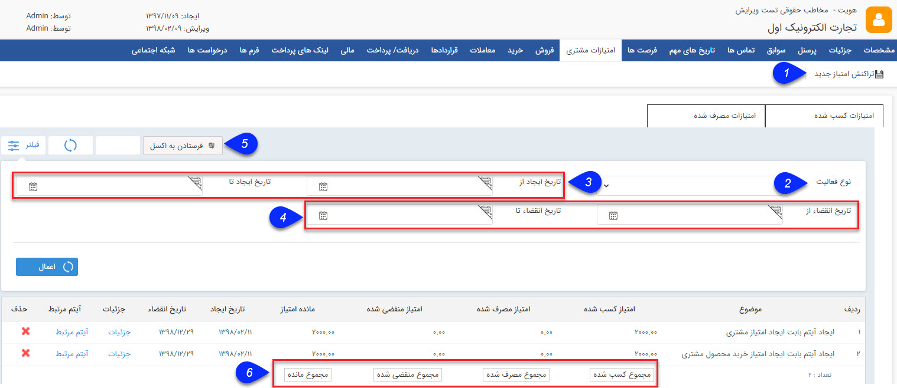

# امتیازات مشتری

**امتیازات مشتری**

در این قسمت تمامی تراکنش های امتیاز انجام شده برای مشتری نمایش داده می شود. می توانید میزان امتیاز فعلی مشتری را مشاهده کرده، از آن ها گزارشی در قالب فایل اکسل دریافت کنید و در صورت نیاز تراکنش امتیاز جدیدی ایجاد کنید. تراکنش ها از نوع افزایش، کاهش یا خرج شده می توانند باشند.

تراکنش های امتیاز افزایشی پس از ارسال کد تایید اصالت کالا توسط مشتری ایجاد می شوند. (توجه داشته باشید که ابتدا باید در قسمت [مدیریت محصولات](BaseInformatio\ProduceManagement.md) ، میزان امتیاز مرتبط با هر محصول و پایه امتیاز فعال آن را مشخص کرده باشید.)

تراکنش های کاهشی پس از گذشتن تاریخ انقضاء تراکنش های امتیاز افزایشی به طور خودکار توسط سیستم ایجاد می شوند و تراکنش های امتیاز خرج شده در زمان استفاده از امتیاز هنگام صدور فاکتور فروش برای مشتری ایجاد خواهند شد. همچنین کاربران سیستم می توانند در صورت نیاز به صورت دستی هر سه نوع تراکنش را برای مشتریان ثبت کنند.

1\. **تراکنش امتیاز جدید:** با استفاده از این دکمه می توانید یک تراکنش امتیاز افزایشی، کاهشی یا خرج شده برای مشتری به صورت دستی ایجاد نمایید.

2\. **پایه امتیاز:** از بین نوع فعالیت های مرتبط با امتیازهای تعریف شده، فعالیت مورد نظر خود را برای نمایش فیلتر کنید. (برای اطلاع از عملکرد فعالیت ها به[مدیریت انواع پروفایل](../../Setting/ProfileTypeManagement.md)  رجوع کنید)

3\. **بازه زمانی ایجاد:** می توانید یک حد بالا و یک حد پایین برای تاریخ ایجاد تراکنش های نمایش داده شده مشخص کنید.

4\. **بازه زمانی انقضاء:** می توانید یک حد بالا و یک حد پایین برای تاریخ انقضاء تراکنش های نمایش داده شده مشخص کنید.

6 . **مجموع امتیازات:** میزان امتیازات کسب شده و مصرف شده و منقضی شده و مانده امتیازات مشتری در این قسمت نمایش داده می شود.

7\. **فرستادن به اکسل:** می توانید با استفاده از این دکمه، جزئیات تراکنش های امتیاز فیلتر شده را در قالب فایل اکسل دریافت نمایید.

نکته: چنانچه بخواهید امتیازی که قبلا کسب شده و سپس مصرف شده را حذف کنید ابتدا باید امتیاز مصرفی را حذف کنید.