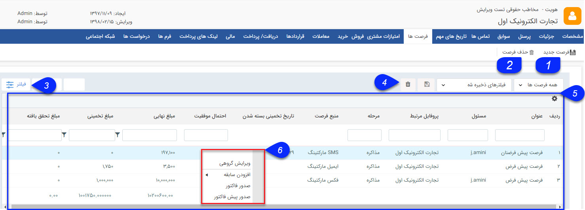
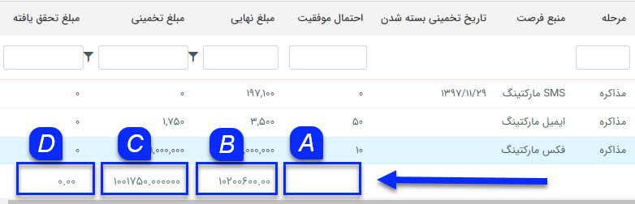

# فرصت ها      

فرصت ها

در این قسمت می توانید تمامی فرصت های ثبت شده برای این هویت را مشاهده کنید، همچنین می توانید یک فرصت جدید ایجاد کنید و یا فرصت های ایجاد شده را حذف کنید.

 

1.  **فرصت جدید** : می توانید یک فرصت جدید برای مخاطب ایجاد کنید.

2.  **حذف**: می توانید یک فرصت فروش را حذف کنید.

3\. **فیلترهای پیشرفته:** با کلیک بر روی دکمه فیلترهای پیشرفته می توانید فیلترهای مختلفی برای جستجوی فرصت یا فرصت های مورد نظر خود داشته باشید

4. **نوع** **فیلتر** : می توانید فیلترهای انتخاب شده را با یک نام مشخص ذخیره کرد تا بتوان به سرعت از آن استفاده کرد.

5\. **جدول فرصت ها:** در این جدول می توانید تمامی فرصت های ثبت شده برای این هویت را بر اساس فیلدهای فرصت (ستون های جدول) مشاهده کنید، برای آشنایی با هرکدام از این فیلدها به صفحه راهنمای [فرصت جدید](http://www.payamgostar.com/support/help/v3/index.md?page=HelpPayamgostar/PayamGostarSyncBank/JobsForFirst/Background/NewOpportunity.md) مراجعه کنید. در واقع مزیت استفاده از این جدول در اینست که می توان در یک نگاه مشاهده نمود که فرصت های ثبت شده برای مشتری از چه منابعی شکل گرفته اند و یا اینکه در کدام مرحله فروش قرار دارند.

علاوه بر این میتوانید با استفاده از دکمه های نمایش داده شده در انتهای این جدول، به راحتی گزارشی از مجموع مبالغ برآوردی، مورد انتظار، محقق شده و یا میانگین درصد احتمال فرصت های ثبت شده برای مشتری داشته باشید 

 

 A. درصد احتمال: با استفاده از این دکمه می توانید میانگین درصد احتمال وارد شده در فرصت های مشتری را در اختیار داشته باشید

B. مجموع مبلغ برآورد: مجموع مبلغ برآورد وارد شده در هرکدام از فرصت ها را محاسبه می کند، این مبلغ برآوردی بر اساس محصولات وارد شده در فرصت به صورت خودکار تکمیل می گردد، اما می توانید به صورت دستی آن را تغییر دهید.

C. مجموع مبلغ مورد انتظار: حاصل ضرب مبلغ برآوردی در درصد احتمال برابر با مبلغ مورد انتظار فرصت می باشد. با استفاده از این دکمه می توانید مجموع مبلغ مورد انتظار فرصت های ثبت شده برای مشتری را در اختیار داشته باشید.

D. مجموع محقق شده: مبلغ محقق شده برابر با مبلغ نهایی فاکتورهای ثبت شده در سوابق فرصت می باشد. از این طریق می توانید مجموع مبالغ محقق شده یا در واقع میزان فروش محقق شده از فرصت های مشتری را در اختیار داشته باشید.

6 . **ر است کلیک:** با راست کلیک بر روی یک فرصت می توان اقدام به صدور پیش فاکتور و یا فاکتور از روی آن کرد. و یا در سوابق این فرصت هر سابقه دیگری (تماس، فرم، یادداشت و ...) ثبت نمود.