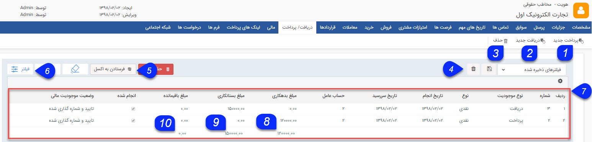

# دریافت/پرداخت    

دریافت/پرداخت

در این صفحه می توانید تمامی دریافت/پرداخت های ثبت شده برای مخاطب را مشاهده کنید. در صورت نیاز یک دریافت/پرداخت جدید ثبت کنید و یا دریافت/پرداخت های ثبت شده را ویرایش و یا حذف کنید.

__

۱. **پرداخت جدید:** پرداخت جدیدی را می توانید برای مخاطب ایجاد کنید، پرداخت مخاطب را به میزان مبلغ موجود در آن بدهکار میکند. (تنظیمات این نوع همانند [دریافت جدید](Background/NewPaid.md) است.)

۲. **دریافت جدید:** می توانید [دریافت جدید](Background/NewPaid.md)  برای مخاطب ایجاد کنید، دریافت مخاطب را به مقدار مبلغ موجود در آن بستانکار می کند.

۳. **حذف:** می توانید دریافت و یا پرداخت های انتخابی را حذف کنید.

۴. **نوع فیلتر:** می توانید فیلترهای انتخاب شده را با یک نام مشخص ذخیره کرد تا بتوان به سرعت از آن استفاده کرد.

۵ . **فرستادن به اکسل:** با استفاده از این دکمه می توانید اطلاعات پرداخت ها و یا دریافت های انتخاب شده را در قالب یک فایل اکسل دریافت کنید.

۶ . **فیلترهای پیشرفته:** می توانید برای پیدا کردن پرداخت و یا دریافت مورد نظر از [فیلترهای پیشرفته](Background/AdvancedFilters.md) استفاده کنید.

۷. **جدول دریافت و پرداخت ها:** در این جدول می توانید تمامی دریافت/پرداخت های ثبت شده برای مخاطب را بر اساس فیلدهای مرتبط با آن ها (ستون های جدول) مشاهده کنید. برای آشنایی بیشتر با این فیلدها به صفحه راهنمای [دریافت جدید](Background/NewPaid.md) مراجعه کنید.

۸. **مجموع بدهکاری:** با استفاده از این دکمه می توانید مجموع مبالغ وارد شده در پرداخت های ثبت شده برای مخاطب را به سادگی محاسبه کنید.

۹_._ **مجموع بستانکاری:** با استفاده از این دکمه می توانید مجموع مبالغ وارد شده در دریافت های ثبت شده برای مخاطب را به سادگی محاسبه کنید.

۱۰. **مجموع مبلغ:** با استفاده از این دکمه می توانید برآوردی از مجموع مبالغ وارد شده در تمامی دریافت ها و پرداخت های مخاطب داشته باشید. توجه داشته باشید که ثبت دریافت، مخاطب را به ازای مبلغ وارد شده بستانکار و ثبت پرداخت، مخاطب را بدهکار می کند. بنابراین در این ستون مبالغ مرتبط با دریافت ها با مقدار منفی و مبالغ مرتبط با پرداخت ها با مقدار مثبت نمایش داده می شود و محاسبه مجموع مبلغ نیز بر همین اساس می باشد.