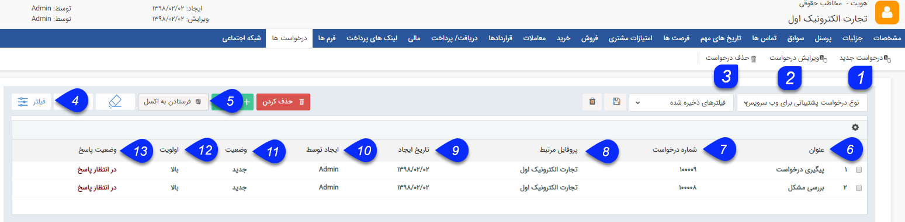

# درخواست ها        

**درخواست ها**

در صورتی که ماژول مدیریت درخواست ها را تهیه کرده باشید، می توانیددرخواست هایی را که از طریقایمیلتوسط مخاطب ثبت شدهو به پروفایل آن متصل می شود و همچنین درخواست هایی که کاربران برای آن ها در نرم افزار ثبت کرده اند را در این قسمت مشاهده نمایید. ([راهنمای مدیریت درخواست ها](HelpPayamgostar/Setting/Personalizing/RequestsManagement.md) )

نکته: درخواست می تواند سوابق مختص به خود را داشته باشد. این سوابق به عنوان زیر مجموعه درخواست نمایش داده شده و در صورت حذف درخواست می توان آنها را به سوابق مخاطب منتقل کرد.

۱.  **درخواست جدید:** می توانید یک[درخواست جدید](Request/Newrequest.md) را برای مخاطب ایجاد کنید.

۲. **ویرایش درخواست:** می توانید درخواست دلخواه خود را ویرایش کنید.

۳. **حذف درخواست:** می توانید درخواست مورد نظر خود را از سابقه مخاطب حذف نمایید.

۴.  **فیلترهای پیشرفته:** می توانید برای پیدا کردندرخواست مورد نظر از[فیلترهای پیشرفته](HelpPayamgostar/PayamGostarSyncBank/JobsForFirst/Background/AdvancedFilters.md) استفاده کنید.

۵.**فرستادن به اکسل:** با استفاده از این دکمه می توانید اطلاعات درخواست ها را در قالب یک فایل اکسل دریافت کنید.

۶. **عنوان** **:** عنوان ایمیلی که مخاطب برای درخواست خود وارد کرده است (یا عنوانی که کاربر برای درخواست در هنگام ثبت وارد کرده است) را نمایش میدهد.

۷. **شماره درخواست** : شماره درخواست توسط سیستم به صورت خودکار ایجاد می گردد را نمایش می دهد.

۸. **پروفایل مرتبط:** نام هویت مرتبط با این درخواست را نمایش می دهد.

۹. **تاریخ ایجاد** : تاریخ ایجاد درخواست را نمایش می دهد.

۱۰. **ایجاد توسط:** ایجاد کننده درخواست را نمایش میدهد.

۱۱. **وضعیت:** وضعیت فعلی درخواست پشتیبانی را نمایش میدهد.

نکته: درخواست هایی که وضعیت آنها "جدید" باشد در این لیست با فونت برجسته (بولد شده Bold) نمایش داده می شوند.

۱۲. **اولویت:** اولویت وارد شده برای پاسخگویی به درخواست را در این قسمت نمایش می دهد.

۱۳. **وضعیت پاسخ:** نشان می دهد که آیا پاسخی در جواب این درخواست از طریق ایمیل ارسال شده است و یا خیر.

نکته:برایآشنایی بافیلترهای اختصاصی سوابق درخواست ها به قسمت[درخواست ها](../../CRM/Requests.md) در [مدیریت ارتباط با مشتریان](../../CRM.md) مراجعه کنید.