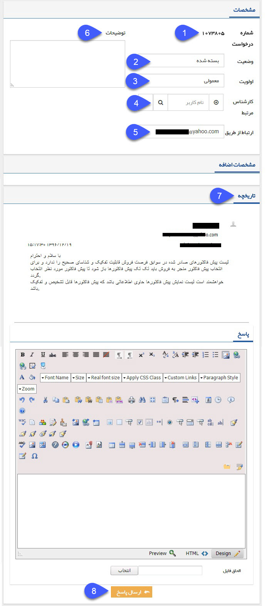

# درخواست جدید    

**درخواست جدید **

می توانید برای مخاطب یک درخواست جدید (Ticket) را ایجاد و یا ویرایش کنید. توجه داشته باشید که ابتدا باید در قسمت شخصی سازی، انواع درخواست های مورد نظر خود را ساخته باشید. درخواست علاوه بر اینکه امکان ایجاد توسط کاربران را دارد، می تواند از طرف مخاطب هم از طریق ارسال ایمیل به آدرسی ایمیلی که درخواست روی آن تنظیم شده است، ایجاد گردد.

برای ساخت درخواست جدید به [مدیریت درخواست ها](../../../Setting/Personalizing/RequestsManagement.md) مراجعه کنید.

نکته مهم: لطفا ابتدا قسمت [اطلاعات مشترک سوابق](HelpPayamgostar\PayamGostarSyncBank\JobsForFirst\Background\Backgroundscommoninfo.md) را مطالعه کنید.

 

۱. **شماره درخواست:** شماره درخواستی که سیستم به درخواست اختصاص داده است را نمایش می دهد. مخاطب می تواند از طریق این شماره درخواست خود را پیگیری کند. توجه داشته باشید که امکان تخصیص شماره دستی به درخواست وجود ندارد.

۲. **وضعیت:** وضعیت فعلی درخواست پشتیبانی را نمایش می دهد.

۳. **اولویت:** اولویت پاسخگویی به این درخواست را نمایش میدهد.

۴. **کارشناس مرتبط:** در صورتی که پاسخگویی به این پروفایل بر عهده شخص خاصی باید باشد، کارشناس مرتبط با درخواست را مشخص نمایید.

۵. **ارتباط از طریق:** آدرس ایمیلی که پاسخها به آن ارسال می شود را نمایش می دهد. در واقع اگر درخواست از طرف مخاطب ثبت شده باشد، آدرس ایمیلی که از طریق آن درخواست خود را ثبت کرده است در این فیلد نمایش داده خواهد شد و اگر کاربران سیستم بخواهند درخواست را ثبت کنند، آدرس ایمیلی که در پروفایل مخاطب وارد شده است در این قسمت به صورت خودکار وارد خواهد شد، اما میتوانید آن را تغییر دهید.

نکته: توجه داشته باشید که ارتباط بین شما و مخاطب در آیتم درخواست تنها از طریق ایمیل می باشد و تکمیل این فیلد ضروری می باشد.

۶. **توضیحات:** برای نوشتن توضیحات بیشتر می توانید از این قسمت استفاده نمایید.

۷.**تاریخچه:** متن ایمیل های تحویل گرفته شده و ارسال شده  بر اساس تاریخ نمایش داده می شود.

۸. **ارسال پاسخ:** در انتهای صفحه می توانید پیام جدیدی را تنظیم و ارسال نمایید. این پیام از طریق ایمیل به مخاطب ارسال خواهد شد، همچنین می توانید به پیام خود فایل دلخواهی را پیوست نمایید.