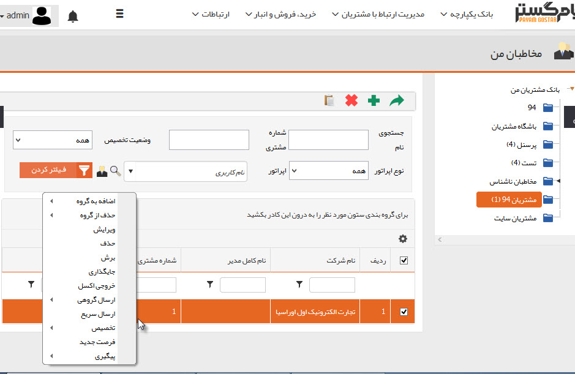

# مخاطبان من      **

**مخاطبان من**

**

در این قسمت می توانید مخاطبانی که در فهرست مشاغل اول جایی ندارند را به برنامه اضافه کنید. این دسته از مخاطبان معمولا مخاطبانی هستند که به صورت انفرادی (بدون نیاز به ثبت پرسنل) در بانک اطلاعات ذخیره می گردند و یا مخاطبانی که ثبت پرسنل آنها از اهمیت برخوردار نیست (مانند آژانس های مسافربری، غذاخوری ها و ... ). با استفاده از منوی بالای صفحه ی اصلی می توان دسته بندی های متنوعی در این قسمت اضافه کرد و یا آن ها را ویرایش و حذف نمود.

نکته: بهتر است که سعی کنید تمامی مخاطبان را در قسمت فهرست مشاغل اول ذخیره کنید.

نکته: دسته بندی های مخاطبانی که توسط نرم افزار به صورت خودکار ایجاد می شوند، باید در این قسمت ایجاد گردند. (مانند مخاطبانی که ماژول مخاطبان ناشناس، باشگاه مشتریان و ... به صورت خودکار در نرم افزار ایجاد می کنند.)

نکته: لطفا ابتدا قسمت  [فهرست مشاغل اول](JobsForFirst.md) را مطالعه فرمایید.

