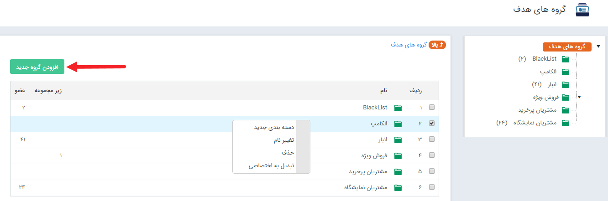
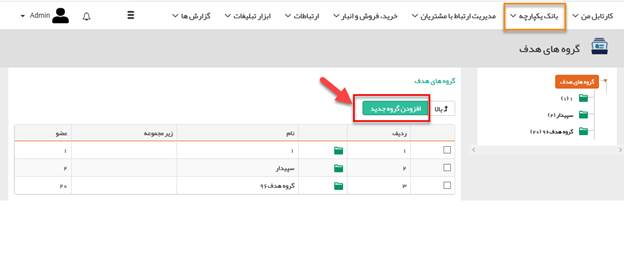
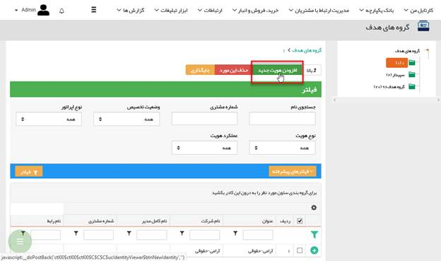
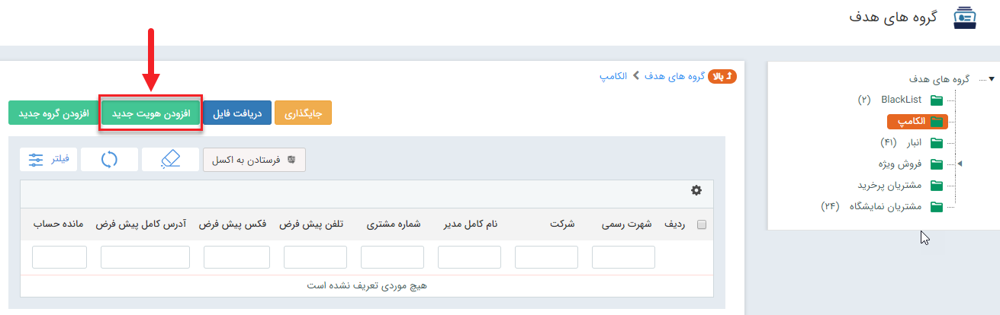
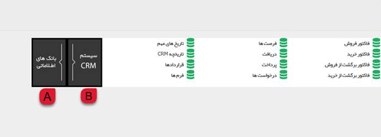
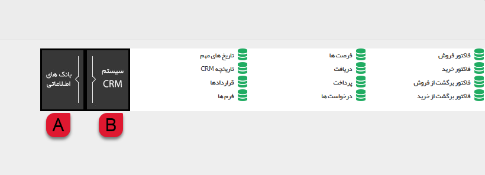
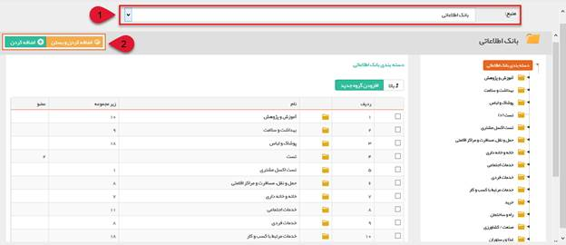
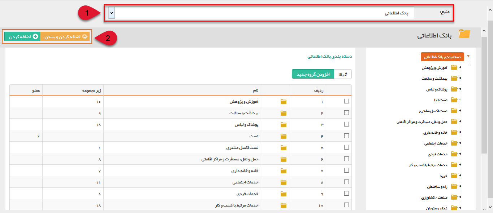

# گروه های هدف        

**گروه های هدف**

هدف از تشکیل یک گروه هدف در واقع یکراه برای مشخص کردن یک گروه خاص ( Favorite  کردن)در نرم افزار به منظور اهداف مختلف می باشد . در پنجره ی «گروه های هدف » می توان گروه ها و زیر گروه هاییرا برای دسته بندی مخاطبان و سرنخ هاایجاد کرد. وقتی یک گروه و محتوای آن ذخیره شوند، در تمام برنامه های تبلیغاتی می توان به سادگی با انتخاب این گروه، تمام هویت های آن را مورد هدف آن برنامه ی تبلیغاتی قرار داد.

برای مثال اگر می خواهید که یک دسته از مخاطبان را برای نمایشگاه دعوت کنید، میتوانید آنها را در یک گروه به نام "دعوت به نمایشگاه" در این قسمت اضافه کنید و در برنامه های تبلیغاتی اعم از پیامک و ... از آن استفاده کنید.

 همچنین از گروه های هدف می توانید در جستجو، گزارشات و فرایندهای کاری نیز استفاده کنید.

نکته: ابتدا قسمت[بانک اطلاعاتی](JobsForFirst.md)را مطالعه فرمایید.

* * *

با کلیک راست بر روی هرکدام از گروه ها می توانید نام آن را تغییر دهید، آن را حذف کنید و یا آن گروه را برای کاربری خود اختصاصی کنید.توجه داشته باشید که برای اختصاصی کردن یک گروه هدف باید خودتان آن را ایجاد کرده باشید و یا مجوز مدیر سیستم یا مدیر بانک اطلاعاتی داشته باشید.

نکته: کاربری که یک گروه هدف را تبدیل به اختصاصی می کند فقط خود قادر است، اطلاعات داخل آن را مشاهده نماید. (البته مدیر سیستم و یا مدیر بانک اطلاعاتیاز این امر مستثنی هستند و کلیه گروه ها را مشاهده می نمایند.)

 پس از ایجاد گروه یا زیر گروه مورد نظر با استفاده از دکمه "افزودن هویت جدید" می توانید هویت های دلخواه خود را انتخاب نمایید.

 

* * *

با کلیک بر روی دکمه افزودن هویت جدید، پنجرهای به شکل زیر باز خواهد شد. این پنجره این امکان را به شما می دهد که بتوانید هویت های مورد نظر خود را بر اساس سوابق سیستم CRM و یا از بانک های اطلاعاتی انتخاب کنید.

**A:**  برای انتخاب از میان مخاطبان بانک اطلاعاتی از این قسمت می توانید استفاده کنید .

**B:**  در این قسمت میتوانید مخاطبان مرتبط با آیتم های مختلف نرم افزار (فاکتورها، فرصت ها و ...) را از منوهای این دسته بندی انتخاب کنید.

* * *

نکته:با انتخاب گزینه بانک های اطلاعاتی برای انتخاب مخاطبان مورد نظر ، پنجره ای مطابق شکل زیر باز خواهد شد که به شما امکان انتخاب منبعو مخاطبین را می دهد.

**1:** به کمک لیست بالای صفحه می توانید هویت ها را از منابع مختلف مانند بانک اطلاعاتی، مشتریان و یا گروه های هدف قبلی ساخته شده انتخاب کنید. همچنین امکان جستجوی پیشرفته در این قسمت نیز قرارداده شده است که می توانید برای پیدا کردن هویت های مورد نظرتان از آن بهره مند شوید .

**2:** برای اضافه کردن هرکدام از مخاطبان، در هرلایه و هر سطحی که باشند، از دکمه "اضافه کردن و بستن" و یا "اضافه کردن" استفاده کنید.