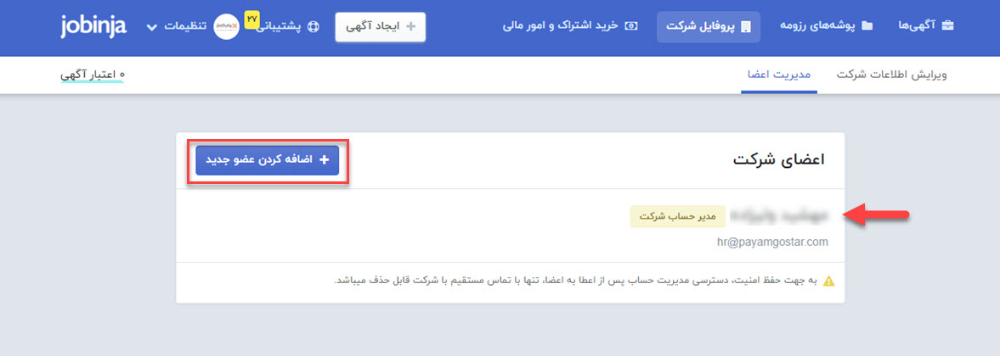
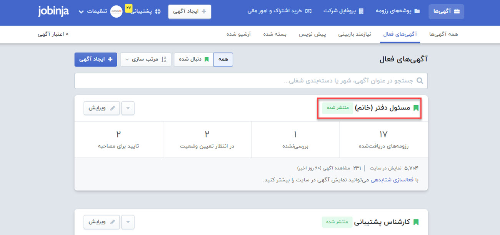
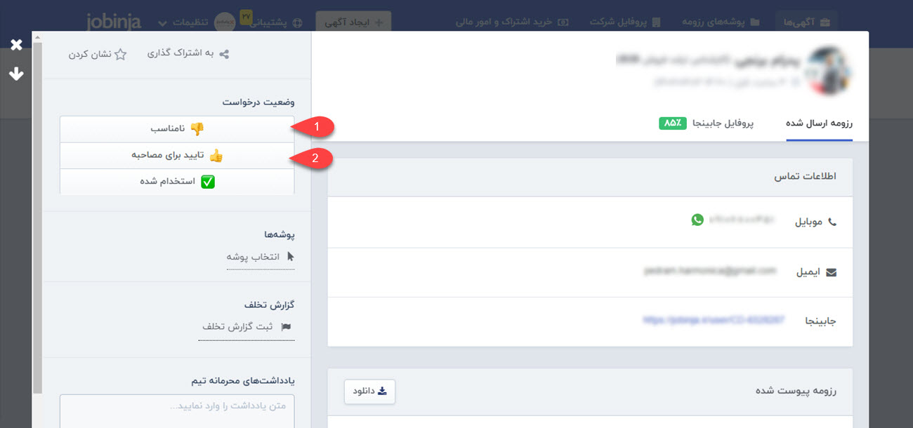
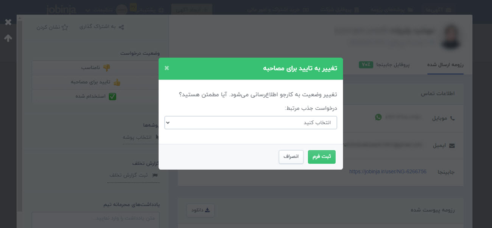
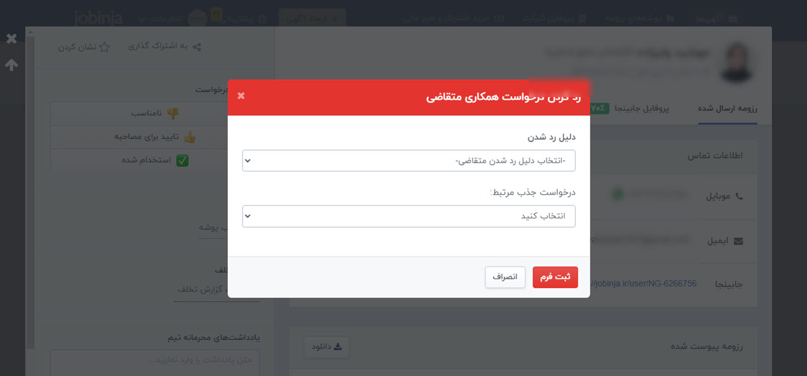

# ارزیابی رزومه‌ها از طریق افزونه ATS  پیام‌گستر
پس از اینکه برای اولین بار این افزونه را روی پیام‌گستر خود فعال کردید، **افرادی که مسئولیت استخدام را بر عهده دارند** باید این افزونه را در مروگر خود نصب و فعال کرده و برای بررسی رزومه‌های دریافت شده روی آگهی‌های استخدامی در هرکدام از سایت‌های جابینجا، جاب‌ویژن و لینکدین اقدام کنند. 
برای بررسی رزومه‌های دریافتی از طریق ATS پیام‌گستر طبق مراحل زیر عمل کنید: 
در این آموزش مراحل را در پلتفرم جابینجا بررسی خواهیم کرد. این روند در جاب‌ویژن نیز به همین صورت خواهد بود. آموزش استفاده از این قابلیت در لینکدین در بخش بعدی آموزش داده خواهد شد. 
1. باید مدیر هر واحد متناسب با درخواست موقعیت شغلی مورد نظر، یک فرم درخواست جذب نیرو ایجاد کرده و فیلدهای اضافه‌ی آن را تکمیل کند. پس از آن این درخواست به واحد منابع انسانی ارجاع داده شده و متناسب با آن مسئول جذب باید یک آگهی استخدام در جابینجا منتشر کند.
2. مسئول استخدام از تیم منابع انسانی، باید در سایت مورد نظر (در این مثال سایت جابینجا) وارد شود. در این مرحله می‌توان چند کاربر را به عنوان مسئول تایید یا رد رزومه ها تعیین کرد. اما در اطلاعات فرم‌هایی که در پیام‌گستر ایجاد می‌شوند، نام کاربری که رزومه‌ها را تایید یا رد می‌کند ثبت می‌شود.
کاربری که توی اکستنشن لاگین کرده ایجاد کننده و ویرایش کننده است.

3. در صفحه جابینجا به لیست آگهی‌های فعال خود مراجعه کرده و روی آگهی استخدام مورد نظر خود کلیک کنید.
 به عنوان مثال در اینجا روی آگهی استخدام مسئول دفتر کلیک می‌کنیم. با کلیک روی هر آگهی، لیست رزومه‌های ارسالی توسط متقاضیان را مشاهده خواهید کرد که وضعیت هرکدام از آن‌ها نمایان است.

4. روی رزومه‌ای که وضعیت آن **در انتظار تعیین وضعیت** است کلیک کرده و اطلاعات رزومه‌ی آن را مطالعه نمایید. در سمت چپ صفحه سه دکمه **نامناسب**، **تایید برای مصاحبه** و استخدام شده در اختیار شما قرار دارد که با کلیک بر روی هرکدام سناریوهای زیر رخ می‌دهد.

> **نکته** 
> درصورتی که برای اولین بار وضعیت رزومه‌ای از یک آگهی را تایید یا رد می‌کنید، باید از بین لیست درخواست‌های جذب ایجاد شده، درخواست مرتبط با آن آگهی را انتخاب کنید.

انتخاب فرم درخواست جذب مرتبط با آگهی استخدام در اولین تایید:

انتخاب فرم درخواست جذب مرتبط با آگهی استخدام در اولین رد:

***به عنوان مثال***
یک فرم درخواست جذب برای استخدام مسئول دفتر در پیام گستر ایجاد شده است. هنگام تایید یا رد رزومه مشاهده شده، باید از لیست فرم‌ها، فرم درخواست جذب مسئول دفتر انتخاب شود که بر روی همان، سابقه‌ی آگهی مرتبط ایجاد شود.

5. اطلاعات مربوط به نتیجه بررسی رزومه و کارجو از طریق تیکت در سابقه هویت در پیام گستر ثبت می‌شود. بنابراین در این مرحله در سمت پیام گستر یک درخواست پشتیبانی با نام مصاحبه، ایجاد می شود. فایل رزومه، اطلاعات متقاضی و مراحل هماهنگی‌های مصاحبه بر روی این درخواست پشتیبانی پیش می‌رود.
6. به صورت همزمان با تایید یا رد هر رزومه، سیستم در لیست فرم‌های آگهی موجود در پیام‌گستر جستجو می‌کند. درصورتی که با کد آگهی مورد نظر فرمی یافت نشد، یک فرم آگهی مرتبط با درخواست جذب (در اینجا درخواست جذب مسئول دفتر مدنظر است) ایجاد می‌کند تا در فیلد اضافه از نوع فرم موجود در درخواست پشتیبانی مصاحبه پیوست شود. 
هر فرم درخواست جذب، یک کد منحصربه فرد در انتهای URL دارد که آن کد در فیلد **Job post ID** موجود در فرم آگهی مرتبط  درج خواهد شد.  
در انتها شما یک درخواست پشتیبانی دارید که از اطلاعات آن می‌توانید در گزارش‌های ساخته شده خود برای داشبورد منابع انسانی استفاده نمایید.  
تعداد رزومه های تایید شده
تعداد رزومه های رد شده
تعداد رزومه ها به تفکیک هر موقعیت شغلی
فراوانی دلایل رد رزومه ها 
... 
و مابقی اطلاعاتی که می‌توانید به کمک گزارش‌ساز پیام‌گستر از این آیتم‌ها استخراج کنید. 
مجوزهایی که در ادامه شرح داده شده است، مواردی هستند که باید کاربر لاگ این کرده در افزونه‌ی ATS  داشته باشد:

- مجوز **مشاهده لیست** فرم درخواست جذب نیرو
- **ذخیره اولیه** و **ویرایش** آگهی برای به‌روزرسانی
- **ذخیره اولیه** و **ویرایش** روی درخواست پشتیبانی مصاحبه
- **ذخیره اولیه** و **ویرایش** زیرنوع هویت

