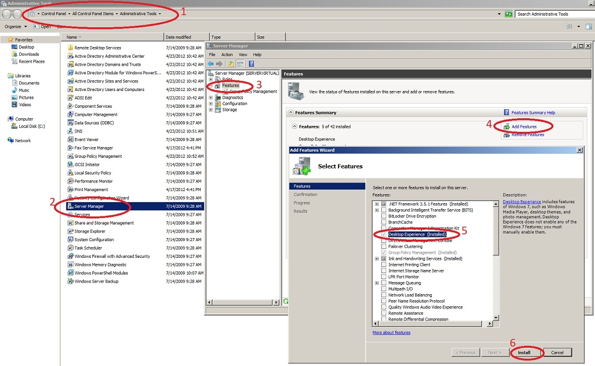
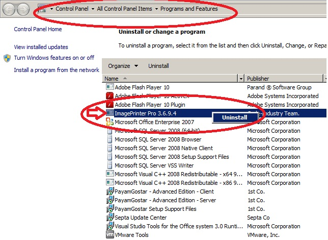
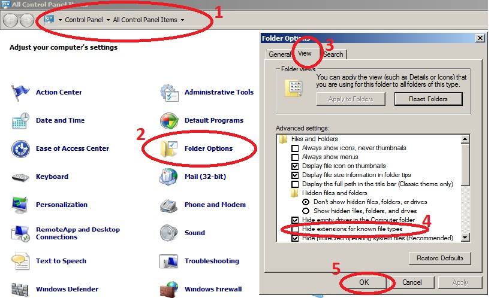
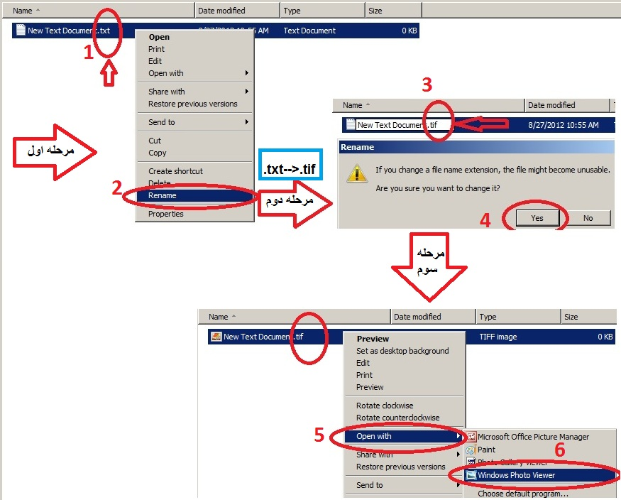

# راه اندازی فکس در ویندوز سرور 2008       

**راه اندازی فکس در ویندوز سرور 2008**

در ویندوز سرور 2008، در هنگام نصب فکس خطا به وجود می آید. برای رفع این مشکل می بایست

اقدامات زیر را انجام دهیم

1. ابتدا Feature مربوط به Desktop Experience را نصب می کنیم .

**Control  Panel\\All Control Panel Items\\Administrative Tools**

****

1. سپس Image Printer را Remove می کنیم مجددا نصب می کنیم .

****

یک فایل .tif را با Windows Photo Viewer باز می کنیم. (برای ایجاد یک فایل tif کافیست به آدرس زیر برویم :

Start/Control Panel/Folder Option/View/Hide Extensions For Known File Type

تیک لینک بالا را برداشته و یک فایل .txt را به .tif تبدیل میکنیم

****

