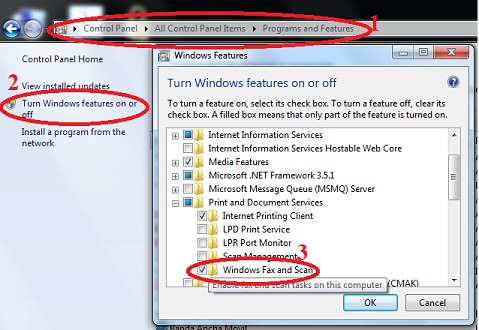
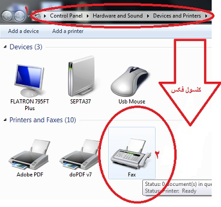
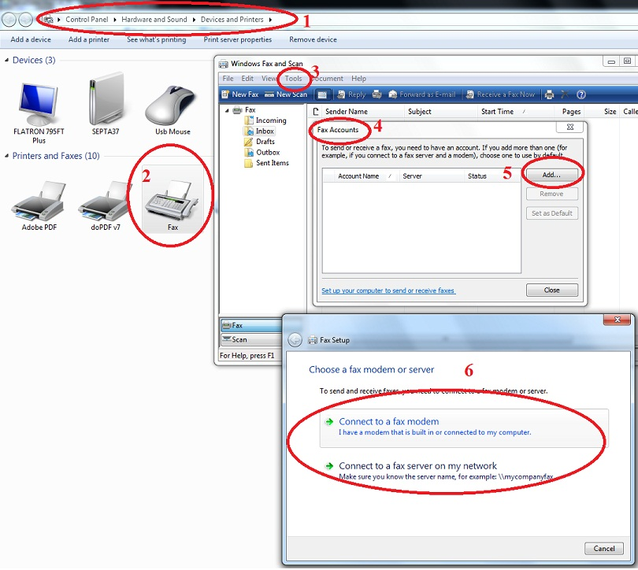

# راه اندازی فکس در ویندوز 7      

**راه اندازی فکس در ویندوز****7** 

برای راه اندازی کنسول فکس ابتدا می بایست سرویس فکس را نصب نماییم .

معمولا Feature فکس در ویندوز 7 فعال است، اگر نبود به آدرس زیر می رویم :

**Control Panel****à****Programs & Feature****à****Turn Win Feature On Or Off****à** **Printer and document Services****à****Windows Fax And Scan**

** **

****

تذکر: اگر به هر دلیلی کنسول فکس Remove شده بود به آدرس بالا میرویم و Feature فکس را Remove و سپس دوباره نصب مینماییم .

سپس به آدرس زیر رفته و Local Fax یاFax Server را Connected می کنیم :

**StartàDevices & PrintersàFaxàToolàFax AccountsàAddà…**

****