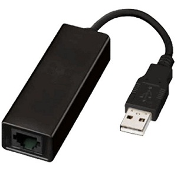
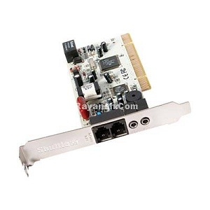
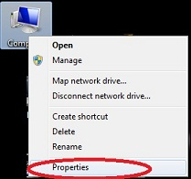
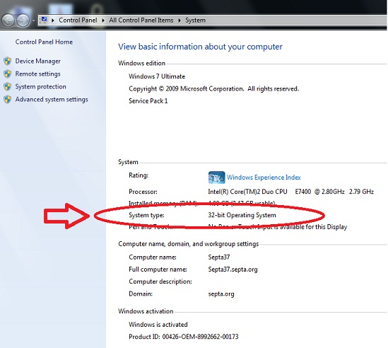
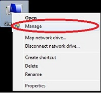
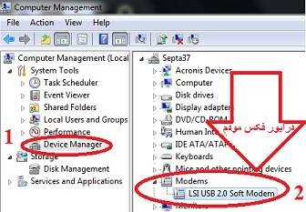

# پیش نیازهای راه اندازی فکس    

**پیش نیازهای راه اندازی فکس**

قبل از هر چیز برای راه اندازی فکس نیازمند قطعه ای سخت افزاری به نام فکس مودم می باشیم که به دو صورت داخلی(اینترنال) و خارجی (اکسترنال) در بازار موجود می باشد. گزینه داخلی همان سخت افزاری است که اغلب در گذشته از آن برای اینترنت دایال آپ استفاده می شده و گزینه خارجی اغلب بر روی لپ تاپ ها برای اینترنت کم سرعت یا دایال آپ استفاده می شود .

**تصاویر مربوط به این دو مدل از فکس در ذیل آمده است .**

فکس مودم اکسترنال  ****

فکس مودم اینترنال ** **

بعد از نصب فکس کافی است نرم افزار مربوط به درایور فکس را برای شناختن فکس توسط ویندوز در صورت عدم نصب اتوماتیک و شناسایی خودکار، نصب نماییم. ( در اغلب ویندوزها به صورت خودکار این کار صورت می گیرد،البته باید به 64 بیتی بودن ویندوز توجه نمود زیرا معمولا فکس مودم های قدیمی دارای درایور های 64 بیتی نیستند یا درایور آنها به سخت یافت می شود. )

**My Computer/Right Click/Properties**

****

**برای چک کردن نصب شدن یا عدم نصب درایور فکس مودم باید اقدامات زیر صورت گیرد .**

**My Computer/Right Click/Manager**

اگر در مرحله دوم تصویر بالا علامت مثلث زرد رنگ روی درایور مودم وجود داشت یعنی درایور مربوط به فکس مودم نصب نیست و می بایست نرم افزار آن را نصب کرد .

اگر به هر دلیلی نرم افزار مربوطه وجود نداشت می توانید آن را دانلود کنید .