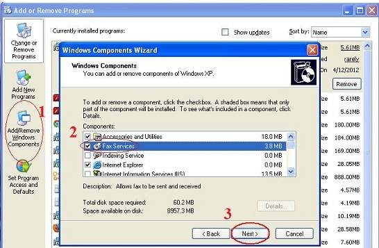
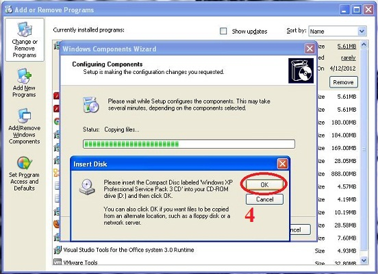
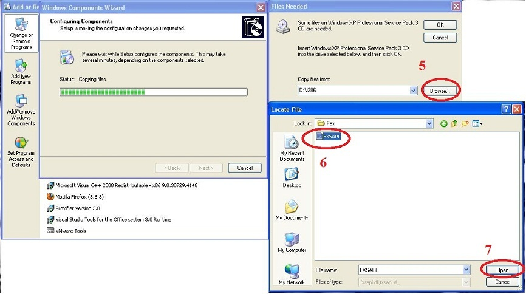
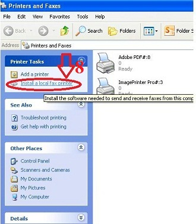
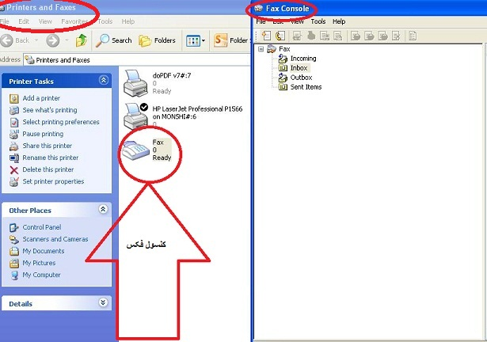
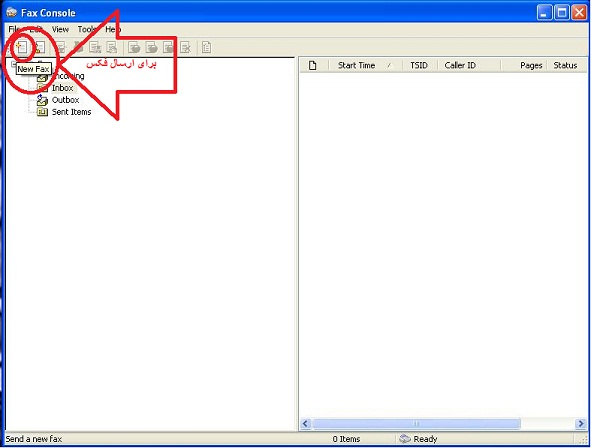

# راه اندازی فکس در ویندوز اکس پی      

**راه اندازی فکس در ویندوزXP**

**بعد از رعایت** **[پیش نیازهای مربوط به فکس](Pishniyaz.md)** **برای راه اندازی فکس در ویندوز اکس پی باید اقدامات زیر را انجام دهیم** .

**ابتدا** **می بایست فیچر مربوط به فکس را در ویندوز نصب نماییم که این عمل نیازمند داشتن سی دی خود ویندوز یا دانلود فایل زیر است .**

[http://resource.1st.ir/CMS/DownloadFiles/Support/PayamGostarV1.0/fax.rar](http://resource.1st.ir/CMS/DownloadFiles/Support/PayamGostarV1.0/fax.rar)

**سپس** **مطابق تصاویر زیر عمل می کنیم**

**Address:Start/Control Panel/Add Or Remove Programs/Add Or Remove Windows Components/Fax Services**

در این قسمت سی دی ویندوز یا فایل دانلود شده را انتخاب می کنیم .

****

**

**سپس** **به آدرس زیر رفته و طبق تصویر زیر عمل می کنیم** **.**

**

**Start/Printer and Faxes/Install alocal fax printer**

**

**این آخرین مرحله راه اندازی فکس می باشد**

****

**توجه نمایید قبل از ارسال فکس از طریق نرم افزار پیام گستر، از طریق کنسول فکس اقدام به ارسال فکس نمایید تا تنظیمات اولیه انجام شو** **د.**

****

**