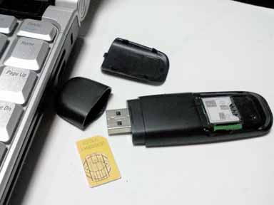

# راه اندازی جی اس ام مودم    

**راه اندازی جی اس ام مودم**

جی اس مودم سخت افزاری است که معمولا به صورت اکسترنال(خارجی) و با یوس ابی به کامپیوتر وصل می شود و قابلیت ارسال پیام کوتاه و دسترسی به اینترنت را فراهم می کند .

****

برندهای پیشنهادی بازار برای ارسال پیام کوتاه

**T-Mobile**

**Data-Net**