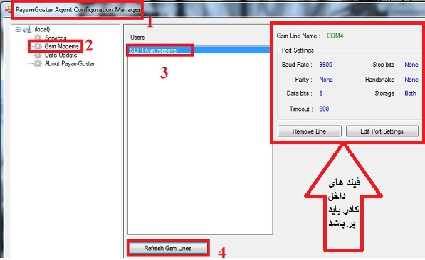
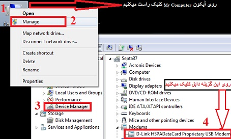
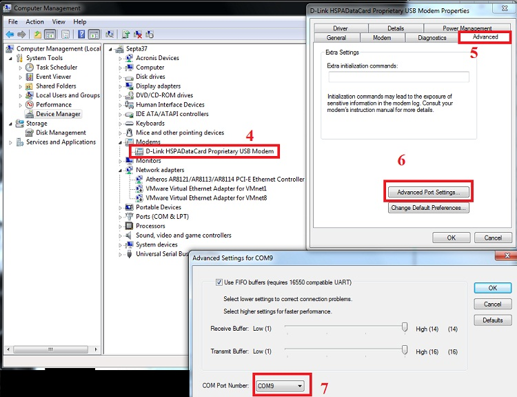
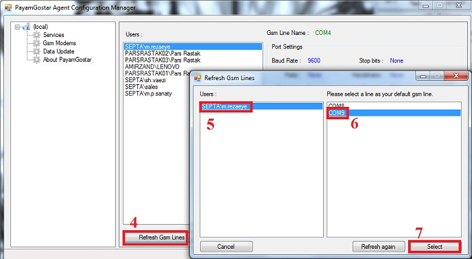
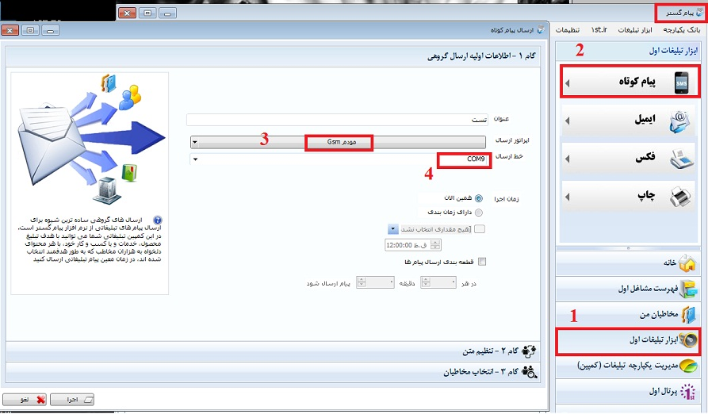

# راه اندازی جی اس مودم      

**راه اندازی جی اس ام مودم**

**

**بعد از اتصال جی اس ام مودم به کامپیوتر و نصب نرم افزار (** **Driver** **) آن که به صورت خودکار بعد از متصل کردن اجرا می شود، برای استفاده از این روش ارسال پیام کوتاه بر روی نرم افزار پیام گستر باید به آدرس زیر رفته و اقدامات لازم را انجام دهید.**

**

**Address:Start/All Programs/1st/PayamGostar/Simple/PayamGostar Agent Configuration Manager**

****

**

**سپس برای مشخص کردن اینکه جی اس ام مودم روی کدام** **COM** **قرار گرفته است اقدامات زیر را انجام می دهیم****.**

**

**

**سپس مطابق تصویر اول در این صفحه گزینه 4 را کلیک کرده و** **COM** **مربوط را برای کاربر مورد نظر انتخاب می کنیم****.**

**

سپس در بخش ارسال گروهی پیام کوتاه مانند تصویر زیر مراحل را طی کنید

****