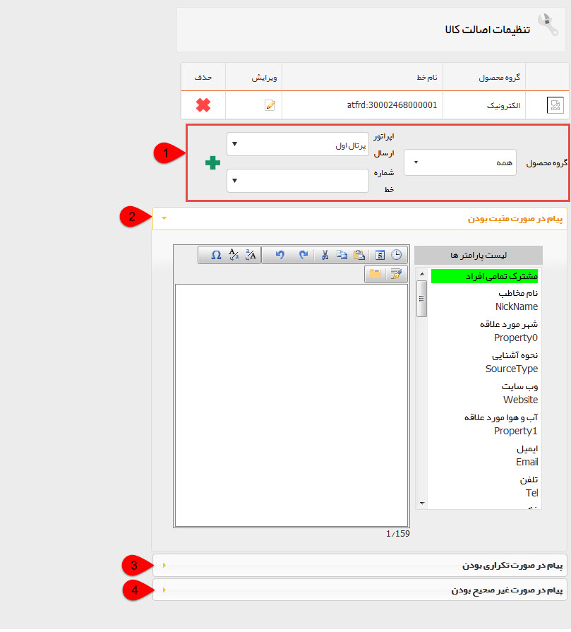

# مدیریت اصالت کالا    

**مدیریت اصالت کالا**

در صورت فعال بودن انبارداری بر اساس سریال، در این قسمت می توانید تنظیمات مرتبط با استعلام اصالت کالاهای خود را انجام دهید.

 

1\. می توانید برای گروه محصول مورد نظر یک خط دارای قابلیت ارسال و دریافت پیامک را انتخاب کنید. (برای تغییر در دسته بندی محصولات به [مدیریت محصولات](../BaseInformatio/ProduceManagement.md)  مراجعه کنید.)

2\. محتوای پیامی که در صورت صحیح بودن کد ارسال شده مخاطب، به عنوان جواب فرستاده می شود را تعیین کنید. (برای راهنمایی در خصوص استفاده از  [متن هوشمند](../AdvertisedTools/InteligentContext.md)  به قسمت [تبلیغات](../AdvertisedTools.md)  مراجعه کنید.)

3\. محتوای پیامی که در صورت تکراری بودن کد ارسال شده مخاطب، به عنوان جواب فرستاده می شود را تعیین کنید.

4\. محتوای پیامی که در صورت غیر صحیح بودن کد ارسال شده مخاطب، به عنوان جواب فرستاده می شود را تعیین کنید.