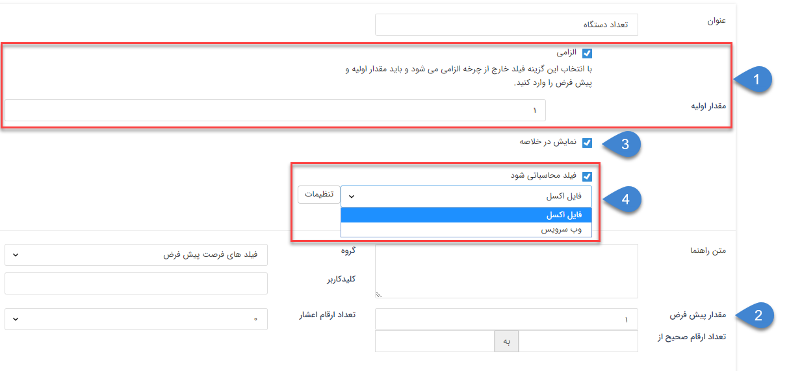
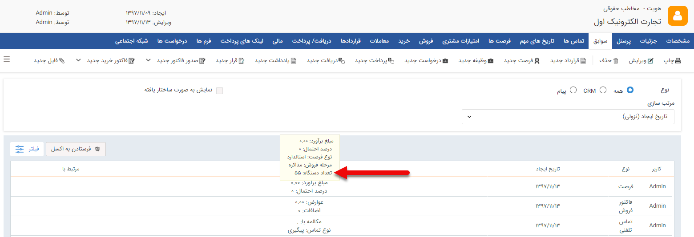
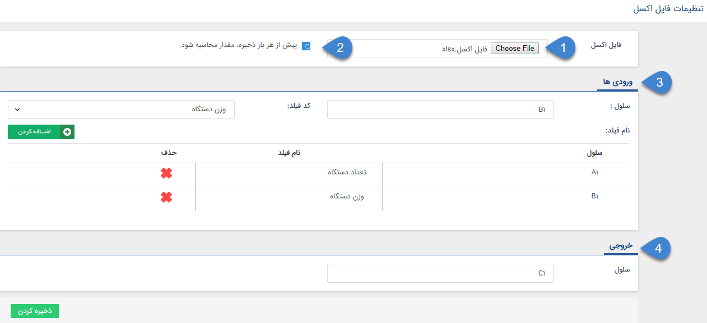
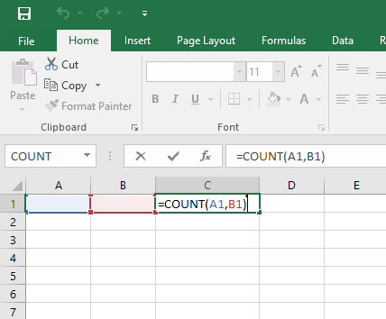
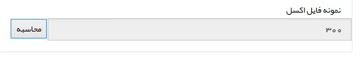

# تنظیمات مشترک فیلدها

تنظیمات مشترک فیلدها

پیش از بررسی تنظیماتی که به صورت مشترک در همه فیلدها وجود دارند ابتدا نحوه [افزدن مشخصه](ParametersAndPersonalInformationManagement.md)  را مطالعه کنید.

**  1. الزامی**

امکان الزامی کردن فیلدها برای آیتم هایی که داخل چرخه های کاری نیستند وجود دارد.

برای الزامی کردن فیلد باید گزینه "الزامی" را فعال کنید. با فعال کردن این گزینه فیلد مقدار اولیه جهت مقداردهی نمایش می شود.

تمام فیلدهای الزامی شده باید مقدار اولیه داشته باشند.

مقدار اولیه: در صورت الزامی کردن فیلد، آیتم هایی که مقدار این فیلد در آن ها خالی است، با مقداری که کاربر به فیلد مقدار اولیه  وارد کرده است، مقداردهی خواهند شد.

**2\. مقدار پیش فرض**

این مقدار به صورت پیش فرض به فیلد اختصاص داده می شود و کاربر می تواند آن را پاک کرده یا ویرایش کند.

**3\. نمایش در خلاصه**

در صورتی که این گزینه فعال باشد، فیلد مورد نظر در جدول سوابق مشتری نمایش داده می شود.

**4\. فیلد محاسباتی شود**

در صورت فعال بودن این گزینه هم می توانیم فیلد را تبدیل به فیلدی از نوع فایل اکسل کنیم و یا اینکه فیلد را به فیلدی از نوع وب سرویس تبدیل کنیم.

**فایل اکسل:** در صورت انتخاب فیلد به صورت فایل اکسل، وارد قسمت تنظیمات شوید.

1. ابتدا فایل اکسلی که حاوی تابع مورد نظرتان هست را پیوست کنید.

2. می توانید تعیین کنید که قبل از هر ذخیره یکبار این محاسبه انجام شود.

3. در این قسمت می توانید سلول های ورودی را تعریف کنید.

4. در این قسمت می توانید سلول های ورودی را تعریف کنید.

برای مثال در تصویر بالا یک فایل اکسل که در آن سلول C1 با فرمول A1\*B1 پر شده است، قرار داده شده است.

در سلول های ورودی A1  را برای تعداد دستگاه و B1 را برای وزن دستگاه در نظر گرفته ایم.

در سلول خروجی هم عبارت C1 وارد شده است تا نرم افزار نتیجه محاسبه فرمول را بتواند تشخیص دهد.

نمونه فیلد  اکسل:

 نمونه فیلد:

**وب سرویس:** این فیلد توانایی گرفتن مقدار خود از یک برنامه یا وب سرویس دیگر را دارد. (قابل استفاده توسط برنامه نویسان)

برای مثال میتواند هزینه را از یک وب سرویس دیگر دریافت کند و در این فیلد قرار دهد.

برای این کار آدرس وب سرویس مورد نظر را در فیلد "آدرس سرویس" وارد کنید.

