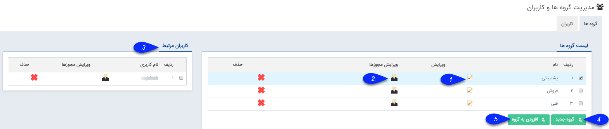

# گروه ها    

**گروه ها**

در این صفحه امکان ایجاد و ویرایش گروه های کاربری وجود دارد. از این گروه ها در تعیین مجوزها، فرآیندهای کاری، ارجاع وظیفه و ... استفاده می شود.

 

1\. **ویرایش:** با کلیک بر روی گزینه ویرایش می توانید نام این گروه یا وضعیت فعال بودن آن را مشخص کنید.

2\. **ویرایش مجوزها:** با کلیک بر روی گزینه مجوزها ، سطح دسترسی آن گروه را به پیام گستر مشخص کنید. برای اطلاعات بیشتر قسمت [مجوزها](GroupsManagementAndUsers/Privileges.md) را مطالعه کنید.

3\. **کاربران مرتبط:** در این قسمت کاربرانی که عضو این گروه است را می توانید مشاهده کنید.

4\.  **گروه جدید:** با کلیک بر روی این دکمه می توانید یک گروه کاربری جدید ایجاد نمایید.

5.  **افزودن به گروه:** با قرار گرفتن روی نام گروه و کلیک بر روی دکمه " اضافه به گروه " می توانید از بین کاربران موجود، کاربری را به آن گروه اضافه نمایید. کاربر اضافه شده دارای دسترسی های گروهی است که در آن عضویت دارد.