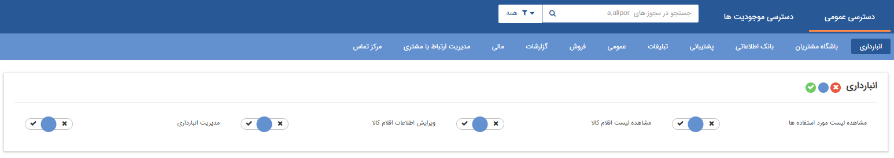
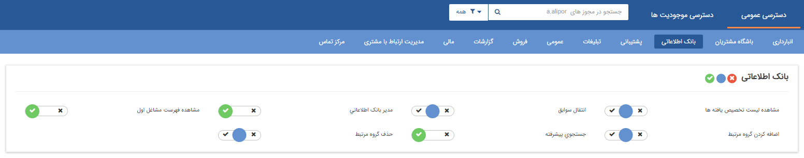
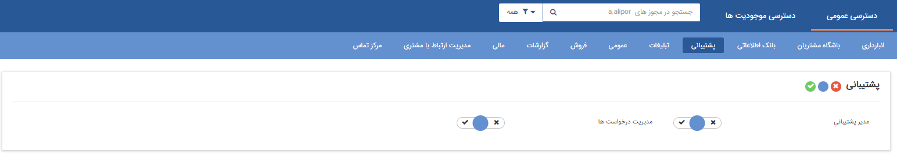
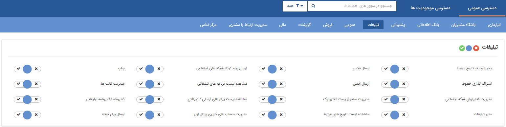
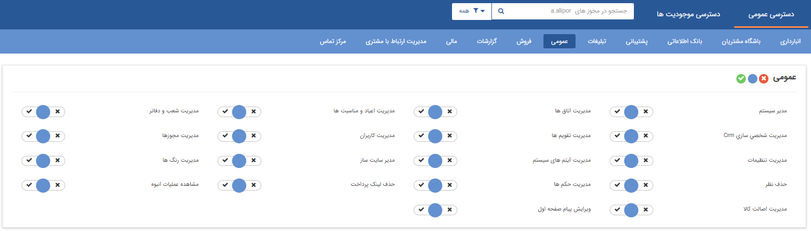
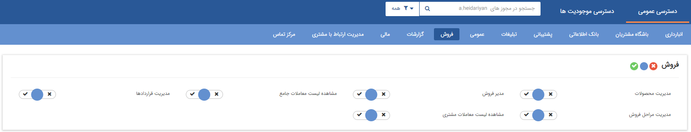
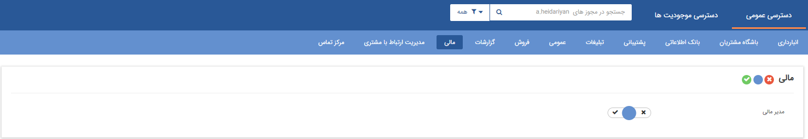
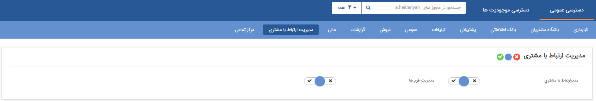
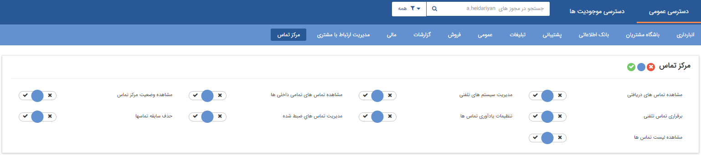

# دسترسی های عمومی        

دسترسی های عمومی

مجوزهای عمومی شامل مجوزهایی است که به صورت کلی دسترسی های کاربر را مشخص می کند.

مجوزها به صورت کلی چند نوع مشترک دارند که در بین تمامی آیتم ها مشترک است:

الف) مجوزهایی که نام مدیر یا مدیریت دارند، تمامی مجوزهای آن دسته را پوشش می دهند. برای مثال مجوز "مدیر بانک اطلاعاتی" تمامی مجوزهای قسمت "بانک اطلاعاتی" را داراست.

ب) مجوز مدیر سیستم، تمامی مجوزهای نرم افزار را شامل می شود.

عملکرد مجوزهای قسمت عمومی به شرح ذیل است:

1\. **انبارداری:**

*   مدیریت انبارداری: به منوی [مدیریت انبارها](../../Warehousemanagement.md) و [گزارشات انبار](../../../ManagementAndReports/Warehousereports.md) دسترسی پیدا می کند.

*   مشاهده لیست اقلام کالا: \*\*\*حالت آزمایشی است.\*\*\*

*   مشاهده لیست مورد استفاده ها: \*\*\*حالت آزمایشی است.\*\*\*

*   ویرایش اطلاعات اقلام کالا: در صورت داشتن این مجوز در صفحه [ویرایش قلم کالا](../../../Buysaleswarehouse/Transactions/Goodsitems.md) دکمه ذخیره ظاهر خواهد شد.

2\. **باشگاه مشتریان:**

*   ایجاد حساب کاربری برای مشتری: \*\*\*حالت آزمایشی است.\*\*\*

*   مدیریت اعضای باشگاه مشتریان: دسترسی به منوی [مدیریت اعضای باشگاه مشتریان](../../Customersclubmanagement.md) پیدا می کند.
*   مشاهده امتیازات مشتریان: به صفحه [امتیازات مشتری](../../../PayamGostarSyncBank/JobsForFirst/IdentityPoints.md) در پروفایل هویت ها دسترسی پیدا کرده و می تواند تراکنش امتیاز جدید ایجاد کند.

3\. **بانک اطلاعاتی:**

*   انتقال سوابق: دسترسی به منوی انتقال سوابق در پروفایل مخاطبان می یابد.

*   جستجوی پیشرفته: دسترسی به منوی [جستجوی پیشرفته](../../../PayamGostarSyncBank/AdvancedSearch.md) در [بانک یکپارچه](../../../PayamGostarSyncBank.md) پیدا می کند.

*   مدیر بانک اطلاعاتی: می تواند از  مخاطبان و سرنخ های موجود در [بانک یکپارچه](../../../PayamGostarSyncBank.md) خروجی اکسل تهیه کند. تمامی دسته بندی های اختصاصی شده توسط کاربران را مشاهده می کند.

*   مشاهده فهرست مشاغل اول: بانک فهرست مشاغل اول (یکی از بانک های اطلاعاتی قابل تهیه در نرم افزار) را در [بانک اطلاعاتی](../../../PayamGostarSyncBank/JobsForFirst.md)  می تواند مشاهده کند.

*   مشاهده لیست تخصیص یافته ها: دسترسی به منوی [تخصیص یافته ها](../../../CRM/TakhsisYafteha.md) در [مدیریت ارتباط با مشتری](../../../CRM.md) پیدا می کند.

4\. **پشتیبانی:**

 

*   مدیر پشتیبانی: اجازه مشاهده [گزارش های CRM](../../../ManagementAndReports/CRMReports.md) را به کاربر می دهد.

*   مدیریت درخواست ها: اجازه مشاهده لیست های درخواست های ایجاد شده در [مدیریت درخواست ها](../../Personalizing/RequestsManagement.md)  را به کاربر میدهد.

5\. **تبلیغات:**

· ارسال ایمیل: اجازه ارسال ایمیل پیدا می کند.

· ارسال پیام کوتاه شبکه های اجتماعی: اجازه ارسال از طریق تلگرام پیدا می کند.

· ارسال پیام کوتاه: اجازه ارسال پیامک پیدا می کند.

· ارسال فکس: اجازه ارسال فکس پیدا می کند.

· اشتراک گذاری خطوط: در هنگام تعریف خطوط مانند خطوط پیام کوتاه اجازه به اشتراک گذاری آن با سایر کاربران را در اختیار یک کاربر قرار میدهد.

· چاپ: اجازه ارسال چاپ پیدا می کند.

· ذخیره/حذف برنامه تبلیغاتی: در قسمت تبلیغات می تواند برای رسانه های که اجازه ارسال از آنها را دارد، برنامه ارسال گروهی تنظیم و ذخیره کند.

· ذخیره/حذف تاریخ مرتبط: اجازه ذخیره کردن یک تاریخ مرتبط در قسمت [تاریخ های مهم](../../../PayamGostarSyncBank/JobsForFirst/LinkedDates.md) پروفایل یک مخاطب یا سرنخ می یابد.

· مدیر تبلیغات: اجازه مشاهده گزارشهای مرتبط با تبلیغات مانند [گزارش های تحلیلی](../../../ManagementAndReports/GozareshateTahlili.md) را در اختیار کاربر قرار میدهد.

· مدیریت فعالیت های شبکه اجتماعی: اجازه استفاده از قسمت [مدیریت شبکه های اجتماعی](../../../AdvertisedTools/Socialnetworks.md) را به کاربر می دهد.

· مدیریت حساب های کاربری پرتال اول: به منوی [1st.ir](../../../1st.md) دسترسی پیدا می کند.

· مدیریت صندوق پست الکترونیک: دسترسی منوی [مدیریت صندوق پست الکترونیک](../../../Communications/MyEmails.md) پیدا می کند.

· مدیریت قالب ها: دسترسی به منوی [مدیریت پیام های الگو](../../../BaseInformatio/SMSFrameManagement.md) پیدا می کند.

· مشاهده لیست های ارسالی/دریافتی: می تواند لیست های ارسال/دریافت رسانه های مختلف را در نرم افزار مشاهده کند.

· مشاهده لیست برنامه های تبلیغاتی: امکان مشاهده برنامه های تبلیغاتی که توسط سایر کاربران در نرم افزار ایجاد شده است را نیز دارد.

· مشاهده لیست تاریخ های مرتبط: به منوی [تاریخ های مرتبط](../../../CRM/LinkedDates.md) در مدیریت ارتباط با مشتریان دسترسی پیدا  می کند.

6\. **عمومی:**

*   حذف نظر:  امکان حذف نظرات ایجاد شده توسط سایر کاربران را پیدا می کند. 

*   مدیر سیستم: به عنوان راهبر نرم افزار تعیین می شود و به تمامی قسمت های نرم افزار دسترسی بدون قید و شرط دارد. اجازه حذف و یا ویرایش تمامی آیتم ها و دسترسی به تمامی منو ها دارد. توجه داشته باشید که مدیر انبارها به صورت جداگانه در منوی [مدیریت انبارها](../../Warehousemanagement.md) تعیین می شود.

*   مدیریت تقویم ها: دسترسی به منوی [مدیریت تقویم ها](../../../BaseInformatio/CalendersManagement.md) می یابد.

*   مدیریت شخصی سازی CRM: دسترسی به منوی [شخصی سازی CRM](../../Personalizing.md) پیدا می کند.
    

*   مدیر سایت ساز: می تواند به امکانات[سایت ساز](../../../MajolhayeTakmili/SiteSaz.md) در نرم افزار دسترسی پیدا کند.

*   مدیریت آیتم های سیستم: به منوی [مدیریت آیتم های سیستم](../../../BaseInformatio/SystemsItemsManagement.md) دسترسی می یابد.

*   مدیریت اتاق ها: به منوی [مدیریت اتاق ها](../../../BaseInformatio/Roomsmanagement.md) دسترسی می یابد.

*   مدیریت اصالت کالا: به منوی [مدیریت اصالت کالا](../../poductauthenticitymanagement.md) دسترسی پیدا می کند.

*   مدیریت اعیاد و مناسبت ها: به منوی [مدیریت اعیاد و مناسبت ها](../../../BaseInformatio/EYDManagement.md)در دسترسی پیدا می کند.

*   مدیریت تنظیمات: به منوی [تنظیمات کلی](../../TotalSetting.md) دسترسی پیدا می کند. (میتوانید تنظیمات کلی سیستم اعم از تنظیم ایمیل ها، امنیتی و ... را تغییر دهید.)

*   مدیریت حکم ها: دسترسی منوی [مدیریت حکم های پرسنلی](../../SecurityItemAuthorize.md) در اختیار کاربر قرار می دهد. (میتوانید حکم های مختلف -مانند کارمند فروش، مدیر مالی و ... - ایجاد و واگذار کنید.)

*   مدیریت رنگ ها: به منوی [مدیریت رنگ ها](../../../BaseInformatio/Colormanagement.md) دسترسی می دهد. (میتوانید ترتیب نمایش رنگ های استفاده شده در نرم افزار را تغییر دهید و یا رنگ جدید اضافه کنید.)

*   مدیریت شعب و دفاتر: دسترسی به [مدیریت شعب - دپارتمان و سمت](../../../BaseInformatio/BranchManagement.md)  ایجاد می کند. ( میتوانید شعب و دفاتر و سمت های مختلف ایجاد کنید و براساس آن ها مجوزهای مختلف تعیین کنید.)

*   مدیریت فیلدها: \*\*\*حالت آزمایشی است.\*\*\*

*   مدیریت کاربران: منوی [مدیریت گروه ها و کاربران](../../GroupsManagementAndUsers.md) را در اختیار کاربر قرار می دهد. (می توانید کاربر/گروه کاربری تعریف کنید و به مجوزهای آنها دسترسی پیدا کنید.)

*   ویرایش پیام صفحه اول: به ویرایش پیام ویجت [اعلان عمومی](../../../Home/Home/Publicannouncement.md) در داشبورد صفحه خانه دسترسی می دهد. (می توانید یک پیام برای نمایش بر روی صفحه خانه تمامی کاربرانی که این ویجت را دارند تنظیم کنید.)

7\. **فروش:**

*   مدیر فروش: کاربر با استفاده از این مجوز می تواند تمامی گزارشات مرتبط با فروش مانند [گزارشات تحلیلی](../../../ManagementAndReports/GozareshateTahlili.md) یا [گزارشات فروش](../../../ManagementAndReports/SalesReport.md) را دریافت کند. همچنین به منوی [مدیریت فاکتورها](../../Personalizing/FactorsManagement.md) در شخصی سازی دسترسی پیدا می کند.

*   مدیریت قراردادها: به منوی [مدیریت قراردادها](../../Personalizing/ContractManagement.md) در شخصی سازی دسترسی پیدا می کند.

*   مدیریت محصولات: به منوی [مدیریت محصولات](../../../BaseInformatio/ProduceManagement.md) دسترسی پیدا می کند. (می تواند محصولات را وارد کند، بروز کند و یا خروجی بگیرد.)

*   مدیریت مراحلفروش: به منوی [مدیریت مراحل فروش](../../../BaseInformatio/SellsManagement.md) دسترسی می دهد. (مراحل فروشی که در [فرصت های فروش](../../../PayamGostarSyncBank/JobsForFirst/Background/NewOpportunity.md) استفاده می شود را می توان ایجاد و ویرایش کرد.)

*   مشاهده لیست معاملات جامع: اجازه دسترسی به [مورد معامله](../../../Buysaleswarehouse/Transactions/dealedgoods.md) و [مورد مذاکره](../../../Buysaleswarehouse/Transactions/Undernegotiation.md) در منوی خرید، فروش و انبار را در اختیار کاربر قرار میدهد.

*   مشاهده لیست معاملات مشتری: دسترسی به منوی [معاملات](../../../PayamGostarSyncBank/JobsForFirst/Transactions.md) را در پروفایل مخاطبان و سرنخ ها در اختیار کاربر می گذارد.

8\. **گزارشات:**

*   مدیریت گزارش های ساخته شده: دسترسی به منوی [گزارش ساز](../../../ManagementAndReports/GozareshSaz/GozareshSazmojod.md) جهت ساختن گزارشات جدید یا مدیریت و مشاهده گزارشات ساخته شده را به کاربر می دهد. 

*   مشاهده همه تقویم های عملیاتی: \*\*\*حالت آزمایشی است.\*\*\*

9\. **مالی:**

*   مدیر مالی: امکان مشاهده گزارشهای مالی مانند گزارش [مانده حساب مشتریان](../../../ManagementAndReports/SalesReport/Customers/Accountbalance.md) یا [جزئیات عملکرد فروش](../../../ManagementAndReports/SalesReport/Details.md) را دارد.

10\. **مدیریت ارتباط با مشتری:**

*   مدیر ارتباط با مشتری: امکان مشاهده [گزارشات CRM](../../../ManagementAndReports/CRMReports.md) و [گزارشات فرآیندی](../../../ManagementAndReports/workflow.md) را به کاربر می دهد.

*   مدیریت فرم ها: دسترسی یه منوی [مدیریت فرم ها](../../Personalizing/FormsManagement.md) در شخصی سازی را به کاربر می دهد.

11\. **مرکز تماس:**

*   برقراری تماس تلفنی: اگر سیستم تلفنی VOIP در اختیار داشته باشید و آن را با نرم افزار پیام گستر به درستی متصل کرده باشید، با فعال کردن این مجوز به کاربران این اجازه داده می شود که بتوانند از داخل نرم افزار با کلیک بر روی شماره تلفن، موبایل یا تلفکس با مخاطب ارتباط برقرار کنند.

*   تنظیمات یادآوری تماس ها: به منوی [تنظیمات یادآوری تماس ها](../../../BaseInformatio/Phonesystems/Callsnotificationsettings.md) دسترسی می دهد.

*   حذف سابقه تماس ها: اجازه حذف سابقه تماس ها از منوی [تماس ها](../../../CRM/Calls.md) و در پروفایل مخاطب تب [تماس ها](../../../PayamGostarSyncBank/JobsForFirst/Calls.md) را می دهد.

*   مدیریت تماس های ضبط شده: به کاربر اجازه می دهد که تماس های ضبط شده را در اختیار داشته باشد.

*   مدیریت سیستم های تلفنی: دسترسی به منوی [مدیریت سیستم های تلفنی](../../../BaseInformatio/Phonesystems/Phonesystemsmanagement.md) را در اختیار کاربر قرار میدهد. (در این منو میتوانید تنظیمات مرتبط با سیستم تلفن های خود -تعریف داخلی و ...- را انجام دهید.)

*   مشاهده تماس های تمامی داخلی ها: به کاربر اجازه می دهد در ویجت تماس خود تمامی تماس های ورودی را مشاهده کند. (با توجه به داخلی های تنظیم شده در [مدیریت سیستم های تلفنی](../../../BaseInformatio/Phonesystems/Phonesystemsmanagement.md) و تنظیمات قسمت [امنیتی](../../TotalSetting/Safetly.md) می توانید مشاهده تماس های ورودی را برای کاربران محدود کنید.)

*   مشاهده تماس های دریافتی: به کاربر اجازه می دهد که از ویجت [تماسهای دریافتی](../../../Home/Home/Incomingcalls.md) استفاده کند. (تماس های ورودی را ببیند و بتواند شماره مخاطب یا سوابق او را ثبت کند.)

*   مشاهده لیست تماس ها: اجازه مشاهده سوابق تماسی در منوی [تماس ها](../../../CRM/Calls.md)  در قسمت مدیریت ارتباط با مشتریان را به کاربر می دهد.

*   مشاهده وضعیت مرکز تماس: به منوی [وضعیت مرکز تماس](../../../Windows/CIDstatus.md) دسترسی می دهد. (میتوانید وضعیت داخلی ها را مشاهده کنید و یا درصورت نیاز با کاربر خود از طریق سیستم در حین مکالمه صحبت کنید.)